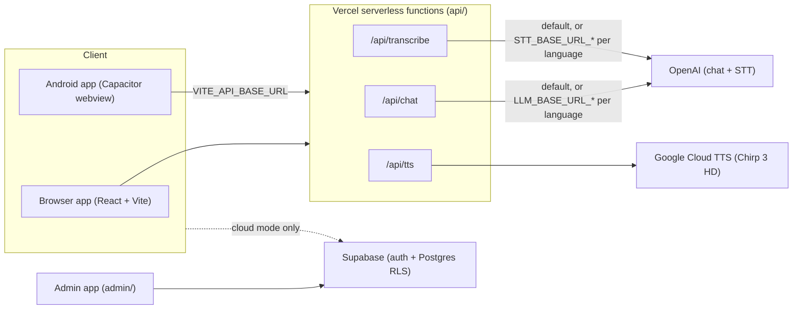
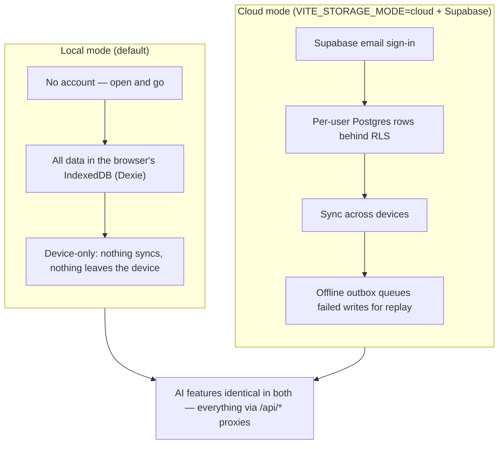

# HomeTongue 粵

**Learn to speak your family's dialect.** HomeTongue is a mobile-first web app (with a Capacitor Android build) for reconnecting with heritage languages — starting with Cantonese as spoken by families in Singapore (`yue-HK` is the speech-service locale, not a content claim — see the locale note in `src/languages/yue-HK/index.ts`). Speak or type English, hear natural Cantonese back in three tones of formality, save phrases, and turn real conversations into personalized lessons with speaking exams.

## Features

- 🎙️ **Live translation chat** — speak English (or Cantonese), get Traditional-Chinese text, Jyutping romanization, and studio-quality speech (Google Chirp 3 HD, 30 voices)
- 💬 **AI reply suggestions** tuned to your persona (personal vs. work) and tone (formal / casual / slang)
- 📚 **Lessons** — structured beginner content plus *conversation lessons* generated from your own chat history
- 🧠 **Speaking exams** — record yourself, get transcribed, and receive a lenient dialect-aware accuracy score
- 🔖 **Bookmarks & tags** — organize phrases and sessions
- 👤 **Personas** — the app learns your communication style and adapts suggestions
- ☁️ **Optional cloud accounts** — real sign-in + per-user sync via Supabase (config-gated; runs fully local without it)
- 🧪 **Opt-in ML data pipeline** — consented, labeled speech corpus for future dialect model training
- 📱 **Android app** via Capacitor (iOS planned)

## Tech stack

React 18 + TypeScript (strict) · Vite 6 · Tailwind CSS v4 · Dexie (IndexedDB) · Vercel serverless functions (`api/`) · Capacitor 8 · OpenAI (chat + speech-to-text) · Google Cloud Text-to-Speech (Chirp 3 HD, `yue-HK`)

All AI provider keys live **server-side only** — the client talks to `/api/chat`, `/api/transcribe`, and `/api/tts`.

## Architecture at a glance

The web and Android clients only ever talk to the serverless proxies, which hold the provider keys. Per-language model routing (`LLM_BASE_URL_*` / `STT_BASE_URL_*`, see `api/_lib/languageManifest.js`) lets each dialect point at its own fine-tuned endpoint later without a client change. A separate admin app (`admin/`) for speech-sample review and lesson publishing talks to the same Supabase project.



## Storage modes

Where your data lives is a build-time choice (`VITE_STORAGE_MODE`, resolved in `src/repositories/index.ts`). Local mode is the default and needs zero accounts or config; cloud mode adds real sign-in and cross-device sync. The AI features are identical either way — both modes call the same `/api/*` proxies.



## Getting started

```bash
pnpm install
cp .env.example .env       # fill in OPENAI_API_KEY and GOOGLE_API_JSON
pnpm dev                   # http://localhost:5173 — /api/* served by dev middleware
```

Without keys the app still runs: translation falls back to a small offline mock, and TTS/STT show friendly errors.

### Scripts

| Command | What it does |
|---|---|
| `pnpm dev` | dev server with `/api/*` middleware |
| `pnpm build` | production build to `dist/` |
| `pnpm typecheck` | strict TypeScript check (must be 0 errors) |
| `pnpm generate:previews` | pre-render voice preview MP3s to `public/voice-previews/` |
| `pnpm android:sync` | build web assets + sync the Capacitor Android project |

### Deploying to Vercel

1. Import the repo; framework preset **Vite** (`vercel.json` already sets build/output and security headers).
2. Set env vars: `OPENAI_API_KEY`, `GOOGLE_API_JSON` (single-line service-account JSON), optionally `OPENAI_MODEL`, `VITE_ACCESS_CODE`.
3. Deploy — the `api/` folder becomes serverless functions automatically.
4. Optional: enable **Web Analytics** in the Vercel project dashboard (Analytics tab) — the app already ships `@vercel/analytics` page-view tracking in production builds; no env vars needed.

### Android build

```bash
pnpm android:sync
npx cap open android       # then run from Android Studio
```

Native builds **must** set `VITE_API_BASE_URL` (e.g. `https://your-app.vercel.app`) at build time so the webview can reach the API. See `docs/MOBILE.md`.

### Store prep

- CI builds an unsigned release AAB on every push to `main` (`android-build` job in `.github/workflows/ci.yml`); iOS builds via `codemagic.yaml` once an Apple Developer account is wired into Codemagic.
- App icons + splash screens regenerate from `public/logo.png`: `node scripts/generate-app-assets.mjs && npx capacitor-assets generate --android --ios`.
- Privacy policy (both stores require a hosted URL): [`docs/PRIVACY_POLICY.md`](docs/PRIVACY_POLICY.md), served at [home-tongue.vercel.app/privacy.html](https://home-tongue.vercel.app/privacy.html).
- Full store checklists: [`docs/MOBILE.md`](docs/MOBILE.md).

## Documentation

- [`docs/ARCHITECTURE.md`](docs/ARCHITECTURE.md) — how the pieces fit together
- [`docs/SETUP.md`](docs/SETUP.md) — environment, keys, and provider setup in detail
- [`docs/MOBILE.md`](docs/MOBILE.md) — Capacitor Android + iOS guide and store checklists
- [`docs/PRIVACY_POLICY.md`](docs/PRIVACY_POLICY.md) — privacy policy (hosted at `/privacy.html`)
- [`docs/DATA_MODEL.md`](docs/DATA_MODEL.md) — domain types and persistence schema
- [`docs/ML_PIPELINE.md`](docs/ML_PIPELINE.md) — consent model and training-data pipeline
- [`docs/IMPROVEMENT_PLAN.md`](docs/IMPROVEMENT_PLAN.md) — phased roadmap and status
- [`CLAUDE.md`](CLAUDE.md) — working conventions for AI-assisted development

## Security notes

- The access-code screen is a **soft gate**. Real authentication (Supabase email sign-in with Row-Level-Security-isolated data) activates when cloud mode is configured — see `docs/SETUP.md`.
- Never put a secret in a `VITE_`-prefixed env var; Vite embeds those in the public bundle. (The Supabase anon key is public by design — RLS is the boundary.)
- `api/*` functions validate input and rate-limit per IP — durable (Redis-backed) when Upstash env vars are set, best-effort in-memory otherwise.

## Status

Hackathon project under active rebuild. Cantonese (Singapore usage; `yue-HK` is the speech-service locale) is live and Hokkien (Singapore usage, text-first) is experimental; Hakka and Teochew are planned via the language-pack architecture (see the improvement plan). Lesson and roleplay content is AI-drafted and pending Singaporean native-speaker review (see `docs/LESSON_AUTHORING.md`).
