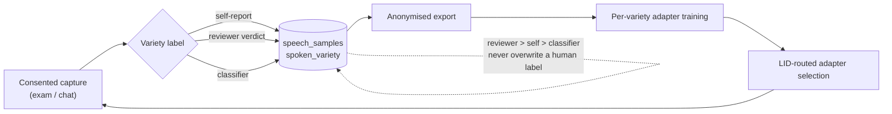

# Dialect variety labelling and classification

**Status:** specification. Nothing in this document is built. It is the companion to
[S2ST_FINDINGS.md](S2ST_FINDINGS.md), whose finding F8 establishes the problem resolved here, and
to [MODEL_CONTROLS.md](MODEL_CONTROLS.md), whose "Adapter selection by variety" control is left
depending on the classifier specified below.

**Date:** 2026-07-26. Every repo path cited below was opened and confirmed against the current
source on that date.

**Locale note.** As in [S2ST_FINDINGS.md](S2ST_FINDINGS.md), the pack codes `yue-HK` and `nan-TW`
are **speech-locale identifiers**, not statements about target audience — they name the closest
vendor-supported speech-service locale families. All content in both packs targets Cantonese and
Hokkien **as spoken in Singapore**; see the locale comments at
[src/languages/yue-HK/index.ts:3](../src/languages/yue-HK/index.ts:3) and
[src/languages/nan-TW/index.ts:4](../src/languages/nan-TW/index.ts:4). The *variety* label this
document introduces exists precisely because a pack code cannot carry that finer distinction —
Singapore-usage Cantonese and Hong-Kong-influenced Cantonese are both `yue-HK` today.

**What this document does not establish.** The corpus has **zero consented samples**
([ml/train/README.md:3](../ml/train/README.md:3)). No variety classifier has been trained, no label
has ever been written, and none of the contribution surfaces described below exists in the product
— including the user-upload surface, which is specified here and deliberately deferred. Every
volume figure is a requirement or an estimate, never a measurement.

---

## Do we need a separate app?

**No.** `admin/` is already a full review application. What is missing is a column, not an
application.

What exists today:

- a review queue that pages unreviewed `speech_samples`, newest first
  ([admin/src/pages/ReviewQueuePage.tsx:17](../admin/src/pages/ReviewQueuePage.tsx:17), fed by
  `fetchUnreviewedPage` at [admin/src/lib/reviewApi.ts:45](../admin/src/lib/reviewApi.ts:45));
- a per-sample card with verdict buttons, a corrected-transcript panel and a rejection-notes panel
  ([admin/src/components/SampleCard.tsx:100](../admin/src/components/SampleCard.tsx:100));
- lazy signed-URL playback of recordings out of the private bucket
  ([admin/src/components/AudioPlayer.tsx](../admin/src/components/AudioPlayer.tsx), signing at
  [admin/src/lib/reviewApi.ts:134](../admin/src/lib/reviewApi.ts:134));
- a reviewed-list view and a stats dashboard that includes the review pipeline
  ([admin/src/pages/DashboardPage.tsx](../admin/src/pages/DashboardPage.tsx));
- reviewer access enforced in the database rather than the client: `profiles.is_admin` cannot be set
  through the API
  ([supabase/migrations/0005_admin_review.sql:46](../supabase/migrations/0005_admin_review.sql:46))
  and `public.is_admin()` ([:73](../supabase/migrations/0005_admin_review.sql:73)) gates every
  review policy;
- a verdict table with the shape a variety verdict needs — one row per sample, upsert so the latest
  reviewer wins, cascade-delete with the sample
  ([supabase/migrations/0005_admin_review.sql:91](../supabase/migrations/0005_admin_review.sql:91));
- and verdicts that already reach training, joined per sample by the export
  ([scripts/export-training-data.mjs:75](../scripts/export-training-data.mjs:75)).

A separate labelling application would have to reproduce all of that: admin authentication and the
`is_admin` gate, signed-URL playback against a private bucket, queue paging, and the export join.
Extending the existing surface touches one migration and a handful of files instead. **That
comparison is this document's judgement**; the inventory it rests on is verifiable at the paths
above.

The one thing the existing application cannot do is write a variety — there is nowhere to put it
and, as § Schema shows, no policy that would permit the write. One migration fixes both.

---

## The label gap

Finding **F8** — the "The label gap" section of [S2ST_FINDINGS.md](S2ST_FINDINGS.md) — states the
problem and its two consequences (per-variety training and per-variety accuracy measurement are
both impossible), and is not restated here. In one line: `speech_samples.language` is declared
`text not null default 'yue-HK'`
([supabase/migrations/0002_ml_data_pipeline.sql:26](../supabase/migrations/0002_ml_data_pipeline.sql:26)),
which faithfully records **which pack was active**, never **what was spoken**.

One consequence belongs here rather than there: because the corpus holds zero consented samples,
there is no historical mislabelling to repair. No row needs re-labelling, no migration needs a
backfill, and no existing measurement needs restating — the column simply does not exist yet, which
makes this the cheapest point in the product's life to add it.

---

## Schema

Migration `0009_spoken_variety.sql` — the next free number after
[supabase/migrations/0008_lesson_content.sql](../supabase/migrations/0008_lesson_content.sql) —
adds three nullable columns to `speech_samples`.

**Table 5.** The variety-label columns added to `speech_samples` by migration
`0009_spoken_variety.sql`. Numbering is shared across this document set so the companion article can
cite every table by the same number: Tables 1 and 3 are in [S2ST_FINDINGS.md](S2ST_FINDINGS.md),
Table 2 is in [MODEL_CONTROLS.md](MODEL_CONTROLS.md), and Table 4 is reserved for the corpus-routes
table in the findings document.

| Column | Type | Notes |
|---|---|---|
| `spoken_variety` | `text` | pack-declared vocabulary; null = unknown |
| `variety_source` | `text` | `check (variety_source in ('self','reviewer','classifier'))` |
| `variety_confidence` | `real` | classifier confidence; null for human sources |

**All three are nullable and there is no backfill.** An absent label means *unknown*, which is the
truthful representation of every existing row: nothing can retroactively establish what a past
speaker said. `null = unknown` in Table 5 is therefore a real, permanent state the whole pipeline
must handle, not a placeholder awaiting a fill-in.

### Why `spoken_variety` carries no value constraint

`variety_source` is constrained because its three values are structural — they name the three write
paths in § Contribution surfaces, and nothing else will ever be one. `spoken_variety` is
deliberately left unconstrained, because its vocabulary is linguistic content, and linguistic
content belongs to the language pack (below). A `check` constraint or Postgres enum naming varieties
would have to be migrated every time a pack revised its list, and would place linguistic judgements
in the schema where nothing reads them.

The tradeoff is real and worth naming: the database will accept a mistyped variety string. The
mitigation is that every write path derives its value from the pack's declared list rather than from
free text — a selector for humans, the same list as label space for the classifier — so a stray
value indicates a code defect rather than user input.

### Where the vocabulary lives

Per the [CLAUDE.md](../CLAUDE.md) convention that language-specific data belongs in
`src/languages/<code>/` and is never inlined in services or components, the `LanguagePack` contract
([src/languages/types.ts:32](../src/languages/types.ts:32)) gains an optional `varieties` list, one
per pack. **Every pack declares its own list** —
`yue-HK` and `nan-TW` alike — and the column stores whatever string the active pack supplied. A pack
that declares no varieties simply never produces a label, and its rows stay null, which is a
supported state and not a defect. Keeping the vocabulary in the pack is what keeps the schema
variety-agnostic.

### RLS, and the policy that is missing

The new columns inherit the existing `speech_samples` policies: own-rows select and delete plus the
consent-checking insert policy from migration 0002
([supabase/migrations/0002_ml_data_pipeline.sql:61](../supabase/migrations/0002_ml_data_pipeline.sql:61)),
and the additive admin-read policy from 0005
([supabase/migrations/0005_admin_review.sql:119](../supabase/migrations/0005_admin_review.sql:119)).
Reviewer-sourced writes gate on `is_admin`, matching the `sample_reviews_insert_admin` and
`sample_reviews_update_admin` write policies of 0005
([:109](../supabase/migrations/0005_admin_review.sql:109) and
[:111](../supabase/migrations/0005_admin_review.sql:111)).

That inheritance has a consequence the design should confront now rather than discover during
implementation: **`speech_samples` has no `UPDATE` policy at all today.** Migration 0002 creates
select, insert and delete policies only (lines
[61](../supabase/migrations/0002_ml_data_pipeline.sql:61),
[63](../supabase/migrations/0002_ml_data_pipeline.sql:63) and
[79](../supabase/migrations/0002_ml_data_pipeline.sql:79)), and 0005 adds admin *select*
([:119](../supabase/migrations/0005_admin_review.sql:119)). Any label written after the insert
therefore needs a write path that does not currently exist. Two consequences follow:

- **A reviewer verdict needs a new admin-gated write path, added by `0009`.** Either an
  `is_admin()`-gated `UPDATE` policy on `speech_samples`, or a `security definer` function that
  performs the write. RLS policies cannot restrict *which columns* an update touches, so if the
  intent is that a reviewer may set the variety columns and nothing else, the column-scoped option
  (a `security definer` RPC, or column-level `grant update (…)` alongside the policy) is the one
  that expresses it. **This choice is left open** — both are viable and the decision belongs with
  the implementation.
- **A self-report is an insert-time field.** With no own-rows `UPDATE` policy, the capture path can
  supply a variety only in the row it inserts. Letting a user revise their own label later means
  granting users an update path — one of the reasons the end-user labelling UI is phase 4 in
  § Rollout phases rather than phase 2.

### Indexing

Per-variety training and per-variety evaluation both filter on the label, exactly as the export
filters on `language` today (`--language`,
[scripts/export-training-data.mjs:43](../scripts/export-training-data.mjs:43), served by
`speech_samples_language_idx`,
[supabase/migrations/0002_ml_data_pipeline.sql:52](../supabase/migrations/0002_ml_data_pipeline.sql:52)).
A partial index on `spoken_variety` restricted to non-null rows mirrors that pattern and stays small
while most rows are unlabelled. It is stated as a sensible default rather than a requirement — with
an empty corpus there is no measurement to justify it.

### Threading

The label crosses four layers, and each keeps its current contract:

1. **Capture.** `SpeechSampleInput`
   ([src/services/speechSampleService.ts:41](../src/services/speechSampleService.ts:41)) gains an
   optional variety field; `buildSpeechSampleRow`
   ([:87](../src/services/speechSampleService.ts:87)) maps it to `spoken_variety` and
   `variety_source` with the same `?? null` shape it already applies to `expected_text` and
   `corrected_text`, and stays a pure, unit-testable seam.
2. **Export.** `scripts/export-training-data.mjs` adds the three fields to the per-sample JSONL
   object ([:90](../scripts/export-training-data.mjs:90)), alongside the existing `review_verdict` /
   `review_corrected_text` join.
3. **Review.** `SAMPLE_COLUMNS` ([admin/src/lib/reviewApi.ts:11](../admin/src/lib/reviewApi.ts:11))
   gains the three columns so `SampleCard` can display the current label, and a variety-verdict
   write joins `submitReview` ([:83](../admin/src/lib/reviewApi.ts:83)).
4. **Routing.** Consumed by adapter selection — see § The classifier.

### Error handling

**All three columns are nullable at every layer. An absent label is a normal state, not an error,
and must never block capture, export or review.** Concretely:

- capture stays fire-and-forget. `recordSpeechSample`
  ([src/services/speechSampleService.ts:197](../src/services/speechSampleService.ts:197)) returns
  immediately and swallows every failure; asking for a variety must not change that. An unanswered
  prompt yields a null label, never a dropped sample;
- the export must not filter on the label. An unlabelled row still exports, and downstream consumers
  partition on what they find;
- the review queue must not require a label to review a sample. A missing variety is a prompt for
  the reviewer, not a reason to hide the row.

### Testing, once this is built

From the design spec: the migration is applied to a Supabase branch first, never directly to
production, and `pnpm typecheck && pnpm lint && pnpm test` are green before commit, per
[CLAUDE.md](../CLAUDE.md). Two further cases follow from the error-handling rule above and are worth
writing as tests because they are exactly what a careless implementation breaks: a
`buildSpeechSampleRow` case asserting that input without a variety produces `null` in all three
columns rather than a default string, and an export case asserting that an unlabelled row still
appears in `speech_samples.jsonl`.

---

## Contribution surfaces

Four ways a label can arrive. Three are near-term; the fourth is specified here and deferred. **None
of the four is built.** The review application exists (§ Do we need a separate app?), but nothing
anywhere writes a variety label today.

### 1. Reviewer verdicts

The strongest label, and the one needing the least new surface. A trained reviewer already listens
to the recording and judges the transcript in `SampleCard`
([admin/src/components/SampleCard.tsx:100](../admin/src/components/SampleCard.tsx:100)); a variety
selector populated from the pack's declared list puts the judgement where the audio already is. It
writes `variety_source = 'reviewer'` and leaves `variety_confidence` null.

Access gates on `is_admin`, matching the `sample_reviews_insert_admin` and
`sample_reviews_update_admin` write policies of migration 0005
([:109](../supabase/migrations/0005_admin_review.sql:109) and
[:111](../supabase/migrations/0005_admin_review.sql:111)),
and requires the new admin write path described in § Schema — admins have read-only access to
`speech_samples` today.

Reviewer capacity is the limit on this surface, and it is a real one: judging a variety is slower
than pressing a verdict button. Whether reviewers can label at the rate consented samples arrive is
**unknown**, and unknowable until both exist.

### 2. Self-report at capture

The exam flow
([src/features/learn/exam/ExamView.tsx:101](../src/features/learn/exam/ExamView.tsx:101)) is today's
only production caller of `recordSpeechSample`, and self-report rides its `SpeechSampleInput`,
writing `variety_source = 'self'`. Chat capture is a declared-but-unused variant:
`SpeechSampleInput.source` is already typed `"exam" | "chat"`
([src/services/speechSampleService.ts:42](../src/services/speechSampleService.ts:42)), and the unit
test at
[src/services/speechSampleService.test.ts:128](../src/services/speechSampleService.test.ts:128)
exercises the `"chat"` variant — so self-report lands wherever `recordSpeechSample` is called, today
the exam flow, and the chat flow once a production caller exists. Chat's actual capture today is a
different path:
[src/features/chat/hooks/useReplyFlow.ts:56](../src/features/chat/hooks/useReplyFlow.ts:56) calls
`recordCorrection`, which writes to the separate `corrections` table, never `SpeechSampleInput` or
`speech_samples`. The vocabulary offered is the active pack's declared list, never free text.

Two constraints shape it:

- **It must not introduce a blocking prompt.** Capture is fire-and-forget by design and the exam flow
  must not wait on a dialog, so the workable shape is asking once and reusing the answer. Reusing it
  across sessions means defaulting from the profile, and there is no field for that today:
  `UserProfile` ([src/types.ts:145](../src/types.ts:145)) carries `preferredDialect`, which is the
  *pack* selection, not a variety. Phase 2 therefore either asks once per session or adds an
  optional profile field.
- **It is a weak label.** A heritage learner may not know which variety they speak — for many, that
  is part of why they are using the app. **This is interpretation, not measurement**: no self-report
  data exists to check it against. It is nonetheless the reason reviewer verdicts take precedence
  over self-reports rather than the reverse.

### 3. Classifier backfill

A batch pass over already-consented samples, writing `variety_source = 'classifier'` with a
`variety_confidence`, at the lowest precedence and never over a human label. Specified in
§ The classifier.

### 4. User-contributed recordings — specified only, later phase

**This surface does not exist.** There is no upload UI, no third-party consent flow, and no
recording has ever been contributed. What follows is a design, written down now because the corpus
audit in [S2ST_FINDINGS.md](S2ST_FINDINGS.md) found the largest Cantonese corpus non-commercially
licensed (WenetSpeech-Yue, CC BY-NC 4.0 — Table 1) and no suitable public Hokkien corpus at all
(the "Coverage vs. demographics" section) — which leaves fresh, consented recordings as the one
route to Singapore-usage dialect audio whose licence position is clean by construction rather than
by negotiation. **That framing is this document's**, drawn from the audit's findings rather than
stated by it.

**What it is.** A consent-gated contribution path in the app: a user contributes a recording of
family speech. Where the source is a video — a home recording — the audio is extracted
**client-side and the video itself is never uploaded**. The audio is normalised to the same 16 kHz
mono WAV the recorder already produces (`blobToWav`,
[src/hooks/audio.ts:123](../src/hooks/audio.ts:123)), then stored, reviewed and exported through the
existing pipeline: `speech_samples`, `sample_reviews`, and the salted-hash export. No new storage
bucket, no second review tool, no new export format. **One honest gap in that reuse:** `blobToWav`
decodes and resamples an audio blob; pulling an audio track out of a video container is an
additional client-side step that does not exist in this repo today.

**It requires a third-party-speaker consent design that does not exist.** The two consent flags are
first-person — `data_collection_consent`
([supabase/migrations/0002_ml_data_pipeline.sql:16](../supabase/migrations/0002_ml_data_pipeline.sql:16))
and `audio_retention_consent`
([:17](../supabase/migrations/0002_ml_data_pipeline.sql:17)),
toggled by the account holder for their own data
([src/features/profile/components/DataPrivacySection.tsx](../src/features/profile/components/DataPrivacySection.tsx))
and described in first-person terms throughout the privacy policy: "your practice phrases,
transcripts, corrections, and scores" ([PRIVACY_POLICY.md:42](PRIVACY_POLICY.md:42)). **An uploader
cannot consent on another speaker's behalf.** A contribution surface therefore needs, at minimum, a
per-upload attestation from the uploader, a consent record naming the person recorded, and
withdrawal that reaches both. The withdrawal half can ride the existing cascade — sample deletion
already cascades review verdicts
([supabase/migrations/0005_admin_review.sql:92](../supabase/migrations/0005_admin_review.sql:92)),
rows cascade with the account, and withdrawing consent already deletes what was collected under it
([PRIVACY_POLICY.md:47](PRIVACY_POLICY.md:47), [:64](PRIVACY_POLICY.md:64)). Designing the consent
flow itself is work this document does not do; it names it as a precondition.

**Transcription bootstrap is asymmetric per language, and that asymmetry sets throughput.**

- **Cantonese (`yue-HK`).** Vendor STT exists, so an upload can be transcribed automatically and then
  corrected by a reviewer through the `corrected` verdict path already in `SampleCard`. Human effort
  is correction, not transcription.
- **Hokkien (`nan-TW`).** No vendor STT model exists: `sttLanguages` is the empty array at
  [api/_lib/languageManifest.js:55](../api/_lib/languageManifest.js:55) and the pack declares
  `capabilities { tts: false, stt: false }`
  ([src/languages/nan-TW/index.ts:73](../src/languages/nan-TW/index.ts:73)). Every transcript must
  be produced by a human, so human transcription capacity — not upload volume — sets the rate.

**What survives that bottleneck matters.** Variety-labelled audio with *no transcript* is still
useful twice: it is training data for the variety classifier, which needs audio and a label, and it
builds evaluation sets for per-variety measurement. Neither needs a transcript. Fine-tuning STT
does.

**What this changes for Hokkien, stated exactly that narrowly.** The "Coverage vs. demographics"
section of [S2ST_FINDINGS.md](S2ST_FINDINGS.md) records the honest status of `nan-TW` speech support
as "no route currently identified". A contribution surface would convert that into **"a route, gated
on human transcription capacity"**. It does not produce a corpus, a model, or a date; it moves the
status from *none* to *gated*.

**Volumes, stated honestly.** The variety classifier and per-variety evaluation sets need **tens of
hours per variety** — a scale contribution surfaces could plausibly reach. The step-2 STT adaptation
gate is unchanged at roughly 5–15 h of learner audio
([ML_TRAINING_PLAN.md:38](ML_TRAINING_PLAN.md:38)). The thousands-of-hours scale at which the public
Cantonese corpora sit is **not** reachable this way; Table 1 of
[S2ST_FINDINGS.md](S2ST_FINDINGS.md) covers what is, and under which licences.

---

## Precedence

**`reviewer > self > classifier`.** A classifier write must never overwrite a human label, and a
self-report must never overwrite a reviewer verdict.

**This is enforced in the write path, not by convention.** Three independent callers write these
columns — the client capture path, the admin application, and a batch script — and a rule spread
across three call sites in two languages is precisely the kind of rule that drifts. The repo already
has a precedent for moving such a rule into the database: the `profiles_protect_is_admin` trigger
([supabase/migrations/0005_admin_review.sql:46](../supabase/migrations/0005_admin_review.sql:46))
guards `is_admin` with a `before insert or update` trigger rather than trusting clients, for the
stated reason that a policy-and-grant approach needs per-column bookkeeping as columns are added.
The same shape applies here: a trigger, or the `security definer` function from § Schema, that
rejects or ignores a lower-precedence overwrite. **Which of the two is open**; that the rule lives in
exactly one enforced place is not.

Two clarifications the rule needs to be usable:

- **Precedence is by source, never by confidence.** `variety_confidence` is null for human sources
  (Table 5), so it cannot be compared across sources. A classifier at 0.99 still loses to a
  reviewer.
- **It is not immutability.** A reviewer replacing their own earlier verdict is a normal
  same-precedence overwrite, exactly as re-reviewing a sample upserts `sample_reviews` today
  ([admin/src/lib/reviewApi.ts:83](../admin/src/lib/reviewApi.ts:83)). The rule constrains a *lower*
  source beating a *higher* one, and nothing else.

**Figure 4.** The label → train → route loop. A consented sample acquires a variety label from one
of three sources; the label rides the anonymised export into per-variety adapter training; and the
resulting adapters are selected at request time by variety instead of by a hand-set environment
variable, which changes what the next capture is served by. The dashed self-edge is this section's
precedence rule: whichever source writes, a lower-precedence source never overwrites a
higher-precedence one. **Every element of Figure 4 is a specification** — none of the three label
sources, the per-variety training step, or the routing step exists today.

---

## The classifier

### What it is for

Finding **F5** — item 1 of the "What transfers" section of
[S2ST_FINDINGS.md](S2ST_FINDINGS.md) — argues for LID-routed multi-LoRA serving: one adapter per
language, with speech features routed to the adapter the language ID selects. The routing half is
specified in [MODEL_CONTROLS.md](MODEL_CONTROLS.md) as `resolveModel(kind, languageCode, env)`,
whose "Adapter selection by variety" row in Table 2 is left depending on this document.

The dependency is exactly this: `resolveModel` resolves an adapter name from *configuration* — an
environment variable a human sets per language. That is one adapter per **pack**, chosen by hand. A
variety classifier replaces the hand-set variable with a decision derived from the audio, which is
what makes adapter selection per **variety** and automatic. That is the `RT` node in Figure 4.

The classifier is therefore not a research object but the routing key, and one requirement follows
from that role: its label space must be the pack's declared variety list (§ Schema), because a label
the routing layer cannot map onto an adapter is of no use to it.

### How it operates

- **Batch backfill over already-consented samples.** It runs over rows that already exist — never
  inside the capture path, which is fire-and-forget and must not wait on inference.
- **Writes `variety_source = 'classifier'` with a `variety_confidence`.** Lowest precedence; never
  overwrites a human label (§ Precedence).
- **Its own training data is the human-labelled samples from § Contribution surfaces** — reviewer
  verdicts and self-reports. It cannot bootstrap itself, which is why it is the third phase and the
  weakest source.
- **Scale needed: tens of hours per variety, not thousands.** Distinguishing a handful of declared
  varieties is a much smaller problem than transcribing them, and that is the same order of magnitude
  the contribution surfaces could plausibly reach. Both halves of that sentence are estimates, not
  measurements.

### What is deliberately not specified

No model family, feature front end, confidence threshold, or evaluation protocol. The routing
requirement does not determine any of them, and choosing now would be a guess dressed as a design.
Two questions are recorded as open rather than answered:

- **Whether one artifact can serve both roles.** Offline labelling may use a whole utterance and
  unbounded batch compute. Online adapter selection must decide before or during a request, under a
  latency budget, possibly on a partial utterance. These may or may not be the same model, and this
  document does not assume they are.
- **What a low-confidence output should do.** Writing a low-confidence guess and writing nothing are
  both defensible — the first fills the column, the second keeps `null = unknown` honest. The
  threshold separating them cannot be set before there is a classifier to measure. Until then the
  safe default follows from the error-handling rule in § Schema: null is a supported state, so
  declining to label is always allowed.

---

## Rollout phases

A dependency order, not a schedule. **No phase has been started.** The one fixed constraint is that
the end-user labelling UI is later work; the split of the rest below follows from the schema and
precedence facts above.

1. **Migration and reviewer labelling, `admin/` only.** `0009_spoken_variety.sql` (Table 5), the
   admin-gated write path it needs (§ Schema), each pack's variety declaration, the variety control
   in `SampleCard`, the three columns in `SAMPLE_COLUMNS` and in the export JSONL, and the
   enforcement of § Precedence. No end-user surface changes and no client release is required, and
   reviewers are a small trained population — so the vocabulary and the precedence rule get
   exercised where mistakes are cheap and correctable.
2. **Self-report at capture.** The optional field on `SpeechSampleInput`, the pack list offered at
   capture, and whichever default this phase chooses. Depends on phase 1: without precedence
   enforcement already in place, a self-report could overwrite a reviewer verdict.
3. **Classifier backfill.** Depends on phases 1 and 2 having produced enough human labels — tens of
   hours per variety. That is a **data** gate, not a code gate, which is why this phase cannot be
   pulled forward.
4. **Later work: the end-user labelling UI, and the contribution surface.** Both are deliberately
   outside phases 1–3.
   - The **end-user labelling UI** waits because the vocabulary and precedence rule should settle
     against reviewer use first; because it is a product surface carrying copy, help text and
     localisation that none of phases 1–3 carry; and because letting a user revise a label after the
     fact requires an own-row `UPDATE` path that does not exist today (§ Schema).
   - The **contribution surface** waits on the third-party-speaker consent design named in
     § Contribution surfaces, which is not designed. Its transcription bootstrap is also
     per-language asymmetric, so its throughput ceiling differs by pack — Cantonese gated on review
     capacity, Hokkien on human transcription.
