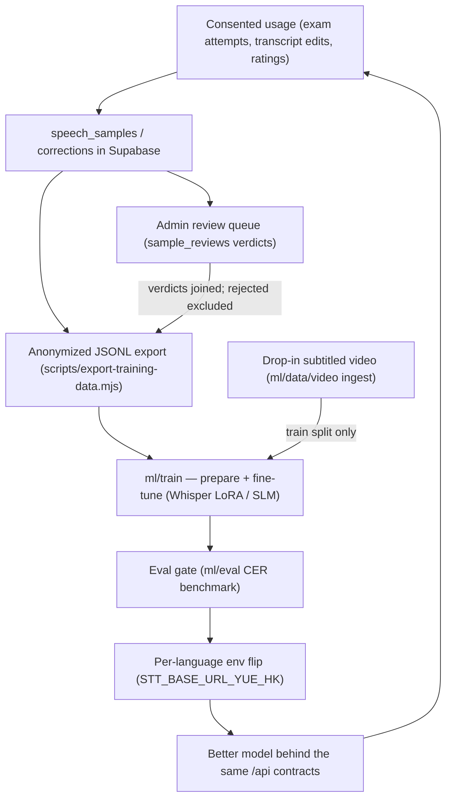

# ML data pipeline (dialect model training)

Goal: a clean, **consented**, labeled corpus of dialect speech that can fine-tune an STT model (e.g. Whisper LoRA) or adapt a small language model to understand Cantonese and, later, other dialects. Everything here is config-gated on Supabase cloud mode.

## Consent model (privacy first)

Two independent flags on the user's profile, both **default OFF**, toggled in Profile settings:

| Flag | Meaning |
|---|---|
| `data_collection_consent` | text-level data may be stored: expected phrase, transcript, correction, score |
| `audio_retention_consent` | additionally, the actual recording may be kept (private storage bucket) |

Enforcement is layered: the app never writes without the flag, **and** the database RLS insert policies re-check the profile flag server-side (`supabase/migrations/0002_ml_data_pipeline.sql`), so a buggy or malicious client cannot insert unconsented rows. Withdrawal of consent deletes the user's rows. All rows cascade-delete with the account.

**Human review**: consented data — transcripts, corrections, scores and (with `audio_retention_consent`) the retained recordings — may be reviewed by trained human reviewers to correct transcriptions and improve the models. The in-app consent copy states this explicitly. Reviewer access requires the `profiles.is_admin` flag, which is granted manually via SQL/dashboard and can never be set through the client API; review verdicts are stored in `sample_reviews` (`supabase/migrations/0005_admin_review.sql`).

## What gets collected (when consented)

| Source | Signal | Why it's valuable |
|---|---|---|
| Exam attempts | `expected_text` + `transcript` + `score` (+ audio) | Gold supervised pairs: known target vs. what STT heard |
| Chat transcript edits | `transcript` + `corrected_text` | Human-labeled STT error corrections |
| Suggestion ratings | thumbs up/down on AI replies | Preference data for reply-generation tuning |

Tables: `speech_samples`, `corrections` (see migration 0002). Audio lands in the private `recordings` storage bucket under `<user_id>/…`, referenced by `audio_url`.

## Export for training

```bash
SUPABASE_URL=https://<ref>.supabase.co \
SUPABASE_SERVICE_ROLE_KEY=<server-only-key> \
node scripts/export-training-data.mjs --language yue-HK --out training-export/
```

Produces `speech_samples.jsonl` + `corrections.jsonl` with user ids replaced by per-export salted hashes (speaker grouping without identity). The service-role key must never be committed or shipped — run this from a trusted machine/CI secret only.

## External drop-in video corpus

The consented in-app corpus is the clean core, but it accumulates slowly. To
bootstrap (and to cover dialects with no public dataset), subtitled dialect
video can be dropped into [`ml/data/video/`](../ml/data/video/README.md):
`ingest-videos.mjs` takes YouTube URLs or local files, cuts audio clips along
manual subtitle cues, optionally rejects clips the ASR disagrees with
(CER-based `--verify` against `/api/transcribe`), and emits train-manifest
rows that append onto `prepare_data.py`'s **train split only** — validation
stays real learner audio. Provenance and license are recorded per source;
see the README's licensing policy (CC/owned/licensed for anything
redistributable, never DRM sources).

## Training path (future)

1. **STT**: Whisper (or gpt-4o-transcribe-class distillation) LoRA fine-tune on `expected_text`/audio pairs, evaluated against the held-out exam scores.
2. **Translation/reply quality**: SLM (e.g. Qwen-class) fine-tuned on correction pairs and rated suggestions.
3. **Serving**: swap models behind the existing `/api/chat` + `/api/transcribe` contracts — the client never changes.

The run scaffolding for these steps lives in [`ml/train/`](../ml/train/README.md): dataset preparation (tested against checked-in fixtures), Whisper-LoRA and SLM SFT/DPO training scripts with `--dry-run` plumbing checks, an STT serving stub matching the `transcribeCore` contract, and the pronunciation-scorer design. Note the corpus currently has **zero samples** — the training scripts are documented scaffolds that cannot run against real data yet; `ml/train/README.md` lists the per-step data gates, costs, and the export → prepare → train → eval-gate → env-flip sequence (companion plan: `docs/ML_TRAINING_PLAN.md`).

End to end it is a loop — a better model improves the app, which drives more consented usage and more data. Review verdicts flow into the export (`review_verdict` / `review_corrected_text`; rejected samples are excluded by default), so admin labeling directly improves the training corpus.


