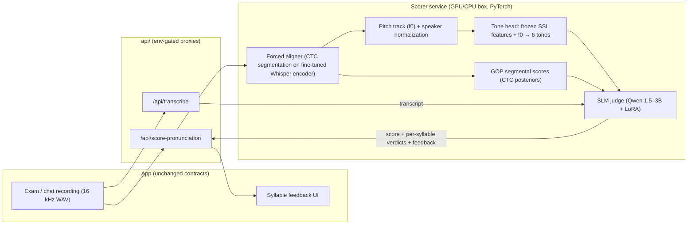
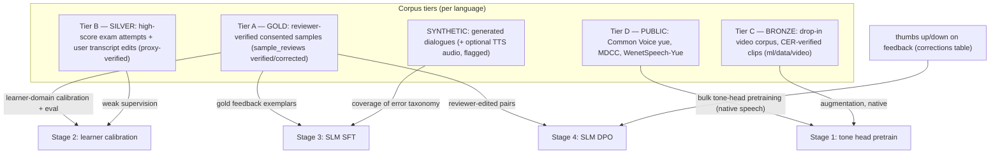
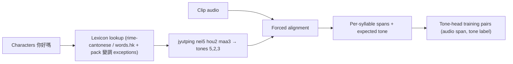
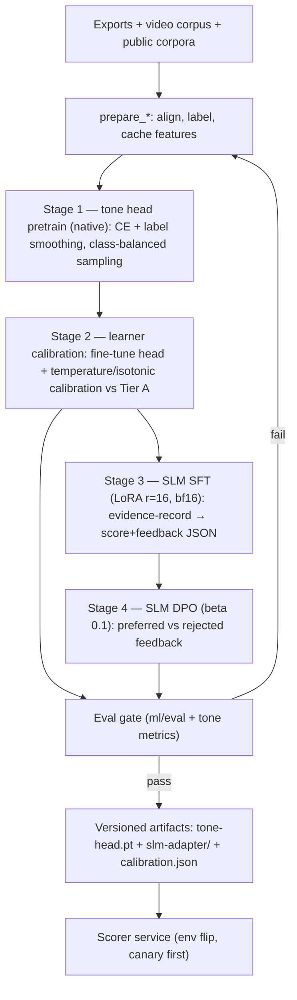
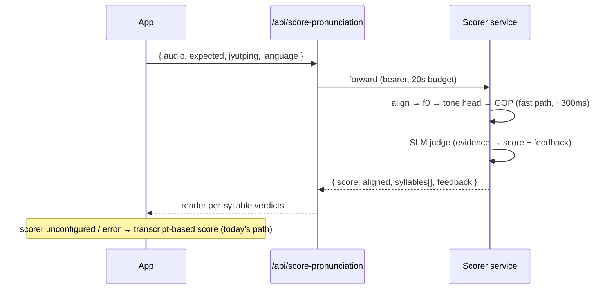
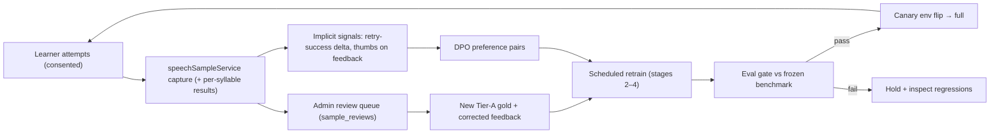
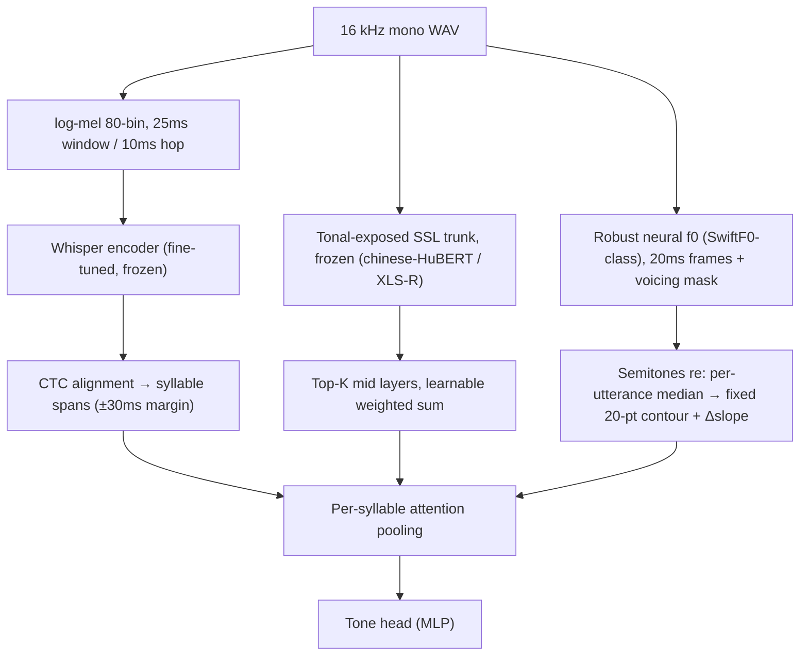
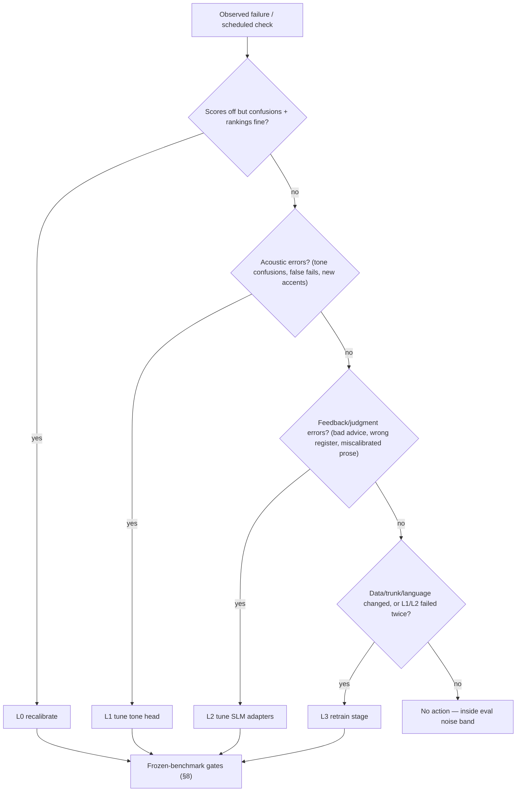
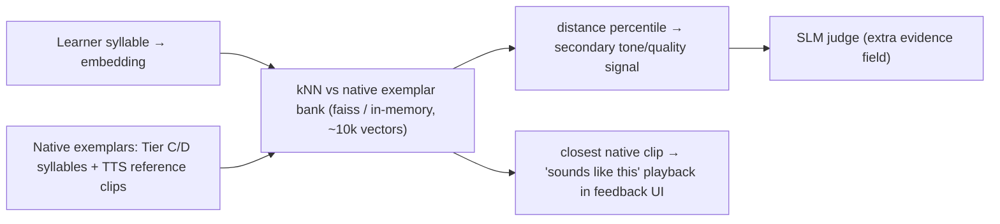

# Tone & Accuracy Detection — Design Report

**Goal**: score a learner's *recording* — not just the transcript — so wrong
tones are caught, explained, and improved over time. This expands
[`ml/train/pronunciation-scorer/DESIGN.md`](../ml/train/pronunciation-scorer/DESIGN.md)
(step 4 of [ML_TRAINING_PLAN](ML_TRAINING_PLAN.md)) into a full architecture,
data-integration, and continuous-improvement design using **PyTorch** for the
acoustic side and a **LoRA-tuned SLM** for judgment and feedback.

Companion docs: [ML_PIPELINE.md](ML_PIPELINE.md) (consent + collection),
[`ml/train/README.md`](../ml/train/README.md) (run scaffolds & data gates),
[`ml/data/video/README.md`](../ml/data/video/README.md) (drop-in video corpus).

---

## 1. The problem with today's scoring

`scoreDialectAccuracy()` sends *text* (expected phrase + STT transcript) to an
LLM. Two failure modes:

1. **Tone-blind pass**: the STT model auto-corrects a learner's wrong tones
   into the right characters → transcript matches → score 100 for speech a
   native listener would not accept. This is *the* canonical heritage-learner
   failure mode.
2. **Unhelpful failure**: when the transcript differs, the LLM can only guess
   *why* — it never heard the audio, so feedback like "watch your tones" is
   generic instead of "嗰 came out as tone 5 (rising), it should be tone 3".

## 2. Design principle: an SLM cannot hear — split the roles

A text-only SLM, LoRA or not, has no access to pitch. Asking it to "detect
tones" from a transcript is asking it to hallucinate. The architecture
therefore splits cleanly:

| Role | Component | Framework | Trained with |
|---|---|---|---|
| **Hear** — per-syllable tone + segment quality from audio | Acoustic scorer (aligner + tone head + GOP) | PyTorch | supervised tone labels derived from text (free — §4.2) |
| **Judge & explain** — fuse noisy evidence into a calibrated score + feedback a learner can act on | SLM judge (Qwen-class, LoRA) | PyTorch + PEFT | SFT on structured examples, then DPO on preferences (§5.3, §7) |

The acoustic layer produces *evidence*; the SLM turns evidence into
*teaching*. Each is small, cheap, and independently testable — and a failure
in one degrades gracefully (evidence without prose, or prose from
transcript-only fallback, which is today's behavior).

## 3. System architecture



Component notes:

- **Aligner**: CTC segmentation using the step-2 fine-tuned Whisper encoder
  (better on learner-accented audio than a generic MFA model, and one less
  toolchain). MFA + Cantonese lexicon stays the fallback if CTC alignment
  proves unstable. Alignment failure is itself a signal ("did not say the
  expected phrase") and must surface as such, never as a fabricated score.
- **Tone head**: per aligned syllable, concatenate (a) pooled frozen
  self-supervised features (wav2vec2-XLSR or the Whisper encoder's hidden
  states — no fine-tuning of the trunk) and (b) explicit prosodic features:
  z-scored log-f0 contour resampled to fixed length, energy, duration. A
  2–3 layer MLP (~1M params) classifies tone 1–6. Explicit f0 input matters:
  it gives the model the *right* inductive bias and keeps it interpretable
  (the contour can be shown to the user later). §12 refines every frontend
  choice here with published evidence (trunk selection, layer choice, pitch
  extractor, pooling).
- **Speaker normalization**: per-utterance z-score of log-f0. Heritage
  learners span children to elderly; absolute pitch is meaningless, only the
  contour and relative height within the speaker's range count.
- **SLM judge**: input is a compact structured record (expected text +
  jyutping, transcript, per-syllable `{expected_tone, predicted_tone,
  confidence, gop}`, alignment status); output is JSON: `{score, syllables:
  [...], feedback}` with feedback written for this app's Singapore-usage
  register. LoRA (r=16, attn+MLP targets) on a 1.5–3B base — small enough to
  serve on CPU via llama.cpp if needed.

## 4. Data integration

### 4.1 Trust-tiered corpus

Every source the project already has (or has tooling for) slots into one
tiered pool. Tiers control *what each source is allowed to teach*.



Rules that make this work:

- **Eval sets come only from Tier A**, split by speaker hash (never by row)
  exactly as `prepare_data.py` does. Lower tiers may leak noise into
  training; they must never define truth.
- **Native ≠ learner**: Tiers C/D are native speech — perfect for teaching
  *what tones sound like*, wrong for calibrating *how learners fail*. Stage 1
  uses them; Stage 2 adapts on learner audio. Skipping stage 2 is the classic
  way these scorers end up harsh and useless.
- **Synthetic TTS audio is quarantined**: usable to cover rare tones/syllables
  in stage 1 with a `synthetic=true` flag and a sampling cap (≤10%), because
  TTS prosody is *idealized* — a tone head trained mostly on TTS overfits to
  studio contours and punishes natural speech.
- **Provenance travels with every row** (`origin`, license, tier, verdicts —
  the export and video-ingest tools already emit this), so any later question
  "what trained this checkpoint?" is answerable, and consent withdrawal can
  propagate (delete rows → next retrain excludes them).

### 4.2 Where tone labels come from (no human tone-labeling, ever)



The transcript's characters, run through a canonical lexicon, yield the tone
number for every syllable; alignment attaches each label to its audio span.
Ambiguities are handled deterministically: heteronyms (多音字) resolved by the
lexicon's word-level entries; the pack carries the small Cantonese changed-tone
(變調) exception list. For Hokkien/Teochew later, one extra rule layer (tone
sandhi applied left-to-right, citation tone kept phrase-finally) lives in the
language pack — same lookup contract, different rules.

### 4.3 Integration mechanics

One prepare step per model, all consuming the same tiered exports:

- `prepare_tone_data.py` (new, `ml/train/tone-scorer/`): reads Tier A–D
  manifests → aligns → emits cached **feature shards** (pooled SSL features +
  f0 contours per syllable, `.pt` files). Features are computed once and
  reused across experiments — the single biggest efficiency lever; retraining
  the 1M-param head takes minutes on CPU after that.
- `prepare_sft_data.py` / `prepare_dpo_data.py` (exist, `ml/train/slm-dialogue/`):
  extended with the scorer record type — each gold sample becomes
  (structured evidence → reviewer-approved score + feedback text).
- Mixing is declared in `config.yaml` per stage (tier sampling weights,
  synthetic cap), not hard-coded — experiments change a config, not code.

## 5. Training pipeline (PyTorch specifics)



| Stage | Trains | Compute | Notes |
|---|---|---|---|
| 1. Tone pretrain | MLP head only (trunk frozen) | 1× T4 hours / CPU overnight | cross-entropy + label smoothing 0.1; class-balanced batches (tone 4/6 are rarer); augment with pitch-preserving noise/tempo (never pitch-shift — it destroys the label) |
| 2. Calibration | head fine-tune (low LR) + isotonic calibration | minutes–hours | early-stop on Tier-A held-out speakers; produce `calibration.json` mapping raw confidence → probability |
| 3. SLM SFT | LoRA adapters | 1× A10/A100 hours | bf16, gradient checkpointing, 8-bit AdamW; sequences are short (~1k tokens) so batches are large |
| 4. SLM DPO | LoRA adapters | 1× A10 hours | pairs from §7; keep an SFT anchor (small SFT replay mix) to prevent style drift |

Efficiency levers, in order of impact: cached features (§4.3) → frozen trunks
(only ~1M + LoRA params ever hold gradients) → bf16 + 8-bit optimizer →
short structured SLM sequences. Nothing here needs multi-GPU.

## 6. Inference flow & contract



Response shape (extends the existing DESIGN.md sketch):

```json
{
  "score": 78,
  "aligned": true,
  "syllables": [
    { "syllable": "gwo2", "expectedTone": 2, "predictedTone": 5, "toneConfidence": 0.86, "gop": 0.71 }
  ],
  "feedback": "「嗰」個音調高咗 — 試下由中間音開始升。"
}
```

Latency budget: alignment + tone head are milliseconds; the SLM at 1.5–3B
with ~150 output tokens fits well inside the app's 20 s upstream budget even
on CPU, and ~1 s on a T4. If the SLM is temporarily down, the service returns
evidence with `feedback: null` — the app still shows per-syllable tones.

## 7. Reinforcement & continuous improvement

No online RL — the loop is **collect preferences → DPO offline → gate →
ship**, which is stable, auditable, and consent-compatible.



Signal inventory (all already have storage homes):

| Signal | Source | Used for |
|---|---|---|
| Reviewer verdicts + corrected text/scores | `sample_reviews` | new gold (stage 2 calibration, SFT exemplars) |
| Thumbs on feedback | `corrections` (`suggestion_rating` kind, context = scorer payload) | DPO pairs (chosen = liked / reviewer-edited; rejected = disliked / model original) |
| **Retry-success delta** | exam flow: score(t+1) − score(t) after feedback shown | the closest thing to true reward — feedback that *causes improvement* is preferred; aggregate per feedback template before trusting it |
| Low-confidence / high-disagreement samples | tone head vs SLM vs LLM-fallback disagreement | **active learning**: routed to the top of the review queue, so human effort lands where the model is weakest |

Cadence and safety:

- Retrain stages 2–4 when ≥ N new gold samples (start N=200) or monthly —
  but always at the *cheapest level that addresses the observed failure*;
  the full retrain-vs-tune ladder is §13.
- Every retrain evaluates against a **frozen benchmark set** (never grows,
  never trains) plus the growing Tier-A eval; both must pass §8 gates.
- Ship via per-language env flip on a preview deployment first; rollback =
  unset the variable (the pattern every model in this project uses).
- Consent withdrawal deletes rows; the next retrain runs from scratch on the
  filtered corpus — adapters are cheap to rebuild by design.

## 8. Evaluation & ship gates

| Metric | Measured on | Gate (initial) |
|---|---|---|
| Tone accuracy (per-syllable) | Tier-A held-out speakers | ≥ 85% overall |
| Confusable-pair recall: T2↔T5, T3↔T6 | same | ≥ 75% each — these pairs are where Cantonese scorers actually fail; report the full 6×6 confusion matrix per run |
| Score–human correlation (Pearson) | reviewer-scored subset | ≥ 0.8, and strictly better than the transcript-only baseline |
| False-fail rate on reviewer-verified *good* audio | same | ≤ 5% — a scorer that punishes correct speech kills learner trust fastest |
| Feedback quality | frontier-LLM judge + human spot-check (n=50) | preferred over SFT-only ≥ 60% (post-DPO) |
| Alignment failure honesty | synthetic wrong-phrase probes | 100% reported as `aligned: false`, never scored |
| Latency p95 | service | < 3 s perceived in exam UX |

## 9. Alternative considered: single audio-LLM (and why not now)

A LoRA-tuned audio-capable SLM (Qwen2-Audio class) could ingest the WAV
directly and output judgment in one model. Rejected as the primary path:
7B+ serving cost, no interpretable per-syllable evidence (harder to render
the tone UI and harder to debug), and tone supervision would be implicit
again — the exact weakness this design removes. It remains a clean future
experiment because the serving contract (§6) hides the implementation: if an
audio-LLM ever beats the split system on §8 gates, it can replace the service
internals without touching the app.

## 10. Risks & mitigations

| Risk | Mitigation |
|---|---|
| Alignment quality on hesitant learner audio | CTC segmentation on the *learner-fine-tuned* Whisper encoder; report `aligned:false` honestly; MFA fallback |
| Code-switching (SG reality: English/Malay words mid-phrase) | lexicon marks non-tonal syllables → excluded from tone scoring, not punished |
| Tiny gold corpus early | stages decouple: 1/3 run on public+synthetic data today; 2/4 wait for the data gates (`ml/train/README.md`) |
| TTS-synthetic prosody bias | quarantine flag + ≤10% cap (§4.1) |
| Score inflation/deflation drift after retrains | frozen benchmark + false-fail gate (§8) |
| Privacy | consent flags + RLS already enforced; per-syllable capture rows go through the same `speechSampleService` gating |

## 11. Milestones (data-gated, not calendar-gated)

| Milestone | Prerequisite | Deliverable |
|---|---|---|
| M1 — tone head v0 | public corpora only (available now) | `ml/train/tone-scorer/` with prepare/train/eval, confusion matrix on Common Voice yue |
| M2 — scorer service v0 | M1 + step-2 Whisper fine-tune | aligner + tone head + GOP behind `/api/score-pronunciation`, feedback = template text (no SLM yet) |
| M3 — SLM judge | ~200 reviewer-scored samples | SFT adapter; feedback quality eval |
| M4 — DPO loop live | ~500 preference events | first DPO retrain through the full gate → canary |
| M5 — Hokkien pack | Tier D for nan (TAT/Common Voice) + sandhi rules in pack | same stack, second language |

Estimated total compute across M1–M4: well under $300 (consistent with the
plan's step-4 "< $100" for the acoustic side; the SLM stages dominate).

## 12. How sound enters the model — audio frontend (research-backed)

The scorer's quality is bounded by its frontend: how the waveform becomes
tensors. Three parallel streams, each with a specific job:



Each choice, with the evidence behind it:

1. **Use an SSL trunk that has seen tonal languages.** Probing studies across
   Mandarin/Cantonese/Vietnamese show lexical tone emerges in SSL
   representations, that fine-tuning on tonal corpora *strengthens* tone
   encoding, and that fine-tuning on non-tonal languages *degrades* it
   ([Shen et al., NAACL 2024](https://arxiv.org/pdf/2403.16865)). So:
   chinese-HuBERT-large or multilingual XLS-R/MMS, not an English-centric
   trunk — and the step-2 Cantonese-fine-tuned Whisper encoder is itself a
   strong candidate (its fine-tune is tonal by construction).
2. **Take mid-network layers, not the last layer.** Layer-wise analyses show
   acoustic/prosodic information peaks in central layers (5–7 of base
   models, 8–11 of large) and *decreases* toward the output layers, which
   specialize toward the pretraining objective
   ([Pasad et al.](https://www.semanticscholar.org/paper/a7d61ab4a3442fd2382f6c11f991421c0d98674a);
   [Mandarin/English suprasegmentals study](https://arxiv.org/pdf/2408.13678)).
   Procedure: probe each layer once with a linear tone classifier on Common
   Voice yue, cache the top-K (K≈3) layers, learn softmax weights over them
   (SUPERB-style). Re-run the probe whenever the trunk changes (§13 L3).
3. **Keep the explicit pitch stream, with a modern extractor.** SSL features
   correlate with f0 but explicit contours add robustness + interpretability.
   Extractor: a SwiftF0-class small neural model — 91.8% harmonic mean at
   10 dB SNR (+12 pts over CREPE) at ~42× CREPE's CPU speed with <100k params
   ([SwiftF0, 2025](https://arxiv.org/abs/2508.18440)) — noisy phone-mic
   audio at home is exactly the 10 dB regime. Convert Hz → **semitones
   relative to the utterance median** (perceptually linear, speaker-free);
   append Δ-slope, energy, duration. Unvoiced/failed-f0 syllables are marked
   `unscoreable`, never guessed.
4. **No discrete audio tokens anywhere in the tone path.** Quantizing SSL
   features into discrete units measurably loses suprasegmental information —
   tone is precisely what survives worst
   ([DSU tone probing](https://arxiv.org/pdf/2410.19935);
   ["Lexical tone is hard to quantize", 2026](https://arxiv.org/abs/2604.07467)).
   Codec-token pipelines are fine for TTS/dialogue elsewhere; the scorer
   stays on continuous features.
5. **Augment without touching the label.** Allowed: additive noise, room
   impulse responses, mild EQ, tempo change via pitch-preserving WSOLA.
   Forbidden: pitch shifting or naive resampling — both alter f0 and
   silently corrupt every tone label they touch.
6. **Cache what the head actually reads** (updates §4.3): per syllable, the
   K pooled layer vectors + the 20-pt semitone contour + scalars, stored
   fp16. Full-trunk activations are never stored; a feature-shard rebuild is
   only needed when the trunk or K changes.

## 13. Retrain vs tune — operational policy

Principle: **run the cheapest level that plausibly fixes the observed
failure; escalate only after the level below fails its gate twice.** All
levels end at the §8 gates on the frozen benchmark before anything ships.

| Level | What changes | Typical cost | Triggers |
|---|---|---|---|
| **L0 — Recalibrate** | temperature / isotonic map only (`calibration.json`) | minutes, CPU | scores drift vs reviewer scores but confusion matrix + rankings stable |
| **L1 — Tune the tone head** | stage-2 fine-tune (low LR, few epochs), optionally re-fit layer weights | minutes–1 h | ≥200 new gold learner samples; false-fail rate ↑ >2 pts; a confusable-pair recall ↓ >3 pts; new accent cluster appears in review queue |
| **L2 — Tune the SLM adapters** | incremental SFT delta and/or a DPO round (LoRA only) | hours, 1 GPU | ≥500 new preference events; feedback complaints (wrong register, unhelpful advice); new error-taxonomy category added |
| **L3 — Retrain a stage** | stage-1 tone pretrain redo, trunk swap (re-probe layers, rebuild feature cache), STT re-fine-tune, or new language pack | day-scale, 1 GPU | new public corpus adopted; SSL trunk upgrade; consent deletions >10% of a tier; L1 attempted twice without clearing its gate; new dialect (Hokkien/Teochew) |



Anti-churn rules:

- **Define the noise band first**: bootstrap ±1σ on the frozen benchmark per
  metric; movements inside the band trigger nothing. A single user complaint
  is a review-queue item, not a retrain trigger.
- **One level per incident**: never bundle an L1 and an L2 in one release —
  if the gates move, you must know which change moved them.
- **Retraining is rebuildable, not precious**: adapters + a 1M-param head +
  declarative data configs mean any level can be reproduced from exports;
  this is also what makes consent-withdrawal re-runs (§7) cheap.
- **Scheduled floor**: even with no triggers, run the L0 check monthly with
  the eval report — drift you haven't measured is drift you don't know about.

## 14. Vector training & retrieval — where embeddings fit

Vectors are already the substrate of §12 (every syllable becomes an SSL
feature vector). Two deliberate upgrades make the vector space itself a
scoring asset:

1. **Contrastive tone embeddings (metric learning).** Instead of training the
   MLP head with cross-entropy alone, add a supervised-contrastive term:
   syllables with the same tone are pulled together, different tones pushed
   apart, in a small projection space (~128-d). Loss:
   `CE + λ·SupCon` (λ≈0.5, temperature 0.07). This directly attacks the
   confusable pairs (T2↔T5, T3↔T6) that plain CE separates worst, because
   the margin between clusters is optimized explicitly. Adoption trigger
   (per §13 discipline): only if L1 tuning twice fails the confusable-pair
   gate — it's an upgrade path, not day-one complexity.
2. **Exemplar retrieval — score against real native voices, not just a
   classifier.** Embed a bank of native reference syllables/words (from
   Tier C/D corpora + the app's own TTS reference audio) in the same space:



   The distance percentile is a second, classifier-free opinion the SLM can
   weigh, and the nearest native clip enables the single most concrete piece
   of feedback a learner can get: *hear the closest correct example*.

Storage pragmatics: the exemplar bank is small (tens of thousands of 128-d
vectors ≈ a few MB) — an in-memory faiss/NumPy index inside the scorer
service is enough; no vector database is needed at this scale. If app-side
retrieval is wanted later (e.g. retrieval-prompted examples in chat), Supabase
already supports **pgvector** — store only consent-clean or public-corpus
embeddings there, never raw learner audio vectors, and treat embeddings as
personal data for consent-withdrawal purposes (delete rows like any other).

## 15. Gradio ML workbench — testing before wiring

A thin [Gradio](https://www.gradio.app) app, `ml/workbench/app.py`, as the ML
engineer's cockpit — the place to *see* what the models do before any env
flip. Tabs:

| Tab | What it shows | Backed by |
|---|---|---|
| **Scorer playground** | record/upload → alignment table, per-syllable tone verdicts with confidence, f0 contour plot vs a native exemplar's contour, SLM feedback text | scorer service (§6) or local checkpoints |
| **STT A/B** | one recording → baseline (`gpt-4o-transcribe`) vs fine-tuned Whisper side by side, with CER against a typed reference | `/api/transcribe` + local CT2 model |
| **Corpus browser** | filter by tier/language/verdict → play clip, see label, provenance, review verdict; flag rows for the admin queue | local export + video-corpus JSONL |
| **Eval report** | latest frozen-benchmark run: confusion matrix heatmap, gate pass/fail per §8 | `ml/eval` outputs |

Boundaries that keep it safe and honest:

- **Localhost, trusted machine only** — it reads local exports and local
  model dirs; it never gets production DB credentials. The in-app admin
  review queue (`sample_reviews`) remains the *only* production labeling
  surface; the workbench can stage flags but reviewers confirm in-app.
- **Demo ≠ eval**: the playground is for intuition and bug-spotting; ship
  decisions come only from the frozen-benchmark gates (§8). A model that
  "sounds right" in Gradio but fails a gate does not ship.
- Effort: Gradio's audio components (mic record, waveform, `gr.Plot`) make
  this a ~1–2 day build once the scorer service exists (M2) — schedule it
  with M2, since that's the first moment there's something to look at.

### References (§12)

- [Shen et al., *Encoding of lexical tone in self-supervised models of spoken language*, NAACL 2024](https://arxiv.org/pdf/2403.16865)
- [Pasad et al., *Layer-wise analysis of a self-supervised speech representation model*](https://www.semanticscholar.org/paper/a7d61ab4a3442fd2382f6c11f991421c0d98674a)
- [*A layer-wise analysis of Mandarin and English suprasegmentals in SSL speech models*](https://arxiv.org/pdf/2408.13678)
- [*Do discrete self-supervised representations of speech capture tone distinctions?*](https://arxiv.org/pdf/2410.19935) · [*Lexical tone is hard to quantize* (2026)](https://arxiv.org/abs/2604.07467)
- [*SwiftF0: fast and accurate monophonic pitch detection* (2025)](https://arxiv.org/abs/2508.18440) · [pitch-benchmark suite](https://github.com/lars76/pitch-benchmark)

---

*Everything in this report reuses existing project contracts: capture and
consent (`speechSampleService`, migrations 0002/0005), exports
(`scripts/export-training-data.mjs`), the video corpus
(`ml/data/video/`), run scaffolds (`ml/train/`), the eval harness
(`ml/eval/`), and env-gated serving (`api/_lib/languageManifest.js`). New
surface area is exactly two things: the `ml/train/tone-scorer/` training
directory and the `/api/score-pronunciation` proxy already sketched in the
step-4 DESIGN.md.*
