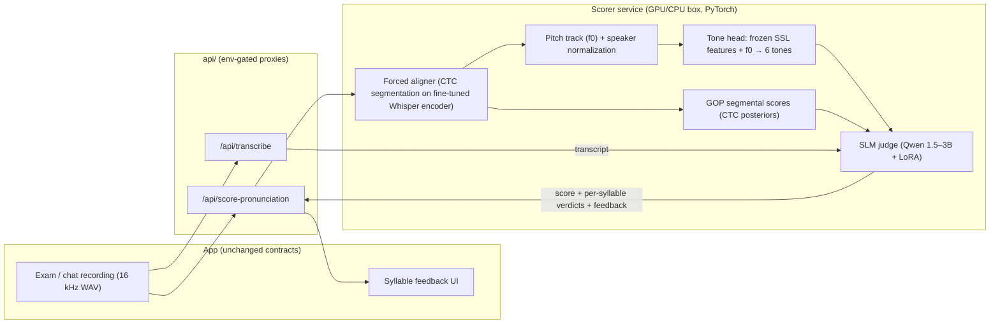
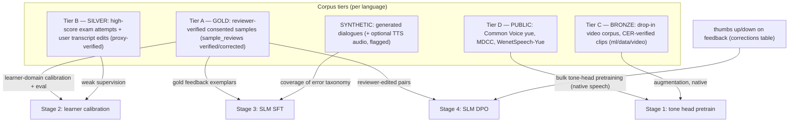
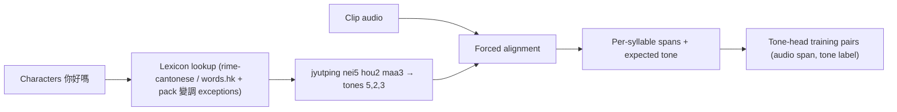
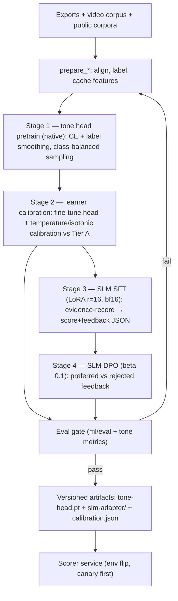
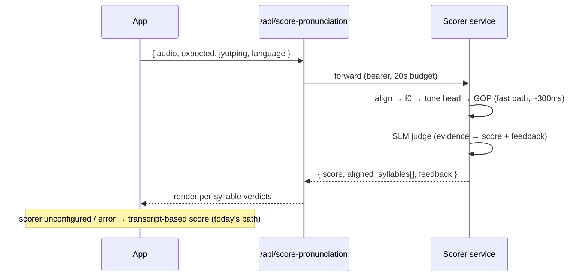
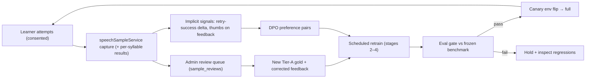

# Tone & Accuracy Detection — Design Report

**Goal**: score a learner's *recording* — not just the transcript — so wrong
tones are caught, explained, and improved over time. This expands
[`ml/train/pronunciation-scorer/DESIGN.md`](../ml/train/pronunciation-scorer/DESIGN.md)
(step 4 of [ML_TRAINING_PLAN](ML_TRAINING_PLAN.md)) into a full architecture,
data-integration, and continuous-improvement design using **PyTorch** for the
acoustic side and a **LoRA-tuned SLM** for judgment and feedback.

Companion docs: [ML_PIPELINE.md](ML_PIPELINE.md) (consent + collection),
[`ml/train/README.md`](../ml/train/README.md) (run scaffolds & data gates),
[`ml/data/video/README.md`](../ml/data/video/README.md) (drop-in video corpus).

---

## 1. The problem with today's scoring

`scoreDialectAccuracy()` sends *text* (expected phrase + STT transcript) to an
LLM. Two failure modes:

1. **Tone-blind pass**: the STT model auto-corrects a learner's wrong tones
   into the right characters → transcript matches → score 100 for speech a
   native listener would not accept. This is *the* canonical heritage-learner
   failure mode.
2. **Unhelpful failure**: when the transcript differs, the LLM can only guess
   *why* — it never heard the audio, so feedback like "watch your tones" is
   generic instead of "嗰 came out as tone 5 (rising), it should be tone 3".

## 2. Design principle: an SLM cannot hear — split the roles

A text-only SLM, LoRA or not, has no access to pitch. Asking it to "detect
tones" from a transcript is asking it to hallucinate. The architecture
therefore splits cleanly:

| Role | Component | Framework | Trained with |
|---|---|---|---|
| **Hear** — per-syllable tone + segment quality from audio | Acoustic scorer (aligner + tone head + GOP) | PyTorch | supervised tone labels derived from text (free — §4.2) |
| **Judge & explain** — fuse noisy evidence into a calibrated score + feedback a learner can act on | SLM judge (Qwen-class, LoRA) | PyTorch + PEFT | SFT on structured examples, then DPO on preferences (§5.3, §7) |

The acoustic layer produces *evidence*; the SLM turns evidence into
*teaching*. Each is small, cheap, and independently testable — and a failure
in one degrades gracefully (evidence without prose, or prose from
transcript-only fallback, which is today's behavior).

## 3. System architecture



Component notes:

- **Aligner**: CTC segmentation using the step-2 fine-tuned Whisper encoder
  (better on learner-accented audio than a generic MFA model, and one less
  toolchain). MFA + Cantonese lexicon stays the fallback if CTC alignment
  proves unstable. Alignment failure is itself a signal ("did not say the
  expected phrase") and must surface as such, never as a fabricated score.
- **Tone head**: per aligned syllable, concatenate (a) pooled frozen
  self-supervised features (wav2vec2-XLSR or the Whisper encoder's hidden
  states — no fine-tuning of the trunk) and (b) explicit prosodic features:
  z-scored log-f0 contour resampled to fixed length, energy, duration. A
  2–3 layer MLP (~1M params) classifies tone 1–6. Explicit f0 input matters:
  it gives the model the *right* inductive bias and keeps it interpretable
  (the contour can be shown to the user later).
- **Speaker normalization**: per-utterance z-score of log-f0. Heritage
  learners span children to elderly; absolute pitch is meaningless, only the
  contour and relative height within the speaker's range count.
- **SLM judge**: input is a compact structured record (expected text +
  jyutping, transcript, per-syllable `{expected_tone, predicted_tone,
  confidence, gop}`, alignment status); output is JSON: `{score, syllables:
  [...], feedback}` with feedback written for this app's Singapore-usage
  register. LoRA (r=16, attn+MLP targets) on a 1.5–3B base — small enough to
  serve on CPU via llama.cpp if needed.

## 4. Data integration

### 4.1 Trust-tiered corpus

Every source the project already has (or has tooling for) slots into one
tiered pool. Tiers control *what each source is allowed to teach*.



Rules that make this work:

- **Eval sets come only from Tier A**, split by speaker hash (never by row)
  exactly as `prepare_data.py` does. Lower tiers may leak noise into
  training; they must never define truth.
- **Native ≠ learner**: Tiers C/D are native speech — perfect for teaching
  *what tones sound like*, wrong for calibrating *how learners fail*. Stage 1
  uses them; Stage 2 adapts on learner audio. Skipping stage 2 is the classic
  way these scorers end up harsh and useless.
- **Synthetic TTS audio is quarantined**: usable to cover rare tones/syllables
  in stage 1 with a `synthetic=true` flag and a sampling cap (≤10%), because
  TTS prosody is *idealized* — a tone head trained mostly on TTS overfits to
  studio contours and punishes natural speech.
- **Provenance travels with every row** (`origin`, license, tier, verdicts —
  the export and video-ingest tools already emit this), so any later question
  "what trained this checkpoint?" is answerable, and consent withdrawal can
  propagate (delete rows → next retrain excludes them).

### 4.2 Where tone labels come from (no human tone-labeling, ever)



The transcript's characters, run through a canonical lexicon, yield the tone
number for every syllable; alignment attaches each label to its audio span.
Ambiguities are handled deterministically: heteronyms (多音字) resolved by the
lexicon's word-level entries; the pack carries the small Cantonese changed-tone
(變調) exception list. For Hokkien/Teochew later, one extra rule layer (tone
sandhi applied left-to-right, citation tone kept phrase-finally) lives in the
language pack — same lookup contract, different rules.

### 4.3 Integration mechanics

One prepare step per model, all consuming the same tiered exports:

- `prepare_tone_data.py` (new, `ml/train/tone-scorer/`): reads Tier A–D
  manifests → aligns → emits cached **feature shards** (pooled SSL features +
  f0 contours per syllable, `.pt` files). Features are computed once and
  reused across experiments — the single biggest efficiency lever; retraining
  the 1M-param head takes minutes on CPU after that.
- `prepare_sft_data.py` / `prepare_dpo_data.py` (exist, `ml/train/slm-dialogue/`):
  extended with the scorer record type — each gold sample becomes
  (structured evidence → reviewer-approved score + feedback text).
- Mixing is declared in `config.yaml` per stage (tier sampling weights,
  synthetic cap), not hard-coded — experiments change a config, not code.

## 5. Training pipeline (PyTorch specifics)



| Stage | Trains | Compute | Notes |
|---|---|---|---|
| 1. Tone pretrain | MLP head only (trunk frozen) | 1× T4 hours / CPU overnight | cross-entropy + label smoothing 0.1; class-balanced batches (tone 4/6 are rarer); augment with pitch-preserving noise/tempo (never pitch-shift — it destroys the label) |
| 2. Calibration | head fine-tune (low LR) + isotonic calibration | minutes–hours | early-stop on Tier-A held-out speakers; produce `calibration.json` mapping raw confidence → probability |
| 3. SLM SFT | LoRA adapters | 1× A10/A100 hours | bf16, gradient checkpointing, 8-bit AdamW; sequences are short (~1k tokens) so batches are large |
| 4. SLM DPO | LoRA adapters | 1× A10 hours | pairs from §7; keep an SFT anchor (small SFT replay mix) to prevent style drift |

Efficiency levers, in order of impact: cached features (§4.3) → frozen trunks
(only ~1M + LoRA params ever hold gradients) → bf16 + 8-bit optimizer →
short structured SLM sequences. Nothing here needs multi-GPU.

## 6. Inference flow & contract



Response shape (extends the existing DESIGN.md sketch):

```json
{
  "score": 78,
  "aligned": true,
  "syllables": [
    { "syllable": "gwo2", "expectedTone": 2, "predictedTone": 5, "toneConfidence": 0.86, "gop": 0.71 }
  ],
  "feedback": "「嗰」個音調高咗 — 試下由中間音開始升。"
}
```

Latency budget: alignment + tone head are milliseconds; the SLM at 1.5–3B
with ~150 output tokens fits well inside the app's 20 s upstream budget even
on CPU, and ~1 s on a T4. If the SLM is temporarily down, the service returns
evidence with `feedback: null` — the app still shows per-syllable tones.

## 7. Reinforcement & continuous improvement

No online RL — the loop is **collect preferences → DPO offline → gate →
ship**, which is stable, auditable, and consent-compatible.



Signal inventory (all already have storage homes):

| Signal | Source | Used for |
|---|---|---|
| Reviewer verdicts + corrected text/scores | `sample_reviews` | new gold (stage 2 calibration, SFT exemplars) |
| Thumbs on feedback | `corrections` (`suggestion_rating` kind, context = scorer payload) | DPO pairs (chosen = liked / reviewer-edited; rejected = disliked / model original) |
| **Retry-success delta** | exam flow: score(t+1) − score(t) after feedback shown | the closest thing to true reward — feedback that *causes improvement* is preferred; aggregate per feedback template before trusting it |
| Low-confidence / high-disagreement samples | tone head vs SLM vs LLM-fallback disagreement | **active learning**: routed to the top of the review queue, so human effort lands where the model is weakest |

Cadence and safety:

- Retrain stages 2–4 when ≥ N new gold samples (start N=200) or monthly.
- Every retrain evaluates against a **frozen benchmark set** (never grows,
  never trains) plus the growing Tier-A eval; both must pass §8 gates.
- Ship via per-language env flip on a preview deployment first; rollback =
  unset the variable (the pattern every model in this project uses).
- Consent withdrawal deletes rows; the next retrain runs from scratch on the
  filtered corpus — adapters are cheap to rebuild by design.

## 8. Evaluation & ship gates

| Metric | Measured on | Gate (initial) |
|---|---|---|
| Tone accuracy (per-syllable) | Tier-A held-out speakers | ≥ 85% overall |
| Confusable-pair recall: T2↔T5, T3↔T6 | same | ≥ 75% each — these pairs are where Cantonese scorers actually fail; report the full 6×6 confusion matrix per run |
| Score–human correlation (Pearson) | reviewer-scored subset | ≥ 0.8, and strictly better than the transcript-only baseline |
| False-fail rate on reviewer-verified *good* audio | same | ≤ 5% — a scorer that punishes correct speech kills learner trust fastest |
| Feedback quality | frontier-LLM judge + human spot-check (n=50) | preferred over SFT-only ≥ 60% (post-DPO) |
| Alignment failure honesty | synthetic wrong-phrase probes | 100% reported as `aligned: false`, never scored |
| Latency p95 | service | < 3 s perceived in exam UX |

## 9. Alternative considered: single audio-LLM (and why not now)

A LoRA-tuned audio-capable SLM (Qwen2-Audio class) could ingest the WAV
directly and output judgment in one model. Rejected as the primary path:
7B+ serving cost, no interpretable per-syllable evidence (harder to render
the tone UI and harder to debug), and tone supervision would be implicit
again — the exact weakness this design removes. It remains a clean future
experiment because the serving contract (§6) hides the implementation: if an
audio-LLM ever beats the split system on §8 gates, it can replace the service
internals without touching the app.

## 10. Risks & mitigations

| Risk | Mitigation |
|---|---|
| Alignment quality on hesitant learner audio | CTC segmentation on the *learner-fine-tuned* Whisper encoder; report `aligned:false` honestly; MFA fallback |
| Code-switching (SG reality: English/Malay words mid-phrase) | lexicon marks non-tonal syllables → excluded from tone scoring, not punished |
| Tiny gold corpus early | stages decouple: 1/3 run on public+synthetic data today; 2/4 wait for the data gates (`ml/train/README.md`) |
| TTS-synthetic prosody bias | quarantine flag + ≤10% cap (§4.1) |
| Score inflation/deflation drift after retrains | frozen benchmark + false-fail gate (§8) |
| Privacy | consent flags + RLS already enforced; per-syllable capture rows go through the same `speechSampleService` gating |

## 11. Milestones (data-gated, not calendar-gated)

| Milestone | Prerequisite | Deliverable |
|---|---|---|
| M1 — tone head v0 | public corpora only (available now) | `ml/train/tone-scorer/` with prepare/train/eval, confusion matrix on Common Voice yue |
| M2 — scorer service v0 | M1 + step-2 Whisper fine-tune | aligner + tone head + GOP behind `/api/score-pronunciation`, feedback = template text (no SLM yet) |
| M3 — SLM judge | ~200 reviewer-scored samples | SFT adapter; feedback quality eval |
| M4 — DPO loop live | ~500 preference events | first DPO retrain through the full gate → canary |
| M5 — Hokkien pack | Tier D for nan (TAT/Common Voice) + sandhi rules in pack | same stack, second language |

Estimated total compute across M1–M4: well under $300 (consistent with the
plan's step-4 "< $100" for the acoustic side; the SLM stages dominate).

---

*Everything in this report reuses existing project contracts: capture and
consent (`speechSampleService`, migrations 0002/0005), exports
(`scripts/export-training-data.mjs`), the video corpus
(`ml/data/video/`), run scaffolds (`ml/train/`), the eval harness
(`ml/eval/`), and env-gated serving (`api/_lib/languageManifest.js`). New
surface area is exactly two things: the `ml/train/tone-scorer/` training
directory and the `/api/score-pronunciation` proxy already sketched in the
step-4 DESIGN.md.*
