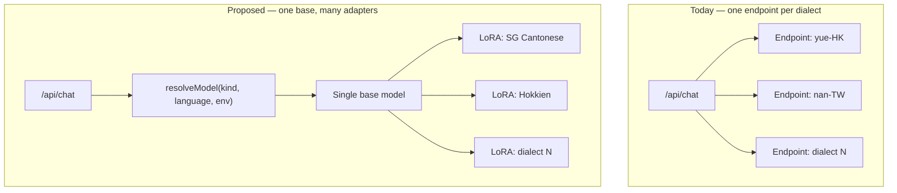

# Model control surface — inference, training, and routing

**Status:** working reference. Companion to [S2ST_FINDINGS.md](S2ST_FINDINGS.md), which supplies
the routing rationale (LID-routed multi-LoRA) and the GRPO rationale summarized below; this
document specifies the control surface itself — every point in the stack where model behavior can
be tuned, what already exists with a real path, and what is proposed.

**Date:** 2026-07-26. Every repo path cited below was opened and confirmed against the current
source on that date.

**Locale note.** As in [S2ST_FINDINGS.md](S2ST_FINDINGS.md), the pack codes `yue-HK` and `nan-TW`
are speech-locale identifiers, not a statement about target audience — all pack content targets
Cantonese and Hokkien as spoken in Singapore.

**What this document does not establish.** The corpus has zero consented samples
([ml/train/README.md:3](../ml/train/README.md:3)). No model referenced below has been trained,
and no row in the "Proposed" column of Table 2 has been built. Every proposed control is a
specification, not a shipped feature or a measured result.

---

## Inference-time

**Table 2.** Model-control surface across three layers: what is tunable today, with a real path in
this repo, and what is proposed. (Table 1, Table 3, and Table 4 live in
[S2ST_FINDINGS.md](S2ST_FINDINGS.md) — Table 4 in its Singapore-local corpus routes section — and
Table 5 lives in [DIALECT_CLASSIFICATION.md](DIALECT_CLASSIFICATION.md). Numbering is shared
across this document set so the companion article can reference each table by the same number.)

| Layer | Control | Today | Proposed |
|---|---|---|---|
| Inference | Voice selection | `GOOGLE_TTS_VOICES` / `asVoiceKey()` in [src/hooks/useGoogleTTS.ts:21](../src/hooks/useGoogleTTS.ts:21) / [:49](../src/hooks/useGoogleTTS.ts:49), default voice `zephyr` | unchanged |
| Inference | Tone / register | persona tone (`personal`/`work`) → `preferredTone` → `casual`, in [src/app/context/ProfileProvider.tsx:33](../src/app/context/ProfileProvider.tsx:33) | expose per-request override |
| Inference | SG vs HK lexicon bias | pack prompt constants in [src/languages/yue-HK/](../src/languages/yue-HK/) | make it an explicit request parameter, not a prompt constant |
| Inference | Dialect strictness | — | new knob; prompt-and-proxy analogue of the survey's `--cfg-coef` — see § Dialect strictness |
| Inference | Scoring harshness | LLM-scored against a fixed rubric, invoked by `scoreDialectAccuracy` in [src/services/translationService.ts:307](../src/services/translationService.ts:307) (rubric location detailed below) | expose threshold; feeds exam difficulty |
| Inference | Latency vs quality | — | model tier per request; depends on routing controls (below) |
| Training | SFT on corrections | planned, [ml/train/slm-dialogue/](../ml/train/slm-dialogue/) | unchanged |
| Training | DPO on ratings | planned, [ml/train/slm-dialogue/train_dpo.py](../ml/train/slm-dialogue/train_dpo.py) | unchanged |
| Training | GRPO on verifiable rewards | — | new; rewards from `pack.scoring.fallbackMatch`, [ml/eval/normalization.json](../ml/eval/normalization.json), stored exam `score` |
| Training | Reward-collapse guardrail | — | mandatory early stopping on held-out dev set (finding F6) |
| Routing | Per-language base URL | `resolveBaseUrl()` in [api/_lib/languageManifest.js:104](../api/_lib/languageManifest.js:104) | unchanged |
| Routing | Per-language model | — | `resolveModel()` — see Proposed additions in detail |
| Routing | Adapter selection by variety | — | LID-routed; depends on the classifier in `DIALECT_CLASSIFICATION.md` |
| Routing | Eval-gated rollout | documented process, [ml/train/README.md:62](../ml/train/README.md:62) (steps 7–8) | unchanged |

The rest of this document walks the table layer by layer, then specifies the routing proposal in
full.

### Voice selection

`GOOGLE_TTS_VOICES` is a static snapshot of the default pack's voice registry;
`getActiveVoices()` / `getDisplayVoices()` resolve the *active* pack's registry at call time so a
language switch is reflected live ([src/hooks/useGoogleTTS.ts:21](../src/hooks/useGoogleTTS.ts:21)).
`asVoiceKey()` ([src/hooks/useGoogleTTS.ts:49](../src/hooks/useGoogleTTS.ts:49)) resolves any
stored identifier — including legacy ElevenLabs voice IDs — to a valid key of the active pack,
falling back to that pack's default. `DEFAULT_VOICE`
([src/hooks/useGoogleTTS.ts:24](../src/hooks/useGoogleTTS.ts:24)) is not a literal in this file; it
reads `LANGUAGE_PACKS[DEFAULT_LANGUAGE].tts.defaultVoice`, which resolves to `"zephyr"` in the
Cantonese pack ([src/languages/yue-HK/index.ts:222](../src/languages/yue-HK/index.ts:222)). No
change proposed — voice selection is already a clean per-pack registry.

### Tone / register

`tone` resolves `activePersonaProfile?.tone ?? userProfile?.preferredTone ?? "casual"`
([src/app/context/ProfileProvider.tsx:33](../src/app/context/ProfileProvider.tsx:33)): the active
persona's own tone first, then the profile-wide preference, then a hardcoded default. This is a
per-*profile* setting, not a per-*request* one — every chat and exam call in a session uses
whatever the profile currently resolves to. **Proposed:** accept an optional per-request override
so a single call (e.g. a one-off formal phrasing) does not require changing the saved profile.

### SG vs HK lexicon bias

The Singapore-vs-Hong-Kong lexicon preference is not a parameter anywhere — it is duplicated as
prose inside prompt constants: the translation system prompt
([src/languages/yue-HK/index.ts:107](../src/languages/yue-HK/index.ts:107), "prefer Singapore
terms … over Hong Kong ones"), the scoring rubric
([src/languages/yue-HK/index.ts:127](../src/languages/yue-HK/index.ts:127)), and the roleplay bot
system prompt ([src/languages/yue-HK/roleplay.ts:24](../src/languages/yue-HK/roleplay.ts:24)).
Three independent copies of the same instruction is a drift risk: editing one without the others
silently reintroduces Hong Kong usage in whichever surface was missed. **Proposed:** promote this
to an explicit request parameter, or at minimum a single pack-level constant interpolated into all
three templates, rather than three hand-maintained copies.

### Dialect strictness

No such control exists today — not in the language packs, the chat proxy, or the client.
**Proposed:** a new knob, modeled as the prompt-and-proxy analogue of a classifier-free-guidance-
style coefficient (the `--cfg-coef` parameter described by the source survey assessed in
[S2ST_FINDINGS.md](S2ST_FINDINGS.md)): a single scalar that pushes generated dialect output toward
stricter, more idiomatic phrasing versus more standard-Chinese-adjacent phrasing a learner might
find easier to parse. No implementation is specified beyond this framing — it is the
least-developed proposed control in this document.

### Scoring harshness

`scoreDialectAccuracy` ([src/services/translationService.ts:307](../src/services/translationService.ts:307))
is a thin wrapper around `scoreDialectAccuracyDetailed`, which calls the LLM with a system prompt
built by the pack's `buildScoringSystem(charCount)`
([src/languages/yue-HK/index.ts:113](../src/languages/yue-HK/index.ts:113)) — a hardcoded rubric
("Award 100 if exact… 80–95 for minor differences… Mandarin↔Cantonese substitutions treated
leniently, only −2 points each…"). The rubric text itself, not `translationService.ts`, is where
the scoring harshness is actually defined; `translationService.ts` is the call site and
orchestrator. If the LLM call fails or returns a non-numeric score,
`scoreDialectAccuracyDetailed` falls back to the pack's own deterministic matcher,
`scoring.fallbackMatch` ([src/languages/yue-HK/index.ts:244](../src/languages/yue-HK/index.ts:244),
called at [src/services/translationService.ts:296](../src/services/translationService.ts:296)) — a
character-overlap scorer that folds Mandarin↔Cantonese equivalents and particle-group variants
together first, mirrored in [ml/eval/normalization.json](../ml/eval/normalization.json). **Proposed:**
expose a threshold or strictness parameter that both the LLM rubric and the fallback matcher read,
feeding exam difficulty settings.

### Latency vs quality

No tiering exists; every request resolves to whichever model the routing layer currently picks
(today, a single global model, see Routing and serving). **Proposed:** a model-tier parameter per
request, meaningful only once per-language and per-tier model resolution exists.

---

## Training-time

### SFT on corrections, DPO on ratings

Both are planned, not run. [ml/train/slm-dialogue/](../ml/train/slm-dialogue/) contains
`prepare_sft_data.py` and `prepare_dpo_data.py` (tested against checked-in fixtures) plus
`train_sft.py` and [train_dpo.py](../ml/train/slm-dialogue/train_dpo.py) (reviewed scaffolds,
explicitly marked "untested until data"). The directory's own README states the trigger condition
— roughly 3–5k ratings/corrections plus a filtered synthetic corpus — has not been reached; the
database currently holds zero consented samples
([ml/train/README.md:3](../ml/train/README.md:3)). No change is proposed to either step; both
remain planned as designed.

### GRPO on verifiable rewards

No GRPO code, config, or reward function exists anywhere in this repo today. **Proposed:** Group
Relative Policy Optimization needs a reward function rather than preference pairs, and this repo
already has three computable, verifiable signals that could serve as one without new data
collection:

- the active pack's `scoring.fallbackMatch`
  ([src/languages/yue-HK/index.ts:244](../src/languages/yue-HK/index.ts:244)) — deterministic
  character-equivalence scoring;
- the char-equivalence and particle-group maps in
  [ml/eval/normalization.json](../ml/eval/normalization.json);
- the stored exam `score` column on `speech_samples`
  ([supabase/migrations/0002_ml_data_pipeline.sql:31](../supabase/migrations/0002_ml_data_pipeline.sql:31)).

Because these are computed rather than collected, GRPO would lower the *data* gate relative to DPO
— but not to zero: it still needs prompts to roll out against and a held-out dev set to stop on.
The full rationale — including why this is a transfer from a text-MT paper rather than an
established speech-domain result — is in the "What transfers" section of
[S2ST_FINDINGS.md](S2ST_FINDINGS.md) (item 2) and is not restated here.

### Reward-collapse guardrail

No guardrail exists because no GRPO step exists yet to guard. **Proposed:** mandatory early
stopping on a held-out dev set, per finding F6 in the "What transfers" section of
[S2ST_FINDINGS.md](S2ST_FINDINGS.md) — treated as a required pipeline component, not an optional
refinement, because long GRPO schedules are prone to reward-variance collapse. Restated as an
explicit rule in Guardrails below.

---

## Routing and serving

### Per-language base URL

`resolveBaseUrl(kind, languageCode, env)`
([api/_lib/languageManifest.js:104](../api/_lib/languageManifest.js:104)) already resolves a
per-language base URL for both `"llm"` and `"stt"` kinds: a per-language env var
(`LLM_BASE_URL_<SUFFIX>` / `STT_BASE_URL_<SUFFIX>`, suffix derived by
[toEnvSuffix](../api/_lib/languageManifest.js:36)) overrides the global `LLM_BASE_URL` /
`STT_BASE_URL`, which in turn falls back to `null` (provider default). Unknown or missing language
codes fall through to global routing, so older and newer clients interoperate. No change proposed.

### Per-language model

Today this does not exist. [api/_lib/chatCore.js:67](../api/_lib/chatCore.js:67) reads a single
flat `env.OPENAI_MODEL ?? env.VITE_OPENAI_MODEL ?? DEFAULT_MODEL` for every language, no matter
which base URL the request routed to. With more than one dialect pack, this forces one full
endpoint per dialect just to change models — the cost pattern multi-LoRA serving exists to avoid,
per the "What transfers" section of [S2ST_FINDINGS.md](S2ST_FINDINGS.md) (item 1); Figure 3 below
shows this one-endpoint-per-dialect state and the proposed alternative side by side. **Proposed:**
`resolveModel(kind, languageCode, env)`, specified in full in Proposed additions in detail below.

### Adapter selection by variety

No classifier and no adapter-selection logic exists in this repo. **Proposed:** LID-routed adapter
selection, where a variety classifier picks the adapter automatically instead of a human setting an
environment variable by hand. This depends entirely on the schema and classifier specified in
[DIALECT_CLASSIFICATION.md](DIALECT_CLASSIFICATION.md).

### Eval-gated rollout

Already a documented process, not code. Step 7, "Eval-gate with the existing harness"
([ml/train/README.md:62](../ml/train/README.md:62)), requires clearing the ship bar — ≥ 15–20%
relative CER reduction against the `gpt-4o-transcribe` baseline on held-out speakers for STT, or a
frontier-judge side-by-side plus a live thumbs A/B for the dialogue SLM. Step 8, "Env flip"
([ml/train/README.md:67](../ml/train/README.md:67)), flips the per-language env var on a preview
deployment first; rollback is unsetting that variable, since OpenAI remains the always-working
default and the client never changes. No change is proposed to this process — `resolveModel` plugs
into the same env-flip mechanism; it does not replace it.

### Licence status is a routing constraint, not a data-sourcing footnote

Any future per-language model override has to answer a question `resolveModel` itself cannot
answer: is the model behind that endpoint legally shippable? [S2ST_FINDINGS.md](S2ST_FINDINGS.md)
establishes that the two largest open assets in this space are both non-commercially licensed —
WenetSpeech-Yue's dataset is CC BY-NC 4.0, and Hibiki-Zero's published weights are CC BY-NC-SA 4.0
(Table 1 and finding F2; not restated here). A model or adapter trained on either cannot be pointed
at from a commercial deployment's `LLM_MODEL_<SUFFIX>` / `STT_MODEL_<SUFFIX>`, no matter how well
it evals in-house. This is therefore a **routing constraint**, not merely a data-sourcing footnote:
whoever sets a per-language override is responsible for confirming the training provenance of
whatever it points at, and `resolveModel` has no mechanism to check this automatically — it
resolves an endpoint name, not a licence.

This also grounds the routing question in what actually exists for each pack today. `nan-TW`
(Hokkien) has no vendor STT/TTS model and, per the "Coverage vs. demographics" section of
[S2ST_FINDINGS.md](S2ST_FINDINGS.md), no identified training corpus at all — so
`resolveModel("stt", "nan-TW", env)` would be moot regardless of routing design; the manifest
already refuses `nan-TW` STT requests outright
([api/_lib/languageManifest.js:55](../api/_lib/languageManifest.js:55)).
`resolveModel("llm", "nan-TW", env)` remains meaningful, since text translation is not gated the
same way.

---

## Proposed additions in detail

This section specifies `resolveModel(kind, languageCode, env)` exactly as the design spec's §C1
defines it — the one piece of code design in this document set, specified here and built in a
later pass, not in this one.

### Shape

Same null-safe shape as `resolveBaseUrl`, same `envSuffix` derivation
([api/_lib/languageManifest.js:36](../api/_lib/languageManifest.js:36)): `toEnvSuffix` uppercases
the language code and replaces runs of non-alphanumeric characters with `_` (`"yue-HK"` →
`"YUE_HK"`).

### Resolution chains

- **`llm`:** `LLM_MODEL_<SUFFIX>` → `OPENAI_MODEL` → `VITE_OPENAI_MODEL` → `DEFAULT_MODEL`. The
  last three names already exist as the flat chain in
  [api/_lib/chatCore.js:67](../api/_lib/chatCore.js:67) and its
  `DEFAULT_MODEL = "gpt-4o-mini"` constant ([api/_lib/chatCore.js:21](../api/_lib/chatCore.js:21));
  `resolveModel` only adds the per-language link in front of them.
- **`stt`:** `STT_MODEL_<SUFFIX>` → provider default. **There is deliberately no global
  `STT_MODEL`.** The STT request body already accepts a client-supplied `model` field
  ([api/_lib/transcribeCore.js:38](../api/_lib/transcribeCore.js:38)); adding a second, server-side
  global would create two competing sources of truth for the same field — one from the request,
  one from the environment — with no principled way to decide which wins. The per-language
  variable is the only server-side STT model control, by design, not by omission.

### The allowlist asymmetry (load-bearing — read carefully)

`ALLOWED_MODELS` ([api/_lib/transcribeCore.js:17](../api/_lib/transcribeCore.js:17)) validates the
**client-supplied** `model` field ([api/_lib/transcribeCore.js:38](../api/_lib/transcribeCore.js:38),
checked at [:53](../api/_lib/transcribeCore.js:53)). That is a security boundary, and this proposal
does not touch it: a client must never be able to name an arbitrary upstream model, so the
allowlist **stays exactly as-is**.

A **server-configured** `STT_MODEL_<SUFFIX>` is a different value with a different trust origin. It
bypasses `ALLOWED_MODELS` entirely — not as an oversight, but because it originates in trusted
environment configuration set by whoever operates the deployment, never in a request body an end
user controls.

**These are two distinct values, and they must not share a code path.** Validating the
server-configured value against `ALLOWED_MODELS` would make it impossible to ever name a custom
fine-tune or LoRA adapter server-side, since such a name would almost never appear in the
client-facing allowlist. Skipping validation on the client-supplied value, conversely, would remove
the only thing stopping a client from asking the server to proxy to an arbitrary model name.
Keeping them on separate paths is what makes both properties hold at once.

### Forwarding

The custom-STT branch currently posts `{ audio, language: sttHint, prompt: prompt ?? null }` to a
resolved `customSttUrl`
([api/_lib/transcribeCore.js:100](../api/_lib/transcribeCore.js:100)). It gains a `model` field —
the value `resolveModel("stt", language, env)` resolved, or `null` when nothing is configured — so
a custom endpoint serving more than one fine-tune knows which one to use. This scoping is exact:
`STT_MODEL_<SUFFIX>` reaches only this custom-endpoint JSON payload, which forwards no `model`
field today — the OpenAI branch's `formData.append("model", ...)`
([api/_lib/transcribeCore.js:107](../api/_lib/transcribeCore.js:107)) is untouched and keeps
sending the allowlist-validated client-supplied `model` unchanged. Reading the `stt` chain above as
global to both branches would silently override that allowlisted client choice, reproducing
exactly the competing-sources-of-truth hazard the no-global-`STT_MODEL` rule exists to avoid.

### Dev middleware

[vite.config.ts:59](../vite.config.ts:59) mirrors all three endpoints so `pnpm dev` runs identical
logic to production. Per [CLAUDE.md](../CLAUDE.md), this mirror must stay in sync whenever an
endpoint changes, including this one.

### Error handling

`resolveModel` is null-safe and must never throw. Unknown or missing language codes fall through to
the global value, then to the provider default — identical to `resolveBaseUrl`'s documented
contract that older and newer clients interoperate
([api/_lib/languageManifest.js:94](../api/_lib/languageManifest.js:94)). Introducing a throw here
would break that contract for every existing caller.

### Testing, once this is built

- `resolveModel` unit tests: full precedence chain per `kind`; unknown-language fallthrough;
  empty-string env values treated as unset — matching `resolveBaseUrl`'s existing test shape.
- A `transcribeCore` test asserting the allowlist asymmetry directly: a client-supplied model
  outside `ALLOWED_MODELS` still returns 400, while a server-configured `STT_MODEL_<SUFFIX>` reaches
  the custom endpoint unvalidated against that list.
- A `chatCore` test: a per-language model override wins over the global `OPENAI_MODEL`.
- [tests/languageManifest.test.ts](../tests/languageManifest.test.ts)'s existing client/server
  parity check, extended to the new env scheme.

**Figure 3.** Routing before and after. Today, adding a fine-tuned model for a new dialect means
standing up a whole new endpoint (`LLM_BASE_URL_<SUFFIX>` pointed at a different host). Proposed,
`resolveModel` picks an adapter name server-side and a single base deployment serves all of them —
the LID-routed multi-LoRA pattern described in the "What transfers" section of
[S2ST_FINDINGS.md](S2ST_FINDINGS.md) (item 1), gated by the licence constraint above.

---

## Guardrails

1. **Nothing here has been built or trained.** Every row in Table 2's "Proposed" column, and
   everything in this section, is a specification. The corpus has zero consented samples
   ([ml/train/README.md:3](../ml/train/README.md:3)); no measured result, benchmark, or trained
   checkpoint is implied by anything in this document.
2. **The allowlist asymmetry is an invariant, not a suggestion.** `ALLOWED_MODELS`
   ([api/_lib/transcribeCore.js:17](../api/_lib/transcribeCore.js:17)) validates client-supplied
   model names; `STT_MODEL_<SUFFIX>` validates nothing, because it is trusted configuration. Any
   future change that makes these two values flow through the same validation path reopens either
   a security hole (a client names an arbitrary model) or a deployment dead-end (no way to ever name
   a custom adapter). See Proposed additions in detail above.
3. **GRPO does not ship without the reward-collapse guardrail.** Per finding F6, described in the
   "What transfers" section of [S2ST_FINDINGS.md](S2ST_FINDINGS.md), any GRPO training step added to
   `docs/ML_TRAINING_PLAN.md` must specify mandatory early stopping on a held-out dev set. This is a
   required pipeline component, not a tunable default.
4. **Consent and RLS gate every training-time signal.** `speech_samples` and `corrections` are
   populated only under `data_collection_consent` / `audio_retention_consent`, enforced server-side
   by row-level security
   ([supabase/migrations/0002_ml_data_pipeline.sql](../supabase/migrations/0002_ml_data_pipeline.sql)),
   not merely by client-side opt-in. No proposed training-time control in this document operates on
   real user data today, because there is none yet.
5. **Licence status gates routing, not just data sourcing.** A per-language model override
   (`LLM_MODEL_<SUFFIX>` / `STT_MODEL_<SUFFIX>`) must never point at a model or adapter trained on
   non-commercially-licensed data — WenetSpeech-Yue (CC BY-NC 4.0) and Hibiki-Zero's weights (CC
   BY-NC-SA 4.0) both qualify today, per [S2ST_FINDINGS.md](S2ST_FINDINGS.md) — in any deployment
   serving a commercial product. `resolveModel` cannot enforce this automatically; it is an
   operational responsibility of whoever sets the environment variable.
6. **Rollback is always available and always the same mechanism.** Unset the per-language
   environment variable; OpenAI is the always-working default and the client never changes. This
   holds for `resolveBaseUrl` today and must continue to hold for `resolveModel`.
7. **Audio provenance is not asserted.** Whether Google Chirp 3: HD output carries SynthID
   watermarking is undocumented — which the "Governance" subsection of
   [S2ST_FINDINGS.md](S2ST_FINDINGS.md) is careful to distinguish from *documented as absent*. No
   control in this document — including voice selection — should be described or implemented as
   providing cryptographic provenance for synthesized audio. The stated posture is in-app disclosure
   labelling, not a provenance claim.
