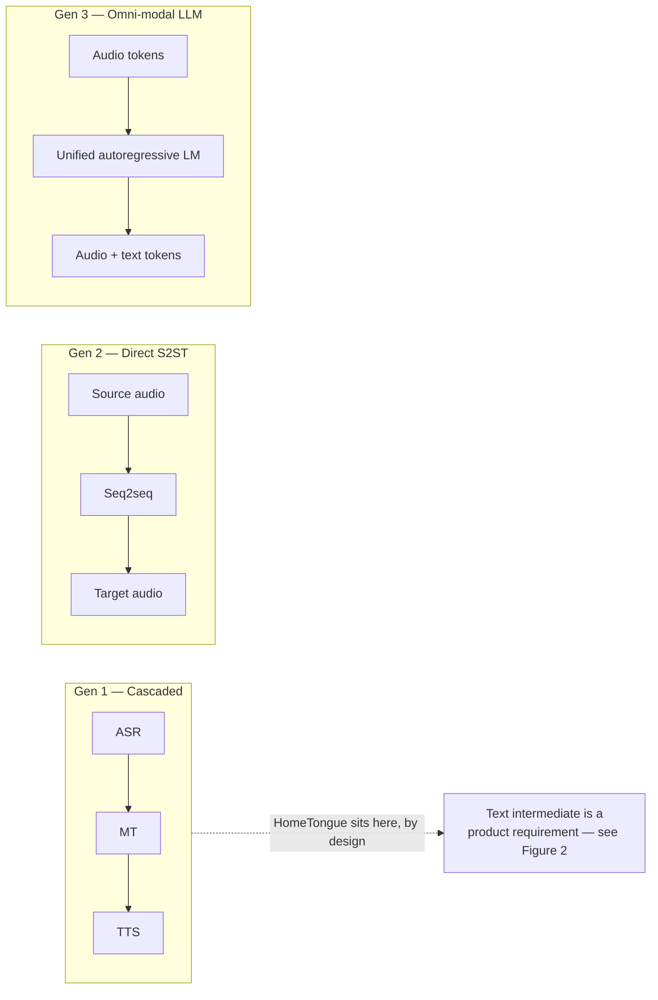

# S2ST research findings — what HomeTongue can actually use

**Status:** working reference. Supersedes
[reference/Latest S2ST Architecture Research.docx](reference/Latest%20S2ST%20Architecture%20Research.docx)
(hereafter *the source survey*), which is retained in the repo for provenance because this
document corrects it.

**Date:** 2026-07-26. Every external claim below was checked against a primary source on
that date; where a claim could not be closed against a primary source, it is marked as
such rather than rounded up into a confident statement.

**Locale note.** The pack codes `yue-HK` and `nan-TW` are **speech-locale identifiers**,
chosen because they name the closest vendor-supported speech-service locale families. They
are not a statement about the target audience. All content in both packs targets Cantonese
and Hokkien **as spoken in Singapore** — see the locale comments at
[src/languages/yue-HK/index.ts:3](../src/languages/yue-HK/index.ts:3) and
[src/languages/nan-TW/index.ts:4](../src/languages/nan-TW/index.ts:4). Read `yue-HK`
throughout as "the Cantonese pack", not as "this app targets Hong Kong".

---

## Scope and verdict

The source survey's core recommendation — replace the ASR→MT→TTS cascade with a direct,
omni-modal speech-to-speech model — **is not applicable to this product**. The decisive
reason is not compute or data: it is that HomeTongue is a language-*learning* application
whose entire teaching surface is rendered from the text intermediate that a direct S2ST
model exists to eliminate. Three sub-parts of the survey do transfer, and they are the
useful residue of the document: **(i)** LID-routed multi-LoRA serving, **(ii)** GRPO over
verifiable rewards, and **(iii)** the IMDA governance framing — the last with an important
substitution, because the survey's provenance recommendation assumes an architecture this
product does not have.

A fourth outcome came from checking the survey's claims rather than from the survey itself:
the corpus assumptions in [ML_TRAINING_PLAN.md](ML_TRAINING_PLAN.md) are stale by roughly
300× on total available Cantonese audio — though far less than that on audio a *commercial*
product may train on, because the largest corpus is non-commercially licensed. That
correction, with its licence caveat, is the single most actionable result in this document
and is treated first.

**What this document does not establish.** No model has been trained. The database holds
**zero consented samples** — stated at the top of
[ml/train/README.md:3](../ml/train/README.md:3) — so nothing here is a measured result, a
benchmark, or a claim about achieved quality. Every performance statement is a statement
about what the literature reports for *other* systems, or about what this repo would need
in order to try.

---

## Corpus re-audit

**F3: the corpus assumptions in the training plan are stale. F4: Singapore has a national
speech corpus under an open licence.**

[ML_TRAINING_PLAN.md:42](ML_TRAINING_PLAN.md:42) budgeted step 2 against "Common Voice
`yue`, MDCC ~73 h" — the honest state of Cantonese public data when the plan was written,
corrected in this documentation pass.

**Table 1.** Public speech corpora relevant to the dialect packs, re-audited 2026-07-26.
Hours are as stated by each corpus's own paper or repository; `not stated` means the
primary source gives no hours figure and none was inferred.

| Corpus | Variety | Hours | Licence | Applicability |
|---|---|---|---|---|
| WenetSpeech-Yue [18] | Cantonese | 21,800 | dataset **CC BY-NC 4.0**; pipeline code Apache-2.0 | Largest Cantonese corpus by far — but non-commercial, so research and evaluation only |
| IMDA National Speech Corpus [5] | Singapore-accented English | **not stated** (~1.2 TB, 6 parts) | Singapore Open Data Licence v1.0 [6] | SG accent modelling; commercial use permitted, download terms uninspected |
| MDCC [19] | HK Cantonese (read audiobook) | 73.6 | custom signed agreement, gated download | Baseline only; the current plan's stale assumption |
| Common Voice `yue` / `zh-HK` [20] | Cantonese | 210.70 / 108.54 validated (CV 26.0) | CC0-1.0 | The only unambiguously commercial-safe Cantonese audio in this table |
| MCE [21] | Cantonese–English code-switch | 34.8 (abstract); 40 in body | **none declared** | Code-switch evaluation only; scripts are LLM-generated, not naturally occurring |
| MERLIon CCS [22] | Mandarin–English code-switch (SG) | >25 h EN + >5 h ZH child-directed speech | signed challenge agreement, redistribution forbidden | Closest match to SG code-switching; not usable in a shipped product |
| TaigiSpeech [23] | Taiwanese Hokkien | ~6.1 (3,079 utterances, 21 speakers) | CC BY 4.0 | **Not an ASR corpus** — 8-class intent classification; not a `nan-TW` speech starting point |
| WenetSpeech-Wu [24] | Wu | ~8,000 | Apache-2.0 | Not applicable; listed to show the method generalises — and that licences differ within one lab |

### Two figures, because the licence splits the answer

The blunt version of F3 — "MDCC ~73 h is stale, there are now 21,800 hours" — is true about
*existence* and misleading about *use*. WenetSpeech-Yue's audio is released under **CC BY-NC
4.0** [18]. The Apache-2.0 licence in its GitHub repository covers the annotation pipeline
**code**, not the corpus. Non-commercial means a model trained on it cannot ship inside a
commercial product. So Table 1 answers two different questions:

- **How much Cantonese audio exists?** 21,800 hours, versus the ~73 h the plan assumes.
  Roughly 300×. This is the figure that matters for research, for a feasibility experiment,
  and for establishing what quality is reachable at all.
- **How much can a shipping model be trained on?** Common Voice under CC0-1.0 is the only
  unambiguously commercial-safe row: **210.70 h validated for `yue` plus 108.54 h for
  `zh-HK`** at Common Voice 26.0 [20]. MDCC's 73.6 h sits behind a signed custom agreement,
  not an open licence. That is a few hundred hours, not twenty thousand.

Both numbers should be carried forward. Reporting only the first would repeat the source
survey's own failure mode — quoting a headline capability without checking whether the
project can actually use it.

### What this changes for `ML_TRAINING_PLAN.md` step 2

**The pre-mix corpus changes, with a licence gate attached.** WenetSpeech-Yue replaces MDCC
as the primary native-speaker pre-mix *for experiments*, which moves step 2 from "pre-mix on
a small read-speech corpus and hope" to "pre-mix on a corpus large enough that the
learner-audio adaptation is genuinely an adaptation". Before any model trained on it is
shipped, one of three things must happen: obtain a commercial licence from the corpus
authors, retrain the shipping model on the CC0 subset only, or keep the NC-derived model to
internal evaluation. **Step 2 should state which.** Discovering the NC term after a training
run is the expensive order to discover it in.

**The gate framing changes, but not the gate.** The step-2 data gate is ~1–2k consented
learner samples. That gate is about *learner-accented* audio and is untouched by any public
corpus, because every corpus in Table 1 is native speakers. What changes is what happens on
the other side of it: a stronger pre-mix means the learner audio is spent on accent
adaptation rather than on teaching the model Cantonese from a weaker base.

**A Singapore-accent axis becomes available.** The IMDA National Speech Corpus is
Singapore-accented **English**, not Cantonese, so it does not substitute for Cantonese data.
It is relevant because HomeTongue's users code-switch, and Singapore-accented English is the
matrix language of that code-switching. MERaLiON-AudioLLM [4] is prior art for building on
the NSC. Of all the rows in Table 1, the NSC has the most permissive terms.

**What does not change: the data moat argument.** [ML_TRAINING_PLAN.md](ML_TRAINING_PLAN.md)
argues that learner-accented Cantonese is the defensible asset because public corpora are
native speakers and current STT fails precisely on heritage learners. Table 1 does not
weaken that argument — it strengthens it, by removing the excuse that there was no decent
base to adapt *from*.

### Why the NSC hours cell says "not stated"

IMDA publishes no hours figure in its own primary publications. The landing page [5] states
the size as approximately 1.2 TB across six parts — a figure recovered by decoding the
client-rendered payload. However, this retrieval method has a limit worth stating. The NSC
page is substantially client-rendered: a plain HTTP fetch returns its navigation and section
headers (About, Benefits, FAQs, Contact) but not the body copy under them, which loads
separately rather than appearing in the static HTML. That method history is kept because it
explains the shape of the earlier claim, but the limitation itself is now closed: the page
was opened in a rendered browser on 2026-07-26 and its full body text read, and **no hours
figure appears there either**. The rendered FAQ gives the size as approximately 1.2 TB,
describes download through a Dropbox account with re-registration yielding all six parts,
names the Singapore Open Data Licence as the corpus licence, and states that there are
currently "no planned future updates to the baseline corpora", the last update having been
July 2021, when three further parts were added [5]. On IMDA's own account the corpus is
therefore static, so `not stated` is not a placeholder awaiting the next release. What the
rendered read does **not** reach is the registration and download flow, which was still not
completed — see qualification 2 below. The only primary publication with a citable hours
figure, Koh et al. at Interspeech 2019 [17], describes "more than 2000
hours" of orthographically transcribed read speech with a further 1,000 hours of
conversational speech planned for a second release — a figure for an earlier version of the
corpus, far smaller than the current release and not covering the parts added since.

A figure of ~10,600 hours circulates widely in dataset mirrors and secondary write-ups, and
traces only to those secondary sources — no IMDA publication found in this pass states it.
**It was not adopted here**, because this document does not carry numbers it cannot trace to
a primary source. The honest cell for the current corpus is `not stated`, with the 2019
figure cited for the version it actually describes. Anyone needing the current duration
should measure it after download, and that measurement should be recorded here when it
exists.

### The IMDA NSC licence — actionable, with one open step

The NSC is governed by the **Singapore Open Data Licence v1.0** [6], which IMDA's own NSC
page names as the corpus licence [5]. The rendered read described above confirms that naming
from the page's own body text rather than only from the decoded payload. Under "What you can
do" that licence permits using, modifying and adapting the datasets "or any derived analyses
or applications, whether commercially or non-commercially". On that reading, **F4 is
actionable**: training on the NSC and shipping the resulting model commercially falls inside
the grant. Three qualifications must travel with that conclusion:

1. **The reading of "derived analyses or applications" is an interpretation.** The licence
   never defines that phrase and never mentions models, model weights, or ML training
   anywhere. Reading derived model weights into it is the best available reading of broadly
   worded, general-purpose licensing language — not literal textual coverage of ML training.
2. **The download terms were never inspected.** NSC download is gated behind registration
   and a Dropbox account. That registration flow **was not completed** in this pass, so any
   terms presented at the point of download were never read and cannot be ruled out. This
   must be closed — by registering and reading what is presented — before shipping a model
   trained on NSC data. Until then, "actionable" means "actionable on the publicly
   documented terms", not "cleared".
3. **Attribution is required, and the personal-data carve-out is material.** The licence's
   additional conditions oblige a conspicuous source notice plus a link to the licence in
   any product or site using the datasets, and it grants no rights over personal data in
   the dataset. For a speech corpus, that carve-out is the one that matters.

**Correction to an earlier premise.** The PDF previously cited as the NSC licence — the
IMDA Digital Services Laboratory *Technology* Licensing Agreement — **is not the corpus
licence**. It is an unexecuted template whose Annex 1 licenses "Natural Speech &
Transcription Technologies (NSTT)", a suite of tools *complementary to* the NSC, and its
"Purposes" clause is a blank placeholder. It should not be cited as the corpus licence
anywhere in this doc set.

### Singapore-local corpus routes

Table 1 answers a global question: what public dialect audio exists anywhere. A separate
question, asked because the answer differs, is whether **Singapore-local** material can add
to the corpus — either material that already exists here, or recordings this product's users
could contribute. Three Singapore-local sources could be checked against a primary source and
are audited in Table 4. The rest of the answer is about routes rather than datasets, and each
route is bounded by who holds which right.

**Table 4.** Singapore-local corpus sources, checked 2026-07-26 — the three that could be
checked against a primary source. `not stated` carries the same meaning as in Table 1: the
primary source gives no hours figure and none was inferred. Retrieval method
differs by row and is recorded in each reference entry — the NAS pages are client-rendered
and were read in a rendered browser; the MagicHub and Hugging Face pages are server-rendered
and were plain-fetched.

| Corpus | Variety | Hours | Licence | Applicability |
|---|---|---|---|---|
| NAS Oral History Centre — *Chinese Dialect Groups* project [27] | Singapore Chinese dialect groups (oral-history interviews) | **not stated** (collection-level only: "several thousand hours" [27]; >4,000 interviews since 1979 [28]) | **none** — all rights reserved to NAS *and* access per interviewee agreement [27]; per-record conditions as narrow as "background information only" [29] | Research and evaluation plausible under written permission; ML training needs an agreement clearing both gates |
| MagicHub ASR-SgpCCSC [30] | Singapore **Mandarin** (zh-SG) spontaneous conversation | 5 | MAGIC DATA open-source licence **and** CC BY-NC-ND 4.0 | Excluded twice over: not a dialect, and NC **and** ND — blocks a shipping model and derivative fine-tunes alike |
| MERaLiON Multitask-NSC v1 [31] | Singapore-accented English / code-switching, derived from the NSC [5] | **not stated** (~15.19M rows, ~3 TB) | **none declared** — no `license` field in the card metadata, no terms in the card body | Evidence that the NSC is treated as ML training data at the scale of the MERaLiON programme [4]; for terms, register for the NSC directly rather than relying on this redistribution |

**Existing cultural media repeats a trap already documented in Table 1.** The obvious idea is
to build from material that exists already: broadcast archives, getai recordings, family
video uploaded to YouTube. The controlling precedent is the largest row in Table 1.
WenetSpeech-Yue's 21,800 hours are released under **CC BY-NC 4.0** [18], while the Apache-2.0
licence its authors also applied covers the annotation pipeline code rather than the corpus —
the split recorded above. **The mechanism this document reads into that outcome**, rather than
one [18] states about its own terms, is that a collector cannot convey commercial rights it
never held, so a corpus assembled from media the collector does not own arrives non-commercial
by necessity rather than by preference. Nothing about doing the same thing with Singapore
material changes that. Copyright is also not the only gate: these are recordings of
identifiable people, and the personal-data carve-out in the NSC licence [6] shows that even the
most permissive open-data terms in this doc set treat personal data as a right the licence does
not convey — a parallel drawn here, not a legal opinion. So existing cultural media is a route
to a **research** corpus at best, and never to a shipping model without negotiated licences —
plural, because broadcasters, getai performers and individual uploaders are different parties
holding different rights.

**NAS Oral History Centre: dialect interviews exist, and are permission-gated twice over.**
Dialect-focused interview material is genuinely there. The OHC's *Chinese Dialect Groups*
project renders on the archive's own record pages — accession 000726, whose reel 4 of 4 gives
a recording date of 22 November 1986, a running time of 26 minutes, and a synopsis concerning
the Poon Yue (番禺) Association [29] — a Cantonese clan group, the characterisation being this
document's, not the page's. What no page carries is a licence, and two independent
gates sit in front of the material:

- **NAS holds the rights.** The FAQ reserves all rights in the recording and transcript,
  including copying, publication, broadcast and performance, to NAS, and directs any intended
  use to a write-in address, nas@nlb.gov.sg [27]. The per-record notice repeats it and requires
  written permission for any use [29].
- **Interviewees govern access.** Access is governed by "the access conditions stipulated by
  interviewees", and NAS states that it honours the interview agreements signed with them [27].
  Those conditions are per record and can be narrow: this reel is marked for background
  information only, behind a request-to-view flow [29].

The consequence is the part worth carrying forward. A permission obtained from NAS would clear
the first gate only. Interviews whose signed agreements never contemplated ML training are not
cleared by NAS's consent, precisely because NAS's stated position is that it honours those
agreements. **That is an inference from two FAQ items rather than a term NAS states** — but it
is the conservative reading, and it is the one that sets the effort: the write-in route is
plausible for evaluation and research use, while an ML-training agreement would have to be
scoped against what the underlying interviewee agreements permit, record by record. No hours
figure is published at project level, which is why Table 4's cell is `not stated` there while
the collection-level figures sit in parentheses beside it.

**One NAS claim is weaker than the others, and the difference is retrieval method.** The NAS
pages are client-rendered — the same limitation this document records for the IMDA NSC page —
so every NAS claim above comes from a rendered-browser read on 2026-07-26 [27][28][29]. One claim
does not: that accession 000726's interview was **conducted in Cantonese** comes from
search-indexed text of the catalogue entry and was **not** confirmed on the rendered record
page, which displays no language-of-interview field [29]. Read it exactly that way — the
dialect project itself is rendered-verified, while per-record interview language is catalogued
in the database and unverified here. Nothing in the argument above depends on that one
record's language.

**A partnership route exists with Singapore dialect organisations — a route, not a
commitment.** Organisations producing Singapore-usage dialect speech from living speakers are
active here: LearnDialect.sg teaches Hokkien, Cantonese and Teochew, including classes aimed
at healthcare workers serving dialect-speaking seniors, and publishes short weekly "How Do You
Say" episodes [32]. Clan associations are the other obvious category — the NAS synopsis above
concerns one. Their published material is copyrighted, so this is a licensing conversation and
not a scraping opportunity. What the route offers that scraping cannot is *fresh* recordings:
made with the partner, under this product's own consent flags, with Singapore usage by
construction and a clean chain of title from the outset. Two limits on how far that should be
read. **No contact has been made with any organisation named here** — this is an identified
possibility, not a plan, a partnership or a commitment. And the LearnDialect.sg entry rests on
search results plus the site's landing content rather than a rendered read of the full site
[32], which is weaker than the NAS rows above it.

**User-contributed recordings are the one commercially clean route identified.** Note first
that the gap is not closing from the literature. The most recent Singapore-focused ASR release
found in this pass, Polyglot-Lion [33], fine-tunes Qwen3-ASR into a compact multilingual family
covering English, Mandarin, Tamil and Malay — Singapore's four official languages, and no
Chinese dialect. That is all it is cited for. What remains is recordings contributed through
the app itself: the only route in this subsection whose licence position is clean by
construction rather than by negotiation, because consent is obtained directly from the people
whose speech it is. The design lives in
[DIALECT_CLASSIFICATION.md](DIALECT_CLASSIFICATION.md#contribution-surfaces) § Contribution
surfaces, as the fourth surface, and is specified there rather than here. Three preconditions
travel with it:

1. **A variety label.** Contributed audio inherits F8's label gap exactly as captured audio
   does, so it needs the `spoken_variety` column from that document's schema. Audio labelled
   `yue-HK` because the Cantonese pack was open is no more useful contributed than captured.
2. **A third-party-speaker consent design that does not exist.** The two existing consent flags
   are first-person, toggled by an account holder for their own data; **an uploader cannot
   consent on a relative's behalf.** The minimum shape is a per-upload attestation, a consent
   record naming the person recorded, and withdrawal that reaches both — the last of which can
   ride the existing cascade-delete path.
3. **A per-language transcription bootstrap, and it is asymmetric.** For Cantonese, vendor STT
   exists, so an upload can be transcribed automatically and corrected by a reviewer — human
   effort is correction. For Hokkien no vendor STT model exists, so every transcript must be
   produced by a human, and human transcription capacity rather than upload volume sets the
   rate.

**What uploads change for Hokkien, stated exactly that narrowly.** "Coverage vs. demographics"
below records the honest status of `nan-TW` speech support as "no route currently identified".
A contribution surface would convert that into **"a route, gated on human transcription capacity"**.
That is the one place in this document where the bottom line moves, and it moves by one step:
not a corpus, not a model, not a date — a status change from *none* to *gated*. Volumes are the
discipline on everything else. The step-2 adaptation gate is unchanged at roughly 5–15 h of
learner audio ([ML_TRAINING_PLAN.md:38](ML_TRAINING_PLAN.md:38)). A variety classifier and per-variety evaluation sets need tens of hours per
variety, a scale contribution surfaces could plausibly reach, and neither needs a transcript —
labelled but untranscribed audio still trains a classifier and still builds an evaluation set.
The thousands-of-hours scale of Table 1's Cantonese rows is not reachable this way at all.

**This extends the licence split, seen from the other end.** "Two figures, because the licence
splits the answer" separates how much dialect audio exists from how much a shipping model may
train on, and F2 draws the consequence that for dialect S2ST availability and usability
diverge. Table 4 extends that argument rather than softening it: the one Singapore-local source
holding actual dialect speech is the one with no licence at all, and the one route that is
commercially clean by construction is the one that cannot reach volume. For dialect audio the
two properties still do not meet above a few hundred hours — Common Voice's CC0 rows remain the
ceiling on commercially safe Cantonese, and nothing in Table 4 supplies a licensed
Singapore-dialect alternative to sit above them.

**Nothing in this subsection is collected audio.** The distinction is easy to lose in a list of
routes, so it is stated plainly: the database holds **zero consented samples**
([ml/train/README.md:3](../ml/train/README.md:3)). No upload surface exists, no third-party
consent flow exists, no recording has ever been contributed, and no organisation has been
approached. Table 4's three rows are sources whose terms were checked, not data this project
holds; the partnership route is an identified possibility and the upload route is a design.
Every statement above about contributed recordings is a statement about a design.

---

## Why direct S2ST does not fit this product

**Figure 1.** Three generations of speech translation architecture. The source survey
frames the movement left-to-right as unambiguous progress. HomeTongue sits in Gen 1
deliberately, for the reason given in F1 below — not because it has not caught up.
(Figure 2, the pipeline diagram that shows *why*, appears in the companion article.)

### F1 — The cascade is a product requirement, not legacy debt

This is the primary reason, and it is a product argument rather than a resource argument.

The source survey treats the ASR→MT→TTS cascade as a defect to be eliminated, listing
compound error propagation, latency, and loss of paralinguistic identity as its systemic
limitations. Every one of those criticisms is correct **for a translation product**. They
do not apply to a teaching product, because in a teaching product the text intermediate is
not an implementation detail that leaks — it is the thing being sold.

Concretely, the intermediate transcript is what feeds:

- the **transcript display** the learner reads back;
- **Jyutping** romanisation — the Cantonese pack's romanisation system, declared at
  [src/languages/yue-HK/index.ts:23](../src/languages/yue-HK/index.ts:23);
- the **word breakdown**, generated from the pack's `breakdownSystem` prompt via
  [src/services/translationService.ts](../src/services/translationService.ts);
- **pronunciation scoring** — `scoreDialectAccuracyDetailed` and its deterministic fallback
  [src/services/translationService.ts:296](../src/services/translationService.ts:296),
  which calls the active pack's `scoring.fallbackMatch`
  ([src/languages/yue-HK/index.ts:244](../src/languages/yue-HK/index.ts:244)).

A direct speech-to-speech model that maps source audio to target audio without surfacing
text removes all four. There is no version of this product that keeps its teaching surfaces
and drops the text intermediate. The survey never considers this case, because it is
written about translation systems and evaluates architectures on translation criteria.

The resource argument exists too and is real — zero consented samples, no training compute
committed, no evaluation corpus — but it is **secondary**. If unlimited data and compute
appeared tomorrow, F1 would be unchanged.

### F2 — Hibiki-Zero is real, and still does not apply

The survey's flagship citation is genuine and worth reading. The paper is *Simultaneous
Speech-to-Speech Translation Without Aligned Data* [1]; **Hibiki-Zero** is the model name,
not the paper title. Weights are published as `kyutai/hibiki-zero-3b-pytorch-bf16` [2]. It
was accepted at ICML 2026 [3].

It does not apply here, for reasons that are structural rather than incidental:

- **Wrong language pair.** The released checkpoint's model card states support for French,
  Spanish, Portuguese and German [2]. None is Sinitic. The abstract of [1] describes "five
  X-to-English tasks" — the fifth is Italian→English, demonstrated in the paper as a
  low-resource adaptation experiment (under 1,000 hours of coarse-aligned speech) rather than
  in the main results. Either way the source-language set is European.
- **Wrong direction.** Every supported task is X→**English**. HomeTongue's primary direction
  is English→Cantonese: an English-speaking heritage learner producing dialect output. The
  model translates *out of* the low-resource language; this product needs to generate *into*
  it.
- **The adaptation figure is not a shortcut for us.** "<1,000 hours of coarse-aligned
  speech" is a genuinely low threshold, and it is the survey's strongest practical claim. But
  it is a threshold for adding a *source* language to an X→English model. It does not
  describe adding a target language, and it does not describe a corpus this project has.
- **The weights are CC BY-NC-SA 4.0 — declared in the card body, not the metadata.** The
  Hugging Face repository's YAML frontmatter has no `license` field, but the card body
  states, under "Model Details": "License: CC BY-NC-SA 4.0" [2]. The separate code repository
  is MIT, which covers code and not weights. The weights therefore do carry a documented
  licence, but it is non-commercial and share-alike — shipping a model built on them inside a
  commercial product requires a separate agreement, not just attribution.

**Consequence: the open ecosystem here is substantially non-commercial.** Both of the two
major open assets this document relies on now carry non-commercial terms: WenetSpeech-Yue's
dataset is **CC BY-NC 4.0** (Table 1, Corpus re-audit) and Hibiki-Zero's weights are **CC
BY-NC-SA 4.0** [2]. Both are freely downloadable and usable for research or evaluation;
neither can be built into a shipped commercial product without a separate licence from the
rights holder. For dialect S2ST specifically, availability and usability diverge: the audio
and the weights exist and are legally accessible, but "openly published" does not mean
"commercially usable" here.

**Citation defect in the source survey.** The survey's reference 11 is labelled "ICML 2026"
but links `https://icml.cc/virtual/2025/poster/44512`, which is the **2025** poster for the
earlier *High-Fidelity Simultaneous Speech-To-Speech Translation* paper [11] — a different
paper. The Hibiki-Zero ICML 2026 poster is `/virtual/2026/poster/66094` [3]. In fairness,
the survey separately links a valid ICML 2026 event page for Hibiki-Zero elsewhere in its
reference list; the defect is the mislabelled reference, not a total failure to cite the
right conference.

---

## What transfers

Four things, in descending order of how ready they are to be acted on.

### 1. LID-routed multi-LoRA serving (F5)

The pattern: assign one LoRA adapter per language, and route speech features to the
corresponding adapter using the known language ID. This is used in practice — the TEA-ASLP
system for the MLC-SLM 2025 challenge states it directly: "Each language is assigned a
specific LoRA adapter, and the speech features are routed to the corresponding adapter based
on the known LID" [7].

**Calibration.** [7] is a **challenge system-description paper**, not the origin of the
technique — but its description of adapter selection quoted above is accurate as stated:
routing is genuinely hard, each language pinned to one adapter. The paper's sigmoid-weighted
mechanism belongs to a *different* component — a weighted-fusion module that combines
dual-encoder (Whisper + MMS) outputs, where per-language trainable parameters pass through a
sigmoid to produce fusion weights selected by LID — and should not be attributed to adapter
selection. Cite [7] as a system that *uses* hard per-language adapter routing, not as the
paper that established it.

**Why it matters here.** The repo already resolves a per-language *base URL* —
[api/_lib/languageManifest.js:104](../api/_lib/languageManifest.js:104) — but the model name
is global: [api/_lib/chatCore.js:67](../api/_lib/chatCore.js:67) reads a single
`OPENAI_MODEL` for every language. With N dialect packs that forces one endpoint per
dialect, which is exactly the cost pattern multi-LoRA serving exists to avoid. The
resolution design is specified in `docs/MODEL_CONTROLS.md`.

This is also the link between routing and the dialect label: a variety classifier makes
adapter selection automatic instead of a manual environment variable. See
[The label gap](#the-label-gap) below.

### 2. GRPO over verifiable rewards (F6)

Group Relative Policy Optimization was introduced in DeepSeekMath [8] as a PPO variant that
drops the value model. [8] itself only says this "significantly reduc[es] training
resources" and never quantifies it — **the "roughly halves" framing is this document's own
inference**, from the observation that the value model is typically a second network of
comparable size to the policy model, not a figure [8] states. Its relevance here is narrow
but real: GRPO needs a **reward function**, not preference pairs. This repo already has
verifiable signals that could serve as one —

- the active pack's `scoring.fallbackMatch` (deterministic character-equivalence scoring),
- the char-equivalence and particle-group maps in
  [ml/eval/normalization.json](../ml/eval/normalization.json),
- the stored exam `score` column in
  [supabase/migrations/0002_ml_data_pipeline.sql](../supabase/migrations/0002_ml_data_pipeline.sql).

Because those are computable rather than collected, GRPO lowers the *data* gate relative to
DPO, which needs thousands of rated preference pairs. It does not lower the gate to zero:
GRPO still needs prompts to roll out against and a held-out dev set to stop on.

**The guardrail is mandatory, not optional.** Long GRPO schedules are prone to reward
variance collapse — as training progresses the sampled hypotheses converge to similar
reward scores, the group standard deviation goes to zero, and the advantage term degenerates.
The clearest statement of the practical consequence is in [9]: practitioners applying GRPO
to new languages or domains should treat early stopping on a held-out development set as a
required component of the training pipeline rather than an optional refinement.

**Domain caveat.** [9] is a **text machine-translation** paper (GRPO on NLLB-200 at 600M and
1.3B). It is not a speech paper, and it does not make the transfer to speech. The
observation is mechanical enough — it is a property of how the group-relative advantage is
computed — that carrying it across is reasonable, but it is a transfer this document is
making, not one the source establishes. Any GRPO step added to
[ML_TRAINING_PLAN.md](ML_TRAINING_PLAN.md) must specify the early-stopping guardrail; the
protocol should be validated on our own runs rather than assumed from [9].

### 3. Curriculum learning and expressivity — transfers in part

The survey's curriculum section describes UniSS [10], a single-stage expressive S2ST
framework that stages training to mitigate catastrophic forgetting of the underlying LLM's
foundational text-translation ability, using a triple-tokenizer split into speaker,
linguistic and semantic tokens.

**What transfers:** the staged-curriculum principle — introduce capabilities in an order
that keeps the model from collapsing onto the easiest objective. That is generic training
practice and applies to any adapter schedule this project eventually runs.

**What does not transfer:** the goal. UniSS's speaker-token stream exists to preserve the
*source speaker's* voice in the target language. HomeTongue wants the opposite: a
consistent, model-provided dialect voice that the learner imitates. Voice cloning and
speaker-identity transfer are permanently out of scope for this product — they are a
misuse surface with no teaching benefit.

### 4. Governance — transfers, with a substitution

The survey correctly identifies the IMDA and AI Verify Foundation *Model AI Governance
Framework for Generative AI* [12] as the relevant regime, which is convenient: the same
agency supplies both that framework and the National Speech Corpus in Table 1.

Two of its dimensions land directly on this repo. **Data security**: dialect training data
carries biometric markers and must be held to the standard applied to medical or financial
records — which is why the two consent flags (`data_collection_consent`,
`audio_retention_consent`) default to false and are enforced server-side by RLS in
[supabase/migrations/0002_ml_data_pipeline.sql](../supabase/migrations/0002_ml_data_pipeline.sql).
**Testing and assurance**: dialect adaptation must be evaluated for degradation into
stereotype, not only for accuracy.

**The provenance recommendation needs a substitution.** The survey recommends embedding
cryptographic watermarks directly in the generated discrete acoustic tokens before waveform
decoding. That recommendation presupposes owning the codec and the decoder. HomeTongue does
not: it calls a vendor TTS API — Google Cloud Chirp 3: HD voices, constrained by the
manifest pattern at
[api/_lib/languageManifest.js:44](../api/_lib/languageManifest.js:44) — and never touches
acoustic tokens.

That leaves the question of whether the vendor watermarks on our behalf. It was checked
against primary sources on 2026-07-26 and the answer is: **not documented**. No Google Cloud
Text-to-Speech documentation states that Chirp 3: HD output carries SynthID; the terms
"SynthID" and "watermark" occur zero times on the Chirp 3: HD reference page [13] and zero
times across seven supporting Cloud TTS pages checked the same day. Google's own SynthID
page [14] names Lyria and the NotebookLM podcast feature as its watermarked *audio*
products; Cloud TTS and Chirp are absent.

**Undocumented is not the same as absent, and the distinction matters.** Silence on a
Google Cloud TTS reference page turned out not to be evidence either way: a Google Cloud
blog post confirms that Gemini 3.1 Flash TTS audio is watermarked with SynthID [15], yet
that model's own official reference page also has zero mentions of SynthID or watermarking.
Cloud TTS reference documentation therefore does not reliably disclose watermarking status
even where watermarking demonstrably applies. The defensible claim is narrow:

> Audio provenance **cannot be relied upon or asserted** for HomeTongue's TTS output. It is
> **not** claimed that the audio is unwatermarked.

**Consequence.** The governance posture is **in-app disclosure labelling** — the product
tells the user, in the interface, that synthesised dialect audio is machine-generated —
rather than any claim of cryptographic provenance. If Google later documents SynthID for
Chirp 3: HD, this can be revisited; it should not be assumed in the meantime.

---

## Coverage vs. demographics

**F7: pack coverage is inverted against Singapore's Chinese dialect demographics.**

By the Singapore Department of Statistics *Census of Population 2020* [26] — the current
basis — the Chinese resident population by dialect group was: Hokkien 39.3%, Teochew 19.4%,
Cantonese 14.3%, Hakka 8.6%, Hainanese 6.1%, of 3,006,769 Chinese residents. The 2000 figures
[16] are kept alongside to show the trend: Hokkien 41.1%, Teochew 21.0%, Cantonese 15.4%,
Hakka 7.9%, Hainanese 6.7%, of 2,513,847. **The rank order is unchanged across both
censuses** — Hokkien > Teochew > Cantonese > Hakka > Hainanese — so the coverage argument
below holds under either year; if anything it is slightly stronger under the fresher data.
Cantonese's share fell proportionally faster than Hokkien's (15.4%→14.3% vs. 41.1%→39.3%),
widening the ratio gap from 2.67× to 2.75× — meaning Cantonese is now an even larger
minority of Hokkien's size. The percentage-point difference between the two narrowed
slightly (25.7 to 25.0 points), but the relative disparity grew. The coverage argument rests
on the ratio: the largest dialect group has only text support, while the third-largest has
full speech support.

Against that, the repo ships exactly two packs. Cantonese (`yue-HK`) is fully supported —
Chirp 3: HD TTS plus STT. Hokkien (`nan-TW`) is text-only. Teochew, Hakka and Hainanese have
no pack at all. Mapped onto the 2020 demographics:

- **Hokkien, 39.3%** — `nan-TW` pack, no speech path
- **Teochew, 19.4%** — no pack
- **Cantonese, 14.3%** — `yue-HK` pack, full speech support
- **Hakka, 8.6%** — no pack
- **Hainanese, 6.1%** — no pack

The fully-supported pack serves the **third**-largest group. The largest group by a wide
margin, Hokkien, is text-only: `sttLanguages` is the empty array at
[api/_lib/languageManifest.js:55](../api/_lib/languageManifest.js:55), and the pack declares
`capabilities { tts: false, stt: false }` at
[src/languages/nan-TW/index.ts:73](../src/languages/nan-TW/index.ts:73) — which the code
treats as the single source of truth that suppresses mic and play controls throughout the UI.

**This is a vendor-availability outcome, not a product preference.** No vendor ships a
usable Hokkien TTS or STT model; Cantonese was supported because Google ships `yue-HK`
Chirp 3: HD voices. It is nonetheless the finding with the largest gap between what the
product does and what the population it serves would need.

**And there is no corpus to close it with.** The corpus audit found **no suitable public
Hokkien ASR corpus**. TaigiSpeech [23] was the candidate and does not qualify: it is an
8-class spoken **intent-classification** set (3,079 short command utterances from 21 elderly
speakers, for elder-care and smart-home commands, totalling ~6.1 hours per the paper's own
Table 4), and is not a general speech-recognition corpus. It is also Taiwanese Hokkien, which
is related to but not the same as the Amoy-based Singapore Hokkien the `nan-TW` pack targets.
So the Hokkien
speech path is blocked twice over — no vendor model *and* no identified training corpus —
and the honest status of `nan-TW` speech support is "no route currently identified", not
"pending work". Finding or building a Singapore Hokkien speech corpus is a prerequisite,
not a step.

**Two caveats on the figures.** First, Census 2020's headline **Statistical Release 1**
(Demographic Characteristics, Education, Language and Religion) does not carry this
dialect-group breakdown — its home-language tables lump all varieties into a single "Chinese
Dialect" category. The percentages above come from a separate data.gov.sg table, *Chinese
Resident Population by Age Group, Detailed Ethnic Group and Sex* [26], which is the correct
citation for this figure. Second, dialect-group ancestry is not the same as dialect
*fluency* — the census records which group a person belongs to, not whether they speak the
language. For a heritage-learning product the second number is the one that matters, and it
is not in this table.

---

## The label gap

**F8: the schema records which pack was active, not what variety was spoken.**

`speech_samples.language` is declared `text not null default 'yue-HK'` at
[supabase/migrations/0002_ml_data_pipeline.sql:26](../supabase/migrations/0002_ml_data_pipeline.sql:26).
That column faithfully records the language pack the app was in when the sample was
captured. It does not record what the speaker actually said. Singapore Cantonese,
HK-influenced Cantonese, Hokkien uttered while the Cantonese pack was active, and
English–Cantonese code-switched speech all collapse into the single string `yue-HK`.

Two consequences follow, and both bite exactly where the transferable techniques land:

- **Per-variety training is impossible.** Section "What transfers" argues for one LoRA
  adapter per variety. Training that requires knowing which variety each sample is — which
  this schema cannot answer.
- **Per-variety accuracy measurement is impossible.** The ship bar in
  [ML_TRAINING_PLAN.md:44](ML_TRAINING_PLAN.md:44) is ≥ 15–20 % relative CER
  reduction. Aggregate CER over an unlabelled mixture of varieties can improve while the
  variety a given user actually speaks gets worse, and nothing in the current pipeline
  would show it.

This is a **label** gap, not an application gap — the review surface to apply labels already
exists in `admin/`. The schema change, the contribution surfaces, the
`reviewer > self > classifier` precedence rule, and the classifier design are specified in
[DIALECT_CLASSIFICATION.md](DIALECT_CLASSIFICATION.md).

---

## Corrections to the source document

**Table 3.** Defects found in the source survey. Rows 1–6 were verified by inspecting the
`.docx` and its embedded hyperlink relationships directly; rows 7–9 are absences, verified
by exhaustive search of the extracted document text. (Table 2 is the model-control surface
and lives in `docs/MODEL_CONTROLS.md`; Table 5, the variety-label columns, lives in
`docs/DIALECT_CLASSIFICATION.md`. Numbering is shared across this doc set so the companion
article can reference each table by the same number.)

| # | Issue | Detail |
|---|---|---|
| 1 | Mathematical notation lost | Mimi sample rate, framerate, RVQ codebook indices, the GRPO advantage formula and the GRPO loss all render blank in the `.docx` |
| 2 | Mis-cited ICML poster | Links `/virtual/2025/poster/44512` (the 2025 Hibiki paper) where Hibiki-Zero is `/virtual/2026/poster/66094` |
| 3 | Non-canonical source | Reference 10 is a Scribd mirror of an arXiv paper |
| 4 | Weak support for broad claims | Reference 1, a small personal GitHub repo, carries much of the introduction's field-framing |
| 5 | No compute or cost figures | Discusses 30B-parameter models and multi-GPU serving without a single cost or hour estimate |
| 6 | No data-volume requirements | States "<1000 h" for Hibiki-Zero adaptation but gives no figures for any other technique |
| 7 | No evaluation methodology | ASR-BLEU, Average Lagging and LAAL are named or implied, never defined; a reader cannot set a ship bar |
| 8 | No dialect data availability analysis | The decisive constraint for any dialect project is absent |
| 9 | Product-fit gap | Never considers that a language-*learning* product requires the text intermediate |

**Verification notes on Table 3**, recorded so a reader can tell what was checked from what
was asserted:

- **Row 1** — confirmed by text extraction: the document reads "sampled at  kHz", "a
  constant framerate of  Hz", "denoted as ,", "Let  be the cumulative calculated reward",
  and "The advantage  for each sequence". Every variable is an empty span. The underlying
  values are recoverable from the Mimi codec's own paper [25], but not from the survey.
- **Row 3** — confirmed. The tenth entry in the works-cited list is
  `https://www.scribd.com/document/999870959/2602-11072v1`, a Scribd mirror of arXiv:2602.11072.
- **Row 4** — confirmed. The first works-cited entry is
  `https://github.com/abdouaziz/speech-to-speech-translation`, cited as the support for the
  introduction's framing of cascaded-architecture limitations.
- **Row 5** — confirmed by exhaustive search: no `$`, "USD", "GPU-hour" or "per hour" token
  occurs anywhere in the document, while "3B to 30B parameter multimodal models" and
  "Qwen3-Omni-30B-A3B" both do.
- **Row 7 — one refinement.** "ASR-BLEU" and "Average Lagging" are both named in the text.
  **"LAAL" is never named** — zero occurrences. The substance of the row stands (no metric is
  defined, and no ship bar is derivable), but a reader should not expect to find the string
  "LAAL" in the source.

---

## Evidence

Canonical sources only. arXiv `/abs/` pages, ACL Anthology, OpenReview, official vendor and
government documentation. All checked 2026-07-26.

1. Labiausse, T., Fabre, R., Estève, Y., Défossez, A., Zeghidour, N. *Simultaneous
   Speech-to-Speech Translation Without Aligned Data* (the Hibiki-Zero paper).
   https://arxiv.org/abs/2602.11072
2. Kyutai. `hibiki-zero-3b-pytorch-bf16` model card — the source of the four-language
   support list; licensed **CC BY-NC-SA 4.0**, stated in the card body under "Model Details"
   rather than the YAML metadata's `license` field, which is absent.
   https://huggingface.co/kyutai/hibiki-zero-3b-pytorch-bf16
3. ICML 2026 poster 66094 — *Simultaneous Speech-to-Speech Translation Without Aligned
   Data*, Labiausse et al. https://icml.cc/virtual/2026/poster/66094
4. He, Y., Liu, Z., Sun, S., Wang, B., Zhang, W., Zou, X., Chen, N. F., Aw, A. T.
   *MERaLiON-AudioLLM: Bridging Audio and Language with Large Language Models*. The NSC
   dependency is stated in the body, not the abstract. https://arxiv.org/abs/2412.09818
5. IMDA. *National Speech Corpus* — landing page; FAQ item 1 names the Singapore Open Data
   Licence. https://www.imda.gov.sg/how-we-can-help/national-speech-corpus
6. Government of Singapore. *Singapore Open Data Licence v1.0*.
   https://data.gov.sg/open-data-licence
7. Xue, H., Huang, K., Zhou, Z., Huang, S., Shang, S. *The TEA-ASLP System for Multilingual
   Conversational Speech Recognition and Speech Diarization in MLC-SLM 2025 Challenge* — a
   system that uses LID-routed per-language LoRA adapters; a challenge system description,
   not the origin of the technique. https://arxiv.org/abs/2507.18051
8. Shao, Z., et al. *DeepSeekMath: Pushing the Limits of Mathematical Reasoning in Open
   Language Models* — introduces Group Relative Policy Optimization.
   https://arxiv.org/abs/2402.03300
9. Garcia-Estrada, E., Escolano, C., Fonollosa, J. A. R. *Reference-Free Reinforcement
   Learning Fine-Tuning for MT: A Seq2Seq Perspective* — the reward-variance-collapse and
   mandatory-early-stopping result. **Text MT, not speech.**
   https://arxiv.org/abs/2605.15976
10. *UniSS: Unified Expressive Speech-to-Speech Translation with Your Voice* — OpenReview.
    https://openreview.net/forum?id=5o0ZvYzh6B
11. Labiausse, T., Mazaré, L., Grave, E., Défossez, A., Zeghidour, N. *High-Fidelity
    Simultaneous Speech-To-Speech Translation* (the 2025 Hibiki paper — the paper the
    survey's ICML link actually points at). https://arxiv.org/abs/2502.03382
12. IMDA and AI Verify Foundation. *Model AI Governance Framework for Generative AI*,
    launched 30 May 2024. https://aiverifyfoundation.sg/resources/mgf-gen-ai/
13. Google Cloud. *Chirp 3: HD voices* — Text-to-Speech documentation. Zero occurrences of
    "SynthID" or "watermark". https://docs.cloud.google.com/text-to-speech/docs/chirp3-hd
14. Google DeepMind. *SynthID* — names Lyria and NotebookLM as watermarked audio products;
    Cloud TTS and Chirp are absent. https://deepmind.google/science/synthid/
15. Google Cloud. *Gemini 3.1 Flash TTS on Google Cloud* — states that this model's audio is
    watermarked with SynthID, while that model's own reference page does not.
    https://cloud.google.com/blog/products/ai-machine-learning/gemini-3-1-flash-tts-on-google-cloud
16. Singapore Department of Statistics. *Chinese Resident Population by Age Group, Dialect
    Group and Sex, Census of Population 2000* — the 2000 baseline kept alongside [26] to show
    the trend behind the F7 percentages.
    https://data.gov.sg/datasets/d_7a942ef799c7a66a78835245bc581980/view
17. Koh, J. X., et al. *Building the Singapore English National Speech Corpus* —
    Interspeech 2019. The only primary NSC publication; states "more than 2000 hours" of
    read speech with 1,000 further conversational hours planned.
    https://www.isca-archive.org/interspeech_2019/koh19_interspeech.html
18. *WenetSpeech-Yue: A Large-scale Cantonese Speech Corpus with Multi-dimensional
    Annotation* — states 21,800 hours across 10 domains.
    https://arxiv.org/abs/2509.03959 · dataset card, licence `cc-by-nc-4.0`:
    https://huggingface.co/datasets/ASLP-lab/WenetSpeech-Yue
19. Yu, T., et al. *Automatic Speech Recognition Datasets in Cantonese: A Survey and New
    Dataset* (MDCC) — LREC 2022. States 73.6 hours of clean read speech from Hong Kong
    Cantonese audiobooks. https://aclanthology.org/2022.lrec-1.696/
20. Mozilla. *Common Voice* dataset metadata, release 26.0 (2026-06-12) — `yue` 210.70 h
    validated of 307.41 h total; `zh-HK` 108.54 h validated of 143.37 h total; CC0-1.0. The
    public dataset page is client-rendered and not directly citable; these figures come from
    Mozilla's own canonical metadata repository.
    https://github.com/common-voice/cv-dataset
21. *Developing a Multilingual Dataset and Evaluation Metrics for Code-Switching* (MCE) —
    ICASSP 2025. Abstract and Table 1 state 34.8 hours; the body states 40 hours. Scripts
    were LLM-generated and then read aloud by recruited speakers.
    https://arxiv.org/abs/2310.17953
22. Garcia Perera, L. P., Chua, Y. H. V., Liu, H., Woon, F. T., Khong, A. W. H., Dauwels, J.,
    Khudanpur, S., Styles, S. J. *MERLIon CCS Challenge Evaluation Plan* — over 25 hours of
    English and over 5 hours of Mandarin child-directed speech; access requires a signed data
    use agreement and redistribution is forbidden. https://arxiv.org/abs/2305.19493
23. *TaigiSpeech* — Taiwanese Hokkien spoken intent-classification dataset: 3,079 utterances,
    21 speakers, 8 command classes, ~6.1 hours total (the paper's own Table 4: 366.91 min); CC BY 4.0.
    https://arxiv.org/abs/2603.21478
24. *WenetSpeech-Wu* — approximately 8,000 hours across eight Wu sub-dialects; Apache-2.0.
    https://arxiv.org/abs/2601.11027
25. Défossez, A., Mazaré, L., Orsini, M., Royer, A., Pérez, P., Jégou, H., Grave, E.,
    Zeghidour, N. *Moshi: a speech-text foundation model for real-time dialogue* —
    introduces the Mimi codec on which the survey's codec section rests. Mimi is described
    in the body, not the abstract. https://arxiv.org/abs/2410.00037
26. Singapore Department of Statistics. *Chinese Resident Population by Age Group, Detailed
    Ethnic Group and Sex, Census of Population 2020* — the current-basis source for the F7
    percentages; total Chinese resident population 3,006,769.
    https://data.gov.sg/datasets/d_fb8ce4a963b3045ce9f97bafee289c0b/view
27. National Archives of Singapore. *Oral History Interviews — FAQ* — reserves all rights in
    the recordings and transcripts to NAS, directs intended uses to nas@nlb.gov.sg, and states
    that access is governed by the access conditions stipulated by interviewees; gives
    collection scale only as "several thousand hours". This page is client-rendered: a plain
    fetch returned an empty body, so these facts come from a **rendered-browser read**.
    https://www.nas.gov.sg/archivesonline/oral_history_interviews/faq
28. National Archives of Singapore. *Oral History Centre — About Us* — "more than 4,000
    interviews" collected since 1979. **Rendered-browser read**, same client-rendering
    limitation as [27].
    https://www.nas.gov.sg/archivesonline/oral_history_interviews/about-us
29. National Archives of Singapore. *Chinese Dialect Groups*, Accession Number 000726 (Chui
    Choe Shee, reel 4 of 4) — per-record all-rights-reserved notice requiring written
    permission; recording date 22 November 1986; running time 00:26:01; conditions governing
    access "For background information only", behind a request-to-view flow.
    **Rendered-browser read.** The rendered page displays no language-of-interview field, so
    the attribution of this interview to Cantonese is **search-indexed text** of the catalogue
    entry and is not rendered-verified.
    https://www.nas.gov.sg/archivesonline/oral_history_interviews/record-details/03ee4b77-115e-11e3-83d5-0050568939ad
30. MagicHub. *Singaporean Chinese Conversational Speech Corpus* (ASR-SgpCCSC) — 5 hours of
    Singaporean **Mandarin** (zh-SG) spontaneous conversation, mobile-device recordings,
    16 kHz 16-bit mono; licensed under the MAGIC DATA open-source licence and Creative Commons
    Attribution-NonCommercial-NoDerivatives 4.0. Server-rendered; **plain fetch**.
    https://magichub.com/datasets/singaporean-chinese-conversational-speech-corpus/
31. MERaLiON. *Multitask-National-Speech-Corpus-v1* dataset card — derived from IMDA's NSC;
    Singapore-accented English and code-switching across four task families; ~15.19M rows,
    ~3 TB. **No licence is declared**: the card's YAML metadata carries no `license` field and
    the body states no terms, so whether NSC terms flow through is an interpretation and not a
    stated term. **Plain fetch** of both the dataset page and the raw card.
    https://huggingface.co/datasets/MERaLiON/Multitask-National-Speech-Corpus-v1
32. LearnDialect.sg — a Singapore organisation teaching Hokkien, Cantonese and Teochew,
    including classes aimed at healthcare workers serving dialect-speaking seniors, and
    publishing short weekly "How Do You Say" episodes. **Search results plus site landing
    content**, not a rendered read of the full site — the weakest retrieval in this list.
    https://www.learndialect.sg/
33. *Polyglot-Lion: Efficient Multilingual ASR for Singapore via Balanced Fine-Tuning of
    Qwen3-ASR* — covers English, Mandarin, Tamil and Malay, and no Chinese dialect. The
    language list was confirmed against the `/abs/` abstract before citing; cited for nothing
    beyond what that abstract states. https://arxiv.org/abs/2603.16184
