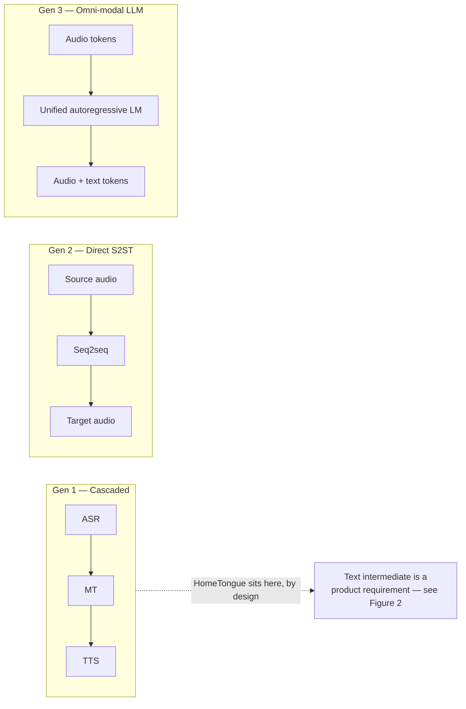

# S2ST research findings — what HomeTongue can actually use

**Status:** working reference. Supersedes
[reference/Latest S2ST Architecture Research.docx](reference/Latest%20S2ST%20Architecture%20Research.docx)
(hereafter *the source survey*), which is retained in the repo for provenance because this
document corrects it.

**Date:** 2026-07-26. Every external claim below was checked against a primary source on
that date; where a claim could not be closed against a primary source, it is marked as
such rather than rounded up into a confident statement.

**Locale note.** The pack codes `yue-HK` and `nan-TW` are **speech-locale identifiers**,
chosen because they name the closest vendor-supported speech-service locale families. They
are not a statement about the target audience. All content in both packs targets Cantonese
and Hokkien **as spoken in Singapore** — see the locale comments at
[src/languages/yue-HK/index.ts:3](../src/languages/yue-HK/index.ts:3) and
[src/languages/nan-TW/index.ts:4](../src/languages/nan-TW/index.ts:4). Read `yue-HK`
throughout as "the Cantonese pack", not as "this app targets Hong Kong".

---

## Scope and verdict

The source survey's core recommendation — replace the ASR→MT→TTS cascade with a direct,
omni-modal speech-to-speech model — **is not applicable to this product**. The decisive
reason is not compute or data: it is that HomeTongue is a language-*learning* application
whose entire teaching surface is rendered from the text intermediate that a direct S2ST
model exists to eliminate. Three sub-parts of the survey do transfer, and they are the
useful residue of the document: **(i)** LID-routed multi-LoRA serving, **(ii)** GRPO over
verifiable rewards, and **(iii)** the IMDA governance framing — the last with an important
substitution, because the survey's provenance recommendation assumes an architecture this
product does not have.

A fourth outcome came from checking the survey's claims rather than from the survey itself:
the corpus assumptions in [ML_TRAINING_PLAN.md](ML_TRAINING_PLAN.md) are stale by roughly
300× on total available Cantonese audio — though far less than that on audio a *commercial*
product may train on, because the largest corpus is non-commercially licensed. That
correction, with its licence caveat, is the single most actionable result in this document
and is treated first.

**What this document does not establish.** No model has been trained. The database holds
**zero consented samples** — stated at the top of
[ml/train/README.md:3](../ml/train/README.md:3) — so nothing here is a measured result, a
benchmark, or a claim about achieved quality. Every performance statement is a statement
about what the literature reports for *other* systems, or about what this repo would need
in order to try.

---

## Corpus re-audit

**F3: the corpus assumptions in the training plan are stale. F4: Singapore has a national
speech corpus under an open licence.**

[ML_TRAINING_PLAN.md:42](ML_TRAINING_PLAN.md:42) budgets step 2 against "Common Voice
`yue`, MDCC ~73 h". That was the honest state of Cantonese public data when the plan was
written. It is no longer.

**Table 1.** Public speech corpora relevant to the dialect packs, re-audited 2026-07-26.
Hours are as stated by each corpus's own paper or repository; `not stated` means the
primary source gives no hours figure and none was inferred.

| Corpus | Variety | Hours | Licence | Applicability |
|---|---|---|---|---|
| WenetSpeech-Yue [18] | Cantonese | 21,800 | dataset **CC BY-NC 4.0**; pipeline code Apache-2.0 | Largest Cantonese corpus by far — but non-commercial, so research and evaluation only |
| IMDA National Speech Corpus [5] | Singapore-accented English | **not stated** (~1.2 TB, 6 parts) | Singapore Open Data Licence v1.0 [6] | SG accent modelling; commercial use permitted, download terms uninspected |
| MDCC [19] | HK Cantonese (read audiobook) | 73.6 | custom signed agreement, gated download | Baseline only; the current plan's stale assumption |
| Common Voice `yue` / `zh-HK` [20] | Cantonese | 210.70 / 108.54 validated (CV 26.0) | CC0-1.0 | The only unambiguously commercial-safe Cantonese audio in this table |
| MCE [21] | Cantonese–English code-switch | 34.8 (abstract); 40 in body | **none declared** | Code-switch evaluation only; scripts are LLM-generated, not naturally occurring |
| MERLIon CCS [22] | Mandarin–English code-switch (SG) | >25 h EN + >5 h ZH child-directed speech | signed challenge agreement, redistribution forbidden | Closest match to SG code-switching; not usable in a shipped product |
| TaigiSpeech [23] | Taiwanese Hokkien | **not stated** (3,079 utterances, 21 speakers) | CC BY 4.0 | **Not an ASR corpus** — 8-class intent classification; not a `nan-TW` speech starting point |
| WenetSpeech-Wu [24] | Wu | ~8,000 | Apache-2.0 | Not applicable; listed to show the method generalises — and that licences differ within one lab |

### Two figures, because the licence splits the answer

The blunt version of F3 — "MDCC ~73 h is stale, there are now 21,800 hours" — is true about
*existence* and misleading about *use*. WenetSpeech-Yue's audio is released under **CC BY-NC
4.0** [18]. The Apache-2.0 licence in its GitHub repository covers the annotation pipeline
**code**, not the corpus. Non-commercial means a model trained on it cannot ship inside a
commercial product. So Table 1 answers two different questions:

- **How much Cantonese audio exists?** 21,800 hours, versus the ~73 h the plan assumes.
  Roughly 300×. This is the figure that matters for research, for a feasibility experiment,
  and for establishing what quality is reachable at all.
- **How much can a shipping model be trained on?** Common Voice under CC0-1.0 is the only
  unambiguously commercial-safe row: **210.70 h validated for `yue` plus 108.54 h for
  `zh-HK`** at Common Voice 26.0 [20]. MDCC's 73.6 h sits behind a signed custom agreement,
  not an open licence. That is a few hundred hours, not twenty thousand.

Both numbers should be carried forward. Reporting only the first would repeat the source
survey's own failure mode — quoting a headline capability without checking whether the
project can actually use it.

### What this changes for `ML_TRAINING_PLAN.md` step 2

**The pre-mix corpus changes, with a licence gate attached.** WenetSpeech-Yue replaces MDCC
as the primary native-speaker pre-mix *for experiments*, which moves step 2 from "pre-mix on
a small read-speech corpus and hope" to "pre-mix on a corpus large enough that the
learner-audio adaptation is genuinely an adaptation". Before any model trained on it is
shipped, one of three things must happen: obtain a commercial licence from the corpus
authors, retrain the shipping model on the CC0 subset only, or keep the NC-derived model to
internal evaluation. **Step 2 should state which.** Discovering the NC term after a training
run is the expensive order to discover it in.

**The gate framing changes, but not the gate.** The step-2 data gate is ~1–2k consented
learner samples. That gate is about *learner-accented* audio and is untouched by any public
corpus, because every corpus in Table 1 is native speakers. What changes is what happens on
the other side of it: a stronger pre-mix means the learner audio is spent on accent
adaptation rather than on teaching the model Cantonese from a weaker base.

**A Singapore-accent axis becomes available.** The IMDA National Speech Corpus is
Singapore-accented **English**, not Cantonese, so it does not substitute for Cantonese data.
It is relevant because HomeTongue's users code-switch, and Singapore-accented English is the
matrix language of that code-switching. MERaLiON-AudioLLM [4] is prior art for building on
the NSC. Of all the rows in Table 1, the NSC has the most permissive terms.

**What does not change: the data moat argument.** [ML_TRAINING_PLAN.md](ML_TRAINING_PLAN.md)
argues that learner-accented Cantonese is the defensible asset because public corpora are
native speakers and current STT fails precisely on heritage learners. Table 1 does not
weaken that argument — it strengthens it, by removing the excuse that there was no decent
base to adapt *from*.

### Why the NSC hours cell says "not stated"

IMDA publishes no hours figure for the National Speech Corpus. Its own pages [5] give the
size as approximately 1.2 TB across six parts and never state a duration; the strings
"hour", "hrs", "10,600" and "10600" do not appear on them. The only primary publication,
Koh et al. at Interspeech 2019 [17], describes "more than 2000 hours" of orthographically
transcribed read speech with a further 1,000 hours of conversational speech planned for a
second release — a far smaller and much older figure that does not cover the parts added
since.

A figure of ~10,600 hours circulates widely in dataset mirrors and secondary write-ups. **It
was not adopted here**, because no IMDA source states it and this document does not carry
numbers it cannot trace to a primary source. The honest cell is `not stated`. Anyone needing
the real duration should measure it after download, and that measurement should be recorded
here when it exists.

### The IMDA NSC licence — actionable, with one open step

The NSC is governed by the **Singapore Open Data Licence v1.0** [6], which IMDA's own NSC
page names as the corpus licence [5]. Under "What you can do" that licence permits using,
modifying and adapting the datasets "or any derived analyses or applications, whether
commercially or non-commercially". On that reading, **F4 is actionable**: training on the
NSC and shipping the resulting model commercially falls inside the grant. Three
qualifications must travel with that conclusion:

1. **The reading of "derived analyses or applications" is an interpretation.** The licence
   never defines that phrase and never mentions models, model weights, or ML training
   anywhere. Reading derived model weights into it is the best available reading of broadly
   worded, general-purpose licensing language — not literal textual coverage of ML training.
2. **The download terms were never inspected.** NSC download is gated behind registration
   and a Dropbox account. That registration flow **was not completed** in this pass, so any
   terms presented at the point of download were never read and cannot be ruled out. This
   must be closed — by registering and reading what is presented — before shipping a model
   trained on NSC data. Until then, "actionable" means "actionable on the publicly
   documented terms", not "cleared".
3. **Attribution is required, and the personal-data carve-out is material.** The licence's
   additional conditions oblige a conspicuous source notice plus a link to the licence in
   any product or site using the datasets, and it grants no rights over personal data in
   the dataset. For a speech corpus, that carve-out is the one that matters.

**Correction to an earlier premise.** The PDF previously cited as the NSC licence — the
IMDA Digital Services Laboratory *Technology* Licensing Agreement — **is not the corpus
licence**. It is an unexecuted template whose Annex 1 licenses "Natural Speech &
Transcription Technologies (NSTT)", a suite of tools *complementary to* the NSC, and its
"Purposes" clause is a blank placeholder. It should not be cited as the corpus licence
anywhere in this doc set.

---

## Why direct S2ST does not fit this product

**Figure 1.** Three generations of speech translation architecture. The source survey
frames the movement left-to-right as unambiguous progress. HomeTongue sits in Gen 1
deliberately, for the reason given in F1 below — not because it has not caught up.
(Figure 2, the pipeline diagram that shows *why*, appears in the companion article.)

### F1 — The cascade is a product requirement, not legacy debt

This is the primary reason, and it is a product argument rather than a resource argument.

The source survey treats the ASR→MT→TTS cascade as a defect to be eliminated, listing
compound error propagation, latency, and loss of paralinguistic identity as its systemic
limitations. Every one of those criticisms is correct **for a translation product**. They
do not apply to a teaching product, because in a teaching product the text intermediate is
not an implementation detail that leaks — it is the thing being sold.

Concretely, the intermediate transcript is what feeds:

- the **transcript display** the learner reads back;
- **Jyutping** romanisation — the Cantonese pack's romanisation system, declared at
  [src/languages/yue-HK/index.ts:23](../src/languages/yue-HK/index.ts:23);
- the **word breakdown**, generated from the pack's `breakdownSystem` prompt via
  [src/services/translationService.ts](../src/services/translationService.ts);
- **pronunciation scoring** — `scoreDialectAccuracyDetailed` and its deterministic fallback
  [src/services/translationService.ts:296](../src/services/translationService.ts:296),
  which calls the active pack's `scoring.fallbackMatch`
  ([src/languages/yue-HK/index.ts:244](../src/languages/yue-HK/index.ts:244)).

A direct speech-to-speech model that maps source audio to target audio without surfacing
text removes all four. There is no version of this product that keeps its teaching surfaces
and drops the text intermediate. The survey never considers this case, because it is
written about translation systems and evaluates architectures on translation criteria.

The resource argument exists too and is real — zero consented samples, no training compute
committed, no evaluation corpus — but it is **secondary**. If unlimited data and compute
appeared tomorrow, F1 would be unchanged.

### F2 — Hibiki-Zero is real, and still does not apply

The survey's flagship citation is genuine and worth reading. The paper is *Simultaneous
Speech-to-Speech Translation Without Aligned Data* [1]; **Hibiki-Zero** is the model name,
not the paper title. Weights are published as `kyutai/hibiki-zero-3b-pytorch-bf16` [2]. It
was accepted at ICML 2026 [3].

It does not apply here, for reasons that are structural rather than incidental:

- **Wrong language pair.** The released checkpoint's model card states support for French,
  Spanish, Portuguese and German [2]. None is Sinitic. The abstract of [1] describes "five
  X-to-English tasks" — the fifth is Italian→English, demonstrated in the paper as a
  low-resource adaptation experiment (under 1,000 hours of unaligned speech) rather than in
  the main results. Either way the source-language set is European.
- **Wrong direction.** Every supported task is X→**English**. HomeTongue's primary direction
  is English→Cantonese: an English-speaking heritage learner producing dialect output. The
  model translates *out of* the low-resource language; this product needs to generate *into*
  it.
- **The adaptation figure is not a shortcut for us.** "<1,000 hours of unaligned speech" is
  a genuinely low threshold, and it is the survey's strongest practical claim. But it is a
  threshold for adding a *source* language to an X→English model. It does not describe
  adding a target language, and it does not describe a corpus this project has.
- **Licensing of the weights is not established.** The Hugging Face repository for the
  checkpoint declares no licence — no `license` field in the card metadata and no LICENSE
  file [2]. The separate code repository is MIT, which covers code and not weights. So the
  weights are *published*, but the terms on which they may be redistributed or used
  commercially are **not documented**. Anyone tempted to build on them should close that
  question first.

**Citation defect in the source survey.** The survey's reference 11 is labelled "ICML 2026"
but links `https://icml.cc/virtual/2025/poster/44512`, which is the **2025** poster for the
earlier *High-Fidelity Simultaneous Speech-To-Speech Translation* paper [11] — a different
paper. The Hibiki-Zero ICML 2026 poster is `/virtual/2026/poster/66094` [3]. In fairness,
the survey separately links a valid ICML 2026 event page for Hibiki-Zero elsewhere in its
reference list; the defect is the mislabelled reference, not a total failure to cite the
right conference.

---

## What transfers

Four things, in descending order of how ready they are to be acted on.

### 1. LID-routed multi-LoRA serving (F5)

The pattern: assign one LoRA adapter per language, and route speech features to the
corresponding adapter using the known language ID. This is used in practice — the TEA-ASLP
system for the MLC-SLM 2025 challenge states it directly: "Each language is assigned a
specific LoRA adapter, and the speech features are routed to the corresponding adapter based
on the known LID" [7].

**Calibration.** [7] is a **challenge system-description paper**, not the origin of the
technique, and its actual mechanism is closer to weighted fusion than to pure hard routing —
it learns per-language parameters passed through a sigmoid to produce fusion weights
selected by LID. Cite it as a system that *uses* per-language adapter routing, not as the
paper that established it.

**Why it matters here.** The repo already resolves a per-language *base URL* —
[api/_lib/languageManifest.js:104](../api/_lib/languageManifest.js:104) — but the model name
is global: [api/_lib/chatCore.js:67](../api/_lib/chatCore.js:67) reads a single
`OPENAI_MODEL` for every language. With N dialect packs that forces one endpoint per
dialect, which is exactly the cost pattern multi-LoRA serving exists to avoid. The
resolution design is specified in `docs/MODEL_CONTROLS.md`.

This is also the link between routing and the dialect label: a variety classifier makes
adapter selection automatic instead of a manual environment variable. See
[The label gap](#the-label-gap) below.

### 2. GRPO over verifiable rewards (F6)

Group Relative Policy Optimization was introduced in DeepSeekMath [8] as a PPO variant that
drops the value model, which roughly halves the memory cost of the RL phase. Its relevance
here is narrow but real: GRPO needs a **reward function**, not preference pairs. This repo
already has verifiable signals that could serve as one —

- the active pack's `scoring.fallbackMatch` (deterministic character-equivalence scoring),
- the char-equivalence and particle-group maps in
  [ml/eval/normalization.json](../ml/eval/normalization.json),
- the stored exam `score` column in
  [supabase/migrations/0002_ml_data_pipeline.sql](../supabase/migrations/0002_ml_data_pipeline.sql).

Because those are computable rather than collected, GRPO lowers the *data* gate relative to
DPO, which needs thousands of rated preference pairs. It does not lower the gate to zero:
GRPO still needs prompts to roll out against and a held-out dev set to stop on.

**The guardrail is mandatory, not optional.** Long GRPO schedules are prone to reward
variance collapse — as training progresses the sampled hypotheses converge to similar
reward scores, the group standard deviation goes to zero, and the advantage term degenerates.
The clearest statement of the practical consequence is in [9]: practitioners applying GRPO
to new languages or domains should treat early stopping on a held-out development set as a
required component of the training pipeline rather than an optional refinement.

**Domain caveat.** [9] is a **text machine-translation** paper (GRPO on NLLB-200 at 600M and
1.3B). It is not a speech paper, and it does not make the transfer to speech. The
observation is mechanical enough — it is a property of how the group-relative advantage is
computed — that carrying it across is reasonable, but it is a transfer this document is
making, not one the source establishes. Any GRPO step added to
[ML_TRAINING_PLAN.md](ML_TRAINING_PLAN.md) must specify the early-stopping guardrail; the
protocol should be validated on our own runs rather than assumed from [9].

### 3. Curriculum learning and expressivity — transfers in part

The survey's curriculum section describes UniSS [10], a single-stage expressive S2ST
framework that stages training to avoid mode collapse, using a triple-tokenizer split into
speaker, linguistic and semantic tokens.

**What transfers:** the staged-curriculum principle — introduce capabilities in an order
that keeps the model from collapsing onto the easiest objective. That is generic training
practice and applies to any adapter schedule this project eventually runs.

**What does not transfer:** the goal. UniSS's speaker-token stream exists to preserve the
*source speaker's* voice in the target language. HomeTongue wants the opposite: a
consistent, model-provided dialect voice that the learner imitates. Voice cloning and
speaker-identity transfer are permanently out of scope for this product — they are a
misuse surface with no teaching benefit.

### 4. Governance — transfers, with a substitution

The survey correctly identifies the IMDA and AI Verify Foundation *Model AI Governance
Framework for Generative AI* [12] as the relevant regime, which is convenient: the same
agency supplies both that framework and the National Speech Corpus in Table 1.

Two of its dimensions land directly on this repo. **Data security**: dialect training data
carries biometric markers and must be held to the standard applied to medical or financial
records — which is why the two consent flags (`data_collection_consent`,
`audio_retention_consent`) default to false and are enforced server-side by RLS in
[supabase/migrations/0002_ml_data_pipeline.sql](../supabase/migrations/0002_ml_data_pipeline.sql).
**Testing and assurance**: dialect adaptation must be evaluated for degradation into
stereotype, not only for accuracy.

**The provenance recommendation needs a substitution.** The survey recommends embedding
cryptographic watermarks directly in the generated discrete acoustic tokens before waveform
decoding. That recommendation presupposes owning the codec and the decoder. HomeTongue does
not: it calls a vendor TTS API — Google Cloud Chirp 3: HD voices, constrained by the
manifest pattern at
[api/_lib/languageManifest.js:44](../api/_lib/languageManifest.js:44) — and never touches
acoustic tokens.

That leaves the question of whether the vendor watermarks on our behalf. It was checked
against primary sources on 2026-07-26 and the answer is: **not documented**. No Google Cloud
Text-to-Speech documentation states that Chirp 3: HD output carries SynthID; the terms
"SynthID" and "watermark" occur zero times on the Chirp 3: HD reference page [13] and zero
times across seven supporting Cloud TTS pages checked the same day. Google's own SynthID
page [14] names Lyria and the NotebookLM podcast feature as its watermarked *audio*
products; Cloud TTS and Chirp are absent.

**Undocumented is not the same as absent, and the distinction matters.** Silence on a
Google Cloud TTS reference page turned out not to be evidence either way: a Google Cloud
blog post confirms that Gemini 3.1 Flash TTS audio is watermarked with SynthID [15], yet
that model's own official reference page also has zero mentions of SynthID or watermarking.
Cloud TTS reference documentation therefore does not reliably disclose watermarking status
even where watermarking demonstrably applies. The defensible claim is narrow:

> Audio provenance **cannot be relied upon or asserted** for HomeTongue's TTS output. It is
> **not** claimed that the audio is unwatermarked.

**Consequence.** The governance posture is **in-app disclosure labelling** — the product
tells the user, in the interface, that synthesised dialect audio is machine-generated —
rather than any claim of cryptographic provenance. If Google later documents SynthID for
Chirp 3: HD, this can be revisited; it should not be assumed in the meantime.

---

## Coverage vs. demographics

**F7: pack coverage is inverted against Singapore's Chinese dialect demographics.**

By the Singapore Department of Statistics *Census of Population 2000* [16], the Chinese
resident population by dialect group was: Hokkien 41.1%, Teochew 21.0%, Cantonese 15.4%,
Hakka 7.9%, Hainanese 6.7%.

Against that, the repo ships exactly two packs. Cantonese (`yue-HK`) is fully supported —
Chirp 3: HD TTS plus STT. Hokkien (`nan-TW`) is text-only. Teochew, Hakka and Hainanese have
no pack at all. Mapped onto the demographics:

- **Hokkien, 41.1%** — `nan-TW` pack, no speech path
- **Teochew, 21.0%** — no pack
- **Cantonese, 15.4%** — `yue-HK` pack, full speech support
- **Hakka, 7.9%** — no pack
- **Hainanese, 6.7%** — no pack

The fully-supported pack serves the **third**-largest group. The largest group by a wide
margin, Hokkien, is text-only: `sttLanguages` is the empty array at
[api/_lib/languageManifest.js:55](../api/_lib/languageManifest.js:55), and the pack declares
`capabilities { tts: false, stt: false }` at
[src/languages/nan-TW/index.ts:73](../src/languages/nan-TW/index.ts:73) — which the code
treats as the single source of truth that suppresses mic and play controls throughout the UI.

**This is a vendor-availability outcome, not a product preference.** No vendor ships a
usable Hokkien TTS or STT model; Cantonese was supported because Google ships `yue-HK`
Chirp 3: HD voices. It is nonetheless the finding with the largest gap between what the
product does and what the population it serves would need.

**And there is no corpus to close it with.** The corpus audit found **no suitable public
Hokkien ASR corpus**. TaigiSpeech [23] was the candidate and does not qualify: it is an
8-class spoken **intent-classification** set (3,079 short command utterances from 21 elderly
speakers, for elder-care and smart-home commands), publishes no duration, and is not a
general speech-recognition corpus. It is also Taiwanese Hokkien, which is related to but not
the same as the Amoy-based Singapore Hokkien the `nan-TW` pack targets. So the Hokkien
speech path is blocked twice over — no vendor model *and* no identified training corpus —
and the honest status of `nan-TW` speech support is "no route currently identified", not
"pending work". Finding or building a Singapore Hokkien speech corpus is a prerequisite,
not a step.

**Two caveats on the figures.** First, they are from the **2000** census and are 26 years
old. They were verified against the primary counts and are accurate *for that census*, but
they have not been refreshed against Census 2020 in this pass; that refresh is outstanding
and the percentages will have shifted. Second, dialect-group ancestry is not the same as
dialect *fluency* — the census records which group a person belongs to, not whether they
speak the language. For a heritage-learning product the second number is the one that
matters, and it is not in this table.

---

## The label gap

**F8: the schema records which pack was active, not what variety was spoken.**

`speech_samples.language` is declared `text not null default 'yue-HK'` at
[supabase/migrations/0002_ml_data_pipeline.sql:26](../supabase/migrations/0002_ml_data_pipeline.sql:26).
That column faithfully records the language pack the app was in when the sample was
captured. It does not record what the speaker actually said. Singapore Cantonese,
HK-influenced Cantonese, Hokkien uttered while the Cantonese pack was active, and
English–Cantonese code-switched speech all collapse into the single string `yue-HK`.

Two consequences follow, and both bite exactly where the transferable techniques land:

- **Per-variety training is impossible.** Section "What transfers" argues for one LoRA
  adapter per variety. Training that requires knowing which variety each sample is — which
  this schema cannot answer.
- **Per-variety accuracy measurement is impossible.** The ship bar in
  [ML_TRAINING_PLAN.md:44](ML_TRAINING_PLAN.md:44) is ≥ 15–20 % relative CER
  reduction. Aggregate CER over an unlabelled mixture of varieties can improve while the
  variety a given user actually speaks gets worse, and nothing in the current pipeline
  would show it.

This is a **label** gap, not an application gap — the review surface to apply labels already
exists in `admin/`. The schema change, the contribution surfaces, the
`reviewer > self > classifier` precedence rule, and the classifier design are specified in
[DIALECT_CLASSIFICATION.md](DIALECT_CLASSIFICATION.md).

---

## Corrections to the source document

**Table 3.** Defects found in the source survey. Rows 1–6 were verified by inspecting the
`.docx` and its embedded hyperlink relationships directly; rows 7–9 are absences, verified
by exhaustive search of the extracted document text. (Table 2 is the model-control surface
and lives in `docs/MODEL_CONTROLS.md`; numbering is shared across this doc set so the
companion article can reference all three by the same numbers.)

| # | Issue | Detail |
|---|---|---|
| 1 | Mathematical notation lost | Mimi sample rate, framerate, RVQ codebook indices, the GRPO advantage formula and the GRPO loss all render blank in the `.docx` |
| 2 | Mis-cited ICML poster | Links `/virtual/2025/poster/44512` (the 2025 Hibiki paper) where Hibiki-Zero is `/virtual/2026/poster/66094` |
| 3 | Non-canonical source | Reference 10 is a Scribd mirror of an arXiv paper |
| 4 | Weak support for broad claims | Reference 1, a small personal GitHub repo, carries much of the introduction's field-framing |
| 5 | No compute or cost figures | Discusses 30B-parameter models and multi-GPU serving without a single cost or hour estimate |
| 6 | No data-volume requirements | States "<1000 h" for Hibiki-Zero adaptation but gives no figures for any other technique |
| 7 | No evaluation methodology | ASR-BLEU, Average Lagging and LAAL are named or implied, never defined; a reader cannot set a ship bar |
| 8 | No dialect data availability analysis | The decisive constraint for any dialect project is absent |
| 9 | Product-fit gap | Never considers that a language-*learning* product requires the text intermediate |

**Verification notes on Table 3**, recorded so a reader can tell what was checked from what
was asserted:

- **Row 1** — confirmed by text extraction: the document reads "sampled at  kHz", "a
  constant framerate of  Hz", "denoted as ,", "Let  be the cumulative calculated reward",
  and "The advantage  for each sequence". Every variable is an empty span. The underlying
  values are recoverable from the Mimi codec's own paper [25], but not from the survey.
- **Row 3** — confirmed. The tenth entry in the works-cited list is
  `https://www.scribd.com/document/999870959/2602-11072v1`, a Scribd mirror of arXiv:2602.11072.
- **Row 4** — confirmed. The first works-cited entry is
  `https://github.com/abdouaziz/speech-to-speech-translation`, cited as the support for the
  introduction's framing of cascaded-architecture limitations.
- **Row 5** — confirmed by exhaustive search: no `$`, "USD", "GPU-hour" or "per hour" token
  occurs anywhere in the document, while "3B to 30B parameter multimodal models" and
  "Qwen3-Omni-30B-A3B" both do.
- **Row 7 — one refinement.** "ASR-BLEU" and "Average Lagging" are both named in the text.
  **"LAAL" is never named** — zero occurrences. The substance of the row stands (no metric is
  defined, and no ship bar is derivable), but a reader should not expect to find the string
  "LAAL" in the source.

---

## Evidence

Canonical sources only. arXiv `/abs/` pages, ACL Anthology, OpenReview, official vendor and
government documentation. All checked 2026-07-26.

1. Labiausse, T., Fabre, R., Estève, Y., Défossez, A., Zeghidour, N. *Simultaneous
   Speech-to-Speech Translation Without Aligned Data* (the Hibiki-Zero paper).
   https://arxiv.org/abs/2602.11072
2. Kyutai. `hibiki-zero-3b-pytorch-bf16` model card — the source of the four-language
   support list; declares no licence.
   https://huggingface.co/kyutai/hibiki-zero-3b-pytorch-bf16
3. ICML 2026 poster 66094 — *Simultaneous Speech-to-Speech Translation Without Aligned
   Data*, Labiausse et al. https://icml.cc/virtual/2026/poster/66094
4. He, Y., Liu, Z., Sun, S., Wang, B., Zhang, W., Zou, X., Chen, N. F., Aw, A. T.
   *MERaLiON-AudioLLM: Bridging Audio and Language with Large Language Models*. The NSC
   dependency is stated in the body, not the abstract. https://arxiv.org/abs/2412.09818
5. IMDA. *National Speech Corpus* — landing page; FAQ item 1 names the Singapore Open Data
   Licence. https://www.imda.gov.sg/how-we-can-help/national-speech-corpus
6. Government of Singapore. *Singapore Open Data Licence v1.0*.
   https://data.gov.sg/open-data-licence
7. Xue, H., Huang, K., Zhou, Z., Huang, S., Shang, S. *The TEA-ASLP System for Multilingual
   Conversational Speech Recognition and Speech Diarization in MLC-SLM 2025 Challenge* — a
   system that uses LID-routed per-language LoRA adapters; a challenge system description,
   not the origin of the technique. https://arxiv.org/abs/2507.18051
8. Shao, Z., et al. *DeepSeekMath: Pushing the Limits of Mathematical Reasoning in Open
   Language Models* — introduces Group Relative Policy Optimization.
   https://arxiv.org/abs/2402.03300
9. Garcia-Estrada, E., Escolano, C., Fonollosa, J. A. R. *Reference-Free Reinforcement
   Learning Fine-Tuning for MT: A Seq2Seq Perspective* — the reward-variance-collapse and
   mandatory-early-stopping result. **Text MT, not speech.**
   https://arxiv.org/abs/2605.15976
10. *UniSS: Unified Expressive Speech-to-Speech Translation with Your Voice* — OpenReview.
    https://openreview.net/forum?id=5o0ZvYzh6B
11. Labiausse, T., Mazaré, L., Grave, E., Défossez, A., Zeghidour, N. *High-Fidelity
    Simultaneous Speech-To-Speech Translation* (the 2025 Hibiki paper — the paper the
    survey's ICML link actually points at). https://arxiv.org/abs/2502.03382
12. IMDA and AI Verify Foundation. *Model AI Governance Framework for Generative AI*,
    launched 30 May 2024. https://aiverifyfoundation.sg/resources/mgf-gen-ai/
13. Google Cloud. *Chirp 3: HD voices* — Text-to-Speech documentation. Zero occurrences of
    "SynthID" or "watermark". https://docs.cloud.google.com/text-to-speech/docs/chirp3-hd
14. Google DeepMind. *SynthID* — names Lyria and NotebookLM as watermarked audio products;
    Cloud TTS and Chirp are absent. https://deepmind.google/science/synthid/
15. Google Cloud. *Gemini 3.1 Flash TTS on Google Cloud* — states that this model's audio is
    watermarked with SynthID, while that model's own reference page does not.
    https://cloud.google.com/blog/products/ai-machine-learning/gemini-3-1-flash-tts-on-google-cloud
16. Singapore Department of Statistics. *Chinese Resident Population by Age Group, Dialect
    Group and Sex, Census of Population 2000* — the source of the F7 percentages.
    https://data.gov.sg/datasets/d_7a942ef799c7a66a78835245bc581980/view
17. Koh, J. X., et al. *Building the Singapore English National Speech Corpus* —
    Interspeech 2019. The only primary NSC publication; states "more than 2000 hours" of
    read speech with 1,000 further conversational hours planned.
    https://www.isca-archive.org/interspeech_2019/koh19_interspeech.html
18. *WenetSpeech-Yue: A Large-scale Cantonese Speech Corpus with Multi-dimensional
    Annotation* — states 21,800 hours across 10 domains.
    https://arxiv.org/abs/2509.03959 · dataset card, licence `cc-by-nc-4.0`:
    https://huggingface.co/datasets/ASLP-lab/WenetSpeech-Yue
19. Yu, T., et al. *Automatic Speech Recognition Datasets in Cantonese: A Survey and New
    Dataset* (MDCC) — LREC 2022. States 73.6 hours of clean read speech from Hong Kong
    Cantonese audiobooks. https://aclanthology.org/2022.lrec-1.696/
20. Mozilla. *Common Voice* dataset metadata, release 26.0 (2026-06-12) — `yue` 210.70 h
    validated of 307.41 h total; `zh-HK` 108.54 h validated of 143.37 h total; CC0-1.0. The
    public dataset page is client-rendered and not directly citable; these figures come from
    Mozilla's own canonical metadata repository.
    https://github.com/common-voice/cv-dataset
21. *Developing a Multilingual Dataset and Evaluation Metrics for Code-Switching* (MCE) —
    ICASSP 2025. Abstract and Table 1 state 34.8 hours; the body states 40 hours. Scripts
    were LLM-generated and then read aloud by recruited speakers.
    https://arxiv.org/abs/2310.17953
22. Garcia Perera, L. P., Chua, Y. H. V., Liu, H., Woon, F. T., Khong, A. W. H., Dauwels, J.,
    Khudanpur, S., Styles, S. J. *MERLIon CCS Challenge Evaluation Plan* — over 25 hours of
    English and over 5 hours of Mandarin child-directed speech; access requires a signed data
    use agreement and redistribution is forbidden. https://arxiv.org/abs/2305.19493
23. *TaigiSpeech* — Taiwanese Hokkien spoken intent-classification dataset: 3,079 utterances,
    21 speakers, 8 command classes, no duration published; CC BY 4.0.
    https://arxiv.org/abs/2603.21478
24. *WenetSpeech-Wu* — approximately 8,000 hours across eight Wu sub-dialects; Apache-2.0.
    https://arxiv.org/abs/2601.11027
25. Défossez, A., Mazaré, L., Orsini, M., Royer, A., Pérez, P., Jégou, H., Grave, E.,
    Zeghidour, N. *Moshi: a speech-text foundation model for real-time dialogue* —
    introduces the Mimi codec on which the survey's codec section rests. Mimi is described
    in the body, not the abstract. https://arxiv.org/abs/2410.00037
