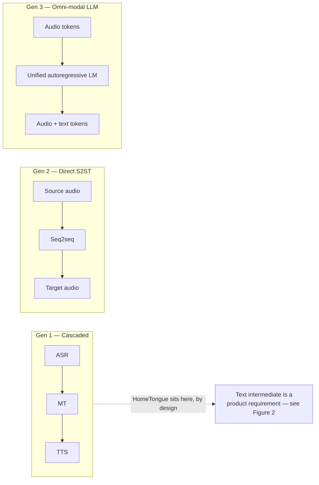
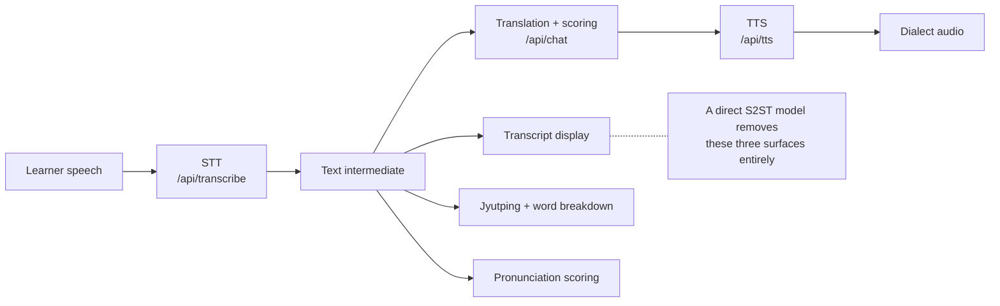
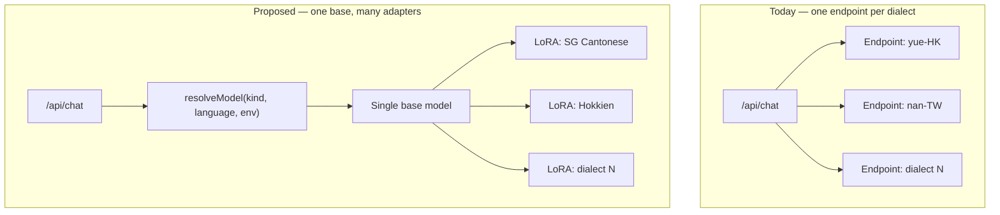
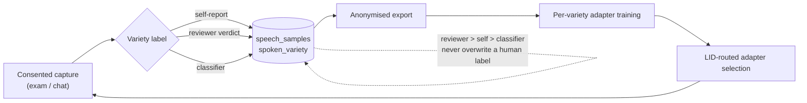
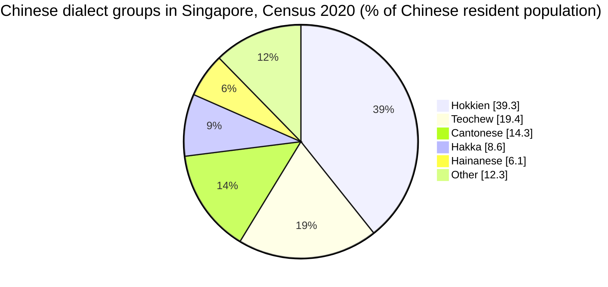

# Dialect-Preserving Speech Translation for Heritage Language Learning: A System Description and Feasibility Audit

**Darren Chua** — no affiliation

*v1.0 — 2026-07-26*

## Abstract

HomeTongue is a heritage-language learning application for Singapore's Chinese dialect communities:
Cantonese with speech support, Hokkien text-only. This paper describes the speech pipeline
and audits the upgrade usually recommended for such systems — replacing the
recognition → translation → synthesis cascade with a direct speech-to-speech model. That upgrade
is inapplicable here for a product reason, not a resource one: every teaching surface is rendered
from the intermediate transcript — the transcript the learner reads back, Jyutping romanisation,
the word-by-word breakdown and pronunciation scoring — so a model mapping audio to audio without
surfacing text deletes the features that constitute the product. A corpus re-audit finds roughly
21,800 hours of Cantonese speech where the project's training plan assumed 73 — but
non-commercially licensed, leaving about 319 hours of public-domain audio a commercial product
may train on. Three techniques transfer: language-ID-routed multi-adapter serving, Group Relative
Policy Optimization over computable rewards, and Singapore's generative-AI governance framing. No
trained model, no measured result and no populated benchmark is presented, because the
consent-gated corpus holds zero samples; the evaluation protocol is pre-registered instead.

## 1. Introduction

Singapore's Chinese dialects are a heritage-language problem: learners have ancestral connection
and partial comprehension but no instruction route, and published recognition models, trained on
fluent native speech, serve them badly. HomeTongue serves two varieties as spoken in Singapore,
built as a cascade the literature treats as superseded. Its internal architecture survey was
audited claim by claim against primary sources (§4).

Contributions:

1. A product-grounded argument for retaining the cascade in learning applications, where the
   text intermediate is the teaching surface, not an implementation artefact (§3).
2. A corpus re-audit correcting a roughly 300-fold stale assumption, and showing why the
   corrected figure cannot be used as stated: licence terms split it (§2, §6).
3. A three-layer taxonomy of model-control points — inference, training, routing — separating
   today's tunable controls from specifications (§5).
4. A variety-labelling design that makes per-variety adapter routing automatic (§5).

## 2. Background and Related Work

Speech translation is described in three generations (Figure 1), presented as progress.

**Figure 1.** Three generations of speech-translation architecture; this system stays in the
first.

Evidence for the direct approach is genuine [1][3], but the released checkpoint has four European
source languages, none Sinitic, translates only *into* English where a heritage learner needs
generation *into* the variety, and carries CC BY-NC-SA 4.0 weights [2]. Corpora are as lopsided
(Table 1, §11.1): 21,800 hours exist for Cantonese [4] and none was identified for Hokkien, whose
nearest candidate is a 6.1-hour Taiwanese intent-classification set [5] — neither a recognition
corpus nor Singapore Hokkien. Singapore's national corpus is accented English [6], the most recent
Singapore ASR release found covers the four official languages and no dialect [7], and governance
is set by Singapore's generative-AI framework [8].

## 3. System Architecture

Three server-side proxies — transcription, chat completion, synthesis — keep vendor credentials
off the client, and language material lives in per-variety packs whose codes, `yue-HK` and
`nan-TW`, name speech locales rather than audiences: both target the varieties as spoken in
Singapore.

**Figure 2.** The learning pipeline: the upper branches are the product.

Figure 2 carries the central claim. Compound error propagation, latency and lost paralinguistic
identity are real criticisms of a cascade — for a *translation* product. In a teaching product the
intermediate is what is being sold, and no version of this application keeps its teaching surfaces
without it. The resource argument — no corpus, no committed compute — is secondary.

## 4. System Setup

Inference is vendor-hosted: `gpt-4o-mini` for translation, suggestions and scoring;
`gpt-4o-transcribe` for recognition, which is also the baseline any fine-tune must beat; and
Chirp 3: HD voices for Cantonese synthesis [9]. Each proxy caps input length, allowlists model
and voice names, and rate-limits. Persistence is on-device by default, or Postgres with row-level
security in cloud mode. An evaluation harness and an anonymised export exist, unrun.

**Reproducibility.** Nothing numeric can be reproduced, because the corpus holds zero samples.
What is reproducible is the numbered reference list (§10): every external claim resolves against
its cited primary source without repo access, checked 2026-07-26; unclosed claims are marked in
place. Retrieval method per source, and all working detail, sits in four repo-internal companion
documents: the [findings](../S2ST_FINDINGS.md), [control surface](../MODEL_CONTROLS.md),
[labelling design](../DIALECT_CLASSIFICATION.md) and [training plan](../ML_TRAINING_PLAN.md).

## 5. Design Rationale and Implementation

Three techniques transfer, one per layer of Table 2 (§11.2).

**Routing.** One adapter per language, routed by language ID, is used in practice
[10]. This system resolves a per-language endpoint but one global model name, forcing a deployment
per dialect (Figure 3). The proposal adds a per-language link ahead of the global chain, with one
load-bearing asymmetry: client-supplied model names stay allowlist-validated, server-configured
overrides bypass the allowlist as trusted configuration, and the two must never share a code path.
A further constraint is legal: no override may name a model trained on non-commercial data (§6).

**Figure 3.** Routing today versus proposed: one endpoint per dialect, or one base, many adapters.

**Training.** Group Relative Policy Optimization [11] needs a reward function rather than
preference pairs, and three computable signals already exist: a character-equivalence matcher, its
normalisation map and stored exam scores — lowering the data gate, not to zero. One guardrail is
mandatory: long schedules risk reward-variance collapse, so early stopping on a held-out
development set is required [12] — a text-translation result, so carrying it to speech is this
paper's transfer.

**Labelling.** Per-variety routing needs a variety label, but the schema records which pack was
active, not what was spoken: Singapore-usage and Hong-Kong-influenced Cantonese collapse into one
string. Three nullable columns fix that (Table 5, §11.4), where absent means unknown,
permanently. Labels arrive from reviewer verdicts, self-reports, a classifier backfill and —
specified only — user uploads, at precedence `reviewer > self > classifier` by source, enforced
database-side (Figure 4).

**Figure 4.** The label → train → route loop; every element is a specification, none built.

## 6. Discussion

**Availability and usability diverge.** WenetSpeech-Yue's 21,800 hours are CC BY-NC 4.0; its
Apache-2.0 licence covers pipeline code, not the corpus [4]. Two numbers must therefore travel
together: 21,800 hours exist, roughly 300 times the 73 the training plan assumed, while about
319 hours are commercially safe — CC0 Common Voice audio (`yue` 210.70 plus `zh-HK` 108.54
validated, release 26.0) [15]. Quoting only the first repeats the failure this audit corrects.
Published weights diverge the same way [2]: for dialect speech translation the open ecosystem is
substantially non-commercial.

**Singapore-local routes are narrower than they look.** Three sources could be checked against
primary sources (Table 4, §11.3). The one holding dialect speech is permission-gated twice, by the
archive's reserved rights and by interviewee access conditions [18][19]; the only downloadable
Singapore-Chinese conversational set is Mandarin under a non-commercial, no-derivatives licence
[20]; and a redistribution of the national corpus declares no licence [21]. The national corpus's
licence permits commercial use of 'derived analyses or applications' in its text [16]; reading
model weights into that phrase is an interpretation. Its duration is unpublished [6][17] and its
download terms were never inspected here.
Consented user uploads are therefore the one commercially clean Singapore-variety route
identified — consent comes from the speaker — but that surface is a design.

**Coverage is inverted against demographics.**

**Figure 5.** Dialect groups as a share of Singapore's 3,006,769 Chinese residents, Census of
Population 2020 [13].

Against Figure 5, the fully supported pack is Cantonese at 14.3 %, while Hokkien at 39.3 %, the
largest group by far, is text-only with no recognition path; Teochew, Hakka and Hainanese have no
pack, and the ranking is unchanged since 2000 [14]. That is vendor availability, not preference:
no vendor ships Hokkien speech models, and no corpus was found. Two caveats: dialect-group
ancestry is not fluency, which the census does not record and which is what a heritage product
needs; and a contribution surface would move Hokkien one step, from "no route identified" to "a
route, gated on human transcription capacity", since without a vendor model every transcript needs
a human.

## 7. Limitations

The database holds zero consented samples, so this paper reports no trained model, no measured
result and no populated benchmark. Performance statements above describe what the literature
reports for other systems. Nothing in §5 has been built.

The protocol is nonetheless fixed in advance. Character and word error rate are measured against
the `gpt-4o-transcribe` baseline on held-out learner audio, using the in-app scorer's
normalisation; train and validation split by speaker hash rather than utterance, so no
speaker appears on both sides; and the ship bar is a relative character-error-rate reduction of
at least 15–20 %, below which nothing ships. Publishing that bar before any result is
deliberate: a later revision fills in measured numbers against an already-public threshold
rather than choosing one afterwards.

## 8. Ethical Considerations

Speech is biometric, and heritage recordings often capture relatives rather than the account
holder. Two flags govern collection — `data_collection_consent` and `audio_retention_consent` —
both default off and both re-enforced server-side by row-level security, not by a client toggle
alone; withdrawal deletes what was collected under them. Both are first-person: an uploader cannot
consent for a relative, so §6's upload route needs a per-upload attestation, a consent record
naming the person recorded, and withdrawal reaching both.

Audio provenance cannot be asserted. No documentation states that the voices used here carry
SynthID watermarking [9], and the vendor's watermarking page omits them [22] — but undocumented
is not absent, since a vendor blog confirms watermarking for a model whose own reference page is
equally silent [23]. So no provenance is claimed, and it is *not* claimed the audio is
unwatermarked; the posture is in-app disclosure labelling: the interface says synthesised audio
is machine-generated.

Two dimensions of Singapore's framework [8] apply: data security, met above, and testing and
assurance, requiring that dialect adaptation be evaluated for degradation into stereotype, not
accuracy alone.

## 9. Conclusion and Future Work

For a learning product the cascade is a requirement, not debt, because the text intermediate is
the teaching surface. The binding constraint is licensed, consented, variety-labelled Singapore
dialect audio, which does not exist at any scale. Next, in dependency order: the variety label
and reviewer labelling, a third-party consent design, then a first adaptation run judged against
§7's protocol. Until then this paper claims a design and an audit, and no result.

## 10. References

1. Labiausse, T., Fabre, R., Estève, Y., Défossez, A., Zeghidour, N. *Simultaneous
   Speech-to-Speech Translation Without Aligned Data* (the Hibiki-Zero paper).
   https://arxiv.org/abs/2602.11072
2. Kyutai. `hibiki-zero-3b-pytorch-bf16` model card — the released checkpoint supports French,
   Spanish, Portuguese and German; licence CC BY-NC-SA 4.0, stated in the card body rather than
   the YAML metadata. https://huggingface.co/kyutai/hibiki-zero-3b-pytorch-bf16
3. ICML 2026 poster 66094 — *Simultaneous Speech-to-Speech Translation Without Aligned Data*.
   https://icml.cc/virtual/2026/poster/66094
4. *WenetSpeech-Yue: A Large-scale Cantonese Speech Corpus with Multi-dimensional Annotation* —
   21,800 hours. https://arxiv.org/abs/2509.03959 · dataset card, licence `cc-by-nc-4.0`:
   https://huggingface.co/datasets/ASLP-lab/WenetSpeech-Yue
5. *TaigiSpeech* — Taiwanese Hokkien spoken intent classification: 3,079 utterances, 21
   speakers, 8 classes, ~6.1 hours; CC BY 4.0. https://arxiv.org/abs/2603.21478
6. IMDA. *National Speech Corpus* — landing page; names the Singapore Open Data Licence as the
   corpus licence, states no hours figure, gives the size as approximately 1.2 TB in six parts,
   and records no planned updates since July 2021.
   https://www.imda.gov.sg/how-we-can-help/national-speech-corpus
7. *Polyglot-Lion: Efficient Multilingual ASR for Singapore via Balanced Fine-Tuning of
   Qwen3-ASR* — English, Mandarin, Tamil and Malay; no Chinese dialect.
   https://arxiv.org/abs/2603.16184
8. IMDA and AI Verify Foundation. *Model AI Governance Framework for Generative AI*, 2024 —
   the source of the data-security and testing-and-assurance dimensions cited in §8.
   https://aiverifyfoundation.sg/resources/mgf-gen-ai/
9. Google Cloud. *Chirp 3: HD voices* — Text-to-Speech documentation; zero occurrences of
   "SynthID" or "watermark". https://docs.cloud.google.com/text-to-speech/docs/chirp3-hd
10. Xue, H., Huang, K., Zhou, Z., Huang, S., Shang, S. *The TEA-ASLP System for Multilingual
    Conversational Speech Recognition and Speech Diarization in MLC-SLM 2025 Challenge* — a
    system that uses LID-routed per-language LoRA adapters; a challenge system description, not
    the origin of the technique. https://arxiv.org/abs/2507.18051
11. Shao, Z., et al. *DeepSeekMath: Pushing the Limits of Mathematical Reasoning in Open
    Language Models* — introduces Group Relative Policy Optimization.
    https://arxiv.org/abs/2402.03300
12. Garcia-Estrada, E., Escolano, C., Fonollosa, J. A. R. *Reference-Free Reinforcement
    Learning Fine-Tuning for MT: A Seq2Seq Perspective* — reward-variance collapse and
    mandatory early stopping. Text machine translation, not speech.
    https://arxiv.org/abs/2605.15976
13. Singapore Department of Statistics. *Chinese Resident Population by Age Group, Detailed
    Ethnic Group and Sex, Census of Population 2020* — the granular dataset carrying the
    dialect-group breakdown, which the census's headline Statistical Release 1 does not; total
    Chinese resident population 3,006,769.
    https://data.gov.sg/datasets/d_fb8ce4a963b3045ce9f97bafee289c0b/view
14. Singapore Department of Statistics. *Chinese Resident Population by Age Group, Dialect
    Group and Sex, Census of Population 2000* — the 2000 baseline: Hokkien 41.1 %, Teochew
    21.0 %, Cantonese 15.4 %, Hakka 7.9 %, Hainanese 6.7 % of 2,513,847, so the rank order is
    unchanged. https://data.gov.sg/datasets/d_7a942ef799c7a66a78835245bc581980/view
15. Mozilla. *Common Voice* dataset metadata, release 26.0 — `yue` 210.70 h validated of
    307.41 h total; `zh-HK` 108.54 h validated of 143.37 h total; CC0-1.0. The public dataset
    page is client-rendered, so these figures come from Mozilla's canonical metadata
    repository. https://github.com/common-voice/cv-dataset
16. Government of Singapore. *Singapore Open Data Licence v1.0* — permits use of the datasets
    "or any derived analyses or applications, whether commercially or non-commercially";
    requires a conspicuous source notice; grants no rights over personal data. The licence
    never mentions models, model weights or machine-learning training, so reading derived model
    weights into it is an interpretation rather than literal coverage.
    https://data.gov.sg/open-data-licence
17. Koh, J. X., et al. *Building the Singapore English National Speech Corpus* — Interspeech
    2019; states "more than 2000 hours" of read speech for an earlier corpus version, the only
    citable hours figure. A widely circulated ~10,600-hour figure traces only to secondary
    sources and is not used here.
    https://www.isca-archive.org/interspeech_2019/koh19_interspeech.html
18. National Archives of Singapore. *Oral History Interviews — FAQ* — reserves all rights in
    the recordings and transcripts, directs intended uses to a write-in address, and states
    that access follows the conditions stipulated by interviewees; gives collection scale only
    as "several thousand hours". Client-rendered page, read in a rendered browser.
    https://www.nas.gov.sg/archivesonline/oral_history_interviews/faq
19. National Archives of Singapore. *Chinese Dialect Groups*, Accession 000726, reel 4 of 4 —
    per-record all-rights-reserved notice requiring written permission; conditions governing
    access "For background information only", behind a request-to-view flow; recorded
    22 November 1986, running time 00:26:01. The rendered page displays no
    language-of-interview field.
    https://www.nas.gov.sg/archivesonline/oral_history_interviews/record-details/03ee4b77-115e-11e3-83d5-0050568939ad
20. MagicHub. *Singaporean Chinese Conversational Speech Corpus* (ASR-SgpCCSC) — 5 hours of
    Singaporean Mandarin spontaneous conversation; MAGIC DATA open-source licence and
    CC BY-NC-ND 4.0.
    https://magichub.com/datasets/singaporean-chinese-conversational-speech-corpus/
21. MERaLiON. *Multitask-National-Speech-Corpus-v1* dataset card — derived from IMDA's National
    Speech Corpus; ~15.19M rows, ~3 TB; no `license` field in the card metadata and no terms in
    the card body.
    https://huggingface.co/datasets/MERaLiON/Multitask-National-Speech-Corpus-v1
22. Google DeepMind. *SynthID* — names Lyria and NotebookLM as watermarked audio products;
    Cloud Text-to-Speech and Chirp are absent. https://deepmind.google/science/synthid/
23. Google Cloud. *Gemini 3.1 Flash TTS on Google Cloud* — states that this model's audio is
    watermarked with SynthID, while that model's own reference page does not.
    https://cloud.google.com/blog/products/ai-machine-learning/gemini-3-1-flash-tts-on-google-cloud
24. National Archives of Singapore. *Oral History Centre — About Us* — more than 4,000
    interviews collected since 1979. Rendered-browser read.
    https://www.nas.gov.sg/archivesonline/oral_history_interviews/about-us
25. He, Y., Liu, Z., Sun, S., Wang, B., Zhang, W., Zou, X., Chen, N. F., Aw, A. T.
    *MERaLiON-AudioLLM: Bridging Audio and Language with Large Language Models* — prior art
    for building on the National Speech Corpus. https://arxiv.org/abs/2412.09818
26. Yu, T., et al. *Automatic Speech Recognition Datasets in Cantonese: A Survey and New
    Dataset* (MDCC) — LREC 2022; 73.6 hours of read Hong Kong Cantonese audiobook speech.
    https://aclanthology.org/2022.lrec-1.696/
27. *Developing a Multilingual Dataset and Evaluation Metrics for Code-Switching* (MCE) —
    ICASSP 2025; 34.8 hours in the abstract, 40 in the body; LLM-generated scripts read aloud.
    https://arxiv.org/abs/2310.17953
28. Garcia Perera, L. P., Chua, Y. H. V., Liu, H., Woon, F. T., Khong, A. W. H., Dauwels, J.,
    Khudanpur, S., Styles, S. J. *MERLIon CCS Challenge Evaluation Plan* — over 25 hours of
    English and over 5 hours of Mandarin child-directed speech; signed data-use agreement, no
    redistribution. https://arxiv.org/abs/2305.19493
29. *WenetSpeech-Wu* — approximately 8,000 hours across eight Wu sub-dialects; Apache-2.0.
    https://arxiv.org/abs/2601.11027

## 11. Appendix

Figure and table numbers are shared with the four companion documents named in §4, so a claim
can be cited by the same number in either place; references are numbered independently in this
paper. The table numbered 3 in that set records defects in the unpublished internal survey and
is not reproduced here. Hours below are as stated by each source's own paper or repository, and
`not stated` means the primary source gives no hours figure and none was inferred.

### 11.1 Corpus re-audit

**Table 1.** Public speech corpora relevant to the dialect packs, re-audited 2026-07-26.

| Corpus | Variety | Hours | Licence | Applicability |
|---|---|---|---|---|
| WenetSpeech-Yue [4] | Cantonese | 21,800 | dataset **CC BY-NC 4.0**; pipeline code Apache-2.0 | Largest Cantonese corpus by far — but non-commercial, so research and evaluation only |
| IMDA National Speech Corpus [6] | Singapore-accented English | **not stated** (~1.2 TB, 6 parts) | Singapore Open Data Licence v1.0 [16] | SG accent modelling; commercial use permitted on the published terms, download terms uninspected |
| MDCC [26] | HK Cantonese (read audiobook) | 73.6 | custom signed agreement, gated download | Baseline only; the training plan's stale assumption |
| Common Voice `yue` / `zh-HK` [15] | Cantonese | 210.70 / 108.54 validated (CV 26.0) | CC0-1.0 | The only unambiguously commercial-safe Cantonese audio in this table |
| MCE [27] | Cantonese–English code-switch | 34.8 (abstract); 40 in body | **none declared** | Code-switch evaluation only; scripts are LLM-generated, not naturally occurring |
| MERLIon CCS [28] | Mandarin–English code-switch (SG) | >25 h EN + >5 h ZH child-directed speech | signed challenge agreement, redistribution forbidden | Closest match to SG code-switching; not usable in a shipped product |
| TaigiSpeech [5] | Taiwanese Hokkien | ~6.1 (3,079 utterances, 21 speakers) | CC BY 4.0 | **Not an ASR corpus** — 8-class intent classification; not a Hokkien speech starting point |
| WenetSpeech-Wu [29] | Wu | ~8,000 | Apache-2.0 | Not applicable; listed to show the method generalises — and that licences differ within one lab |

### 11.2 Model-control surface

**Table 2.** Control points across three layers: what is tunable today, and what is proposed.
Every "Proposed" entry is a specification, and none has been built.

| Layer | Control | Today | Proposed |
|---|---|---|---|
| Inference | Voice selection | per-pack voice registry, with a resolver mapping legacy identifiers to a valid key; default voice `zephyr` | unchanged |
| Inference | Tone / register | resolves active-persona tone → profile preference → `casual` | per-request override |
| Inference | SG vs HK lexicon bias | duplicated as prose inside three pack prompt constants | one explicit request parameter, or a single pack constant interpolated into all three |
| Inference | Dialect strictness | — | new scalar knob; prompt-and-proxy analogue of a guidance coefficient |
| Inference | Scoring harshness | fixed LLM rubric, with a deterministic character-equivalence fallback | exposed threshold, feeding exam difficulty |
| Inference | Latency vs quality | — | model tier per request; depends on the routing controls below |
| Training | SFT on corrections | scripted, untested until data exists | unchanged |
| Training | DPO on ratings | scripted, untested until data exists | unchanged |
| Training | GRPO on verifiable rewards | — | rewards from the deterministic matcher, the shared normalisation map, and stored exam scores |
| Training | Reward-collapse guardrail | — | mandatory early stopping on a held-out dev set |
| Routing | Per-language base URL | per-language environment variable overriding a global default, then the provider default | unchanged |
| Routing | Per-language model | — | a per-language model resolver ahead of the existing global chain (§5) |
| Routing | Adapter selection by variety | — | LID-routed; depends on the variety classifier |
| Routing | Eval-gated rollout | documented process: clear the ship bar, flip a per-language variable on a preview deployment, roll back by unsetting it | unchanged |

### 11.3 Singapore-local corpus routes

**Table 4.** Singapore-local corpus sources, checked 2026-07-26 — the three that could be
checked against a primary source.

| Corpus | Variety | Hours | Licence | Applicability |
|---|---|---|---|---|
| NAS Oral History Centre — *Chinese Dialect Groups* project [18] | Singapore Chinese dialect groups (oral-history interviews) | **not stated** (collection-level only: "several thousand hours" [18]; >4,000 interviews since 1979 [24]) | **none** — all rights reserved to NAS *and* access per interviewee agreement [18]; per-record conditions as narrow as "background information only" [19] | Research and evaluation plausible under written permission; ML training needs an agreement clearing both gates |
| MagicHub ASR-SgpCCSC [20] | Singapore **Mandarin** spontaneous conversation | 5 | MAGIC DATA open-source licence **and** CC BY-NC-ND 4.0 | Excluded twice over: not a dialect, and NC **and** ND — blocks a shipping model and derivative fine-tunes alike |
| MERaLiON Multitask-NSC v1 [21] | Singapore-accented English / code-switching, derived from the NSC [6] | **not stated** (~15.19M rows, ~3 TB) | **none declared** — no `license` field in the card metadata, no terms in the card body | Evidence that the NSC is treated as ML training data at programme scale [25]; for terms, register for the NSC directly rather than relying on this redistribution |

### 11.4 Variety-label columns

**Table 5.** Columns the labelling migration would add to the speech-sample table. The migration
is specified, not built; no column exists today.

| Column | Type | Notes |
|---|---|---|
| `spoken_variety` | `text` | pack-declared vocabulary; null = unknown |
| `variety_source` | `text` | constrained to `self`, `reviewer` or `classifier` |
| `variety_confidence` | `real` | classifier confidence; null for human sources |
