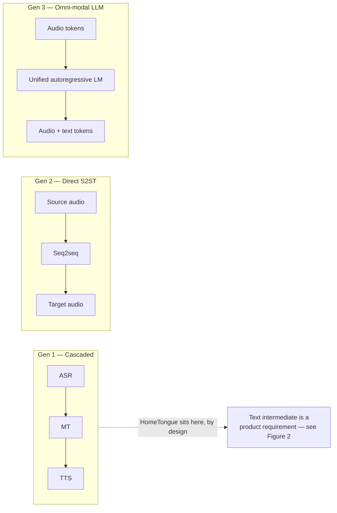
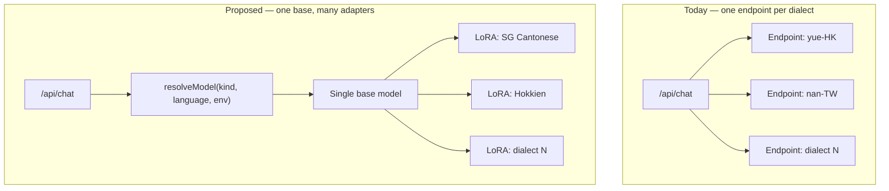
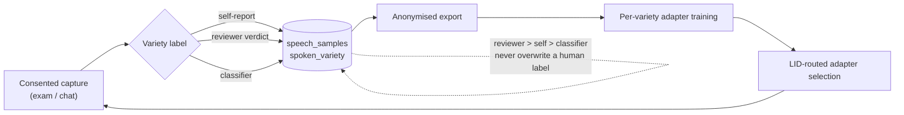
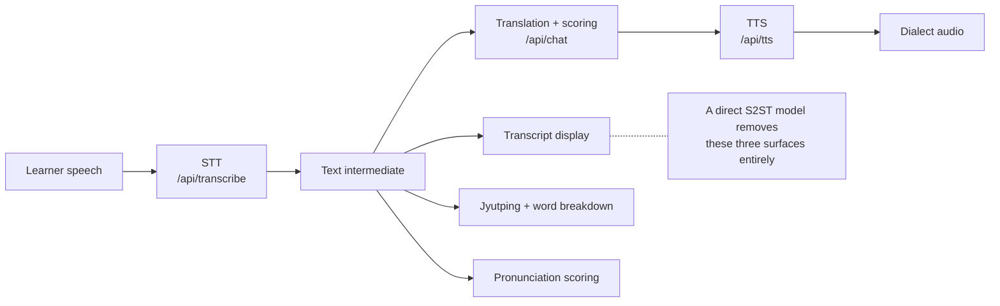
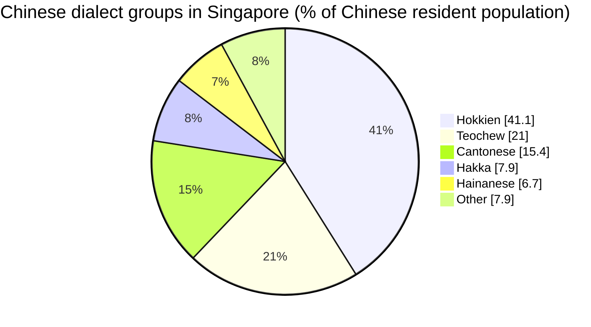

# S2ST Findings, Model Controls, and Dialect Classification — Implementation Plan

> **For agentic workers:** REQUIRED SUB-SKILL: Use superpowers:subagent-driven-development (recommended) or superpowers:executing-plans to implement this plan task-by-task. Steps use checkbox (`- [ ]`) syntax for tracking.

**Goal:** Produce four documents and two doc updates that replace a generic S2ST survey with a repo-grounded findings set, a model-control reference, a dialect-classification feature spec, and a publishable system-description paper.

**Architecture:** Documentation-only pass. A small Node verification script keeps every `file:line` claim in the docs honest against real code; each document task then ends by running it. No product code changes — the two code designs (per-language model routing, dialect label column) are *specified* inside the docs and built in a later pass.

**Tech Stack:** Markdown, Mermaid (matching commit `172009f`), Node 20 stdlib for the verification script. No new dependencies.

**Spec:** `docs/superpowers/specs/2026-07-26-s2st-findings-design.md`

## Global Constraints

- Documentation only. Do **not** modify anything under `src/`, `api/`, `supabase/migrations/`, or `admin/`. The only non-doc file created is `scripts/check-docs-refs.mjs`.
- All content must reflect **Singapore** usage. Never HK or Taiwan usage for user-facing dialect content; pack codes (`yue-HK`, `nan-TW`) stay as speech-locale identifiers and are not renamed.
- The corpus has **zero consented samples**. No document may imply a trained model, measured result, or populated benchmark exists.
- Markdown links are resolved **relative to the containing file** (existing convention: `docs/ML_PIPELINE.md:44` uses `../ml/train/README.md`).
- Mermaid diagrams only — no image binaries. SVG export is out of scope for this pass.
- Every factual claim about this repo must cite a real path, and every external claim must cite a canonical URL (arXiv abs page, ACL Anthology, official docs) — never a Scribd mirror or content farm.
- Commit after every task. Conventional commit format (`docs:`, `chore:`).

---

### Task 1: Docs reference-integrity checker

**Files:**
- Create: `scripts/check-docs-refs.mjs`
- Modify: `package.json` (add `docs:check` script)

**Interfaces:**
- Consumes: nothing.
- Produces: `pnpm docs:check` — exits 0 when every relative markdown link under `docs/` resolves to an existing file and any `:NNN` line suffix is within that file's length; exits 1 listing offenders otherwise. Every later task runs this command as its verification step.

- [ ] **Step 1: Write the checker**

Create `scripts/check-docs-refs.mjs`:

```js
// Fails when a docs/ markdown link points at a repo file that does not exist,
// or at a line number beyond that file's length. Keeps the file:line claims in
// the ML/architecture docs honest as code moves. Stdlib only.
import { readFileSync, readdirSync, statSync, existsSync } from "fs";
import { join, resolve, dirname, relative } from "path";

const DOCS_ROOT = "docs";
// [text](target) and [text](target:123) — captures target and optional line.
const LINK_RE = /\[[^\]]*\]\(([^)\s]+?)(?::(\d+))?\)/g;
const EXTERNAL_RE = /^(https?:|mailto:|#|data:)/;
// Fenced code blocks hold example links, not references. Matches a fence of 3+
// backticks and its same-length closing fence, so ````markdown wrappers around
// ```mermaid blocks are removed whole rather than half-matched.
const FENCE_RE = /^ {0,3}(`{3,})[^\n]*\n[\s\S]*?^ {0,3}\1`*[ \t]*$/gm;

function* walk(dir) {
  for (const entry of readdirSync(dir)) {
    const path = join(dir, entry);
    if (statSync(path).isDirectory()) yield* walk(path);
    else yield path;
  }
}

const offenders = [];
for (const file of walk(DOCS_ROOT)) {
  if (!file.endsWith(".md")) continue;
  const text = readFileSync(file, "utf8").replace(FENCE_RE, "");
  for (const match of text.matchAll(LINK_RE)) {
    const [, target, lineStr] = match;
    if (EXTERNAL_RE.test(target)) continue;
    const abs = resolve(dirname(file), decodeURI(target));
    if (!existsSync(abs)) {
      offenders.push(`${file}: missing target "${target}"`);
      continue;
    }
    if (!lineStr) continue;
    const lineCount = readFileSync(abs, "utf8").split("\n").length;
    const wanted = Number(lineStr);
    if (wanted > lineCount) {
      offenders.push(
        `${file}: "${target}:${wanted}" exceeds ${relative(".", abs)} (${lineCount} lines)`
      );
    }
  }
}

if (offenders.length > 0) {
  console.error("Broken documentation references:");
  for (const line of offenders) console.error(`  ${line}`);
  process.exit(1);
}
console.log("Documentation reference check passed.");
```

- [ ] **Step 2: Run it against the existing docs to verify it works and the tree is clean**

Run: `node scripts/check-docs-refs.mjs`
Expected: `Documentation reference check passed.`

If it reports offenders, they are **pre-existing rot in the current docs**. Fix those links in the same commit and note them in the commit body — do not suppress them.

- [ ] **Step 3: Prove the checker actually fails on a bad reference**

Run:
```bash
printf '\n[broken](../does/not/exist.md)\n' >> docs/SETUP.md && node scripts/check-docs-refs.mjs; echo "exit=$?"
```
Expected: exit=1 and a line reading `docs/SETUP.md: missing target "../does/not/exist.md"`.

Then revert the probe:
```bash
git checkout -- docs/SETUP.md
```

- [ ] **Step 4: Add the npm script**

In `package.json`, add to `"scripts"` immediately after `"lint"`:

```json
"docs:check": "node scripts/check-docs-refs.mjs",
```

- [ ] **Step 5: Verify via pnpm**

Run: `pnpm docs:check`
Expected: `Documentation reference check passed.`

- [ ] **Step 6: Commit**

```bash
git add scripts/check-docs-refs.mjs package.json
git commit -m "chore: add docs reference-integrity checker

Verifies every relative markdown link under docs/ resolves, and that any
:NNN line suffix is within the target file's length. The ML and architecture
docs cite specific file:line locations; nothing caught them going stale."
```

---

### Task 2: Resolve the two open research questions

**Files:**
- Modify: `docs/superpowers/specs/2026-07-26-s2st-findings-design.md` (Open questions section)

**Interfaces:**
- Consumes: nothing.
- Produces: two resolved findings, cited to primary sources, consumed by Task 3 (`S2ST_FINDINGS.md` governance section) and Task 4 (`MODEL_CONTROLS.md`).

Both questions must be answered from **primary sources**, not search-result summaries. If a question cannot be resolved from a primary source, record it as *unresolved* with what was checked — an honest unknown is a valid outcome and must not be papered over with a plausible guess.

- [ ] **Step 1: Determine whether Google Chirp3-HD TTS output carries SynthID watermarking**

Check Google Cloud Text-to-Speech official documentation for watermarking/SynthID coverage of Chirp 3: HD voices. Record: yes / no / not documented, with the doc URL and the date checked.

This decides whether the governance section can claim audio provenance, or must instead recommend in-app disclosure labelling as the substitute.

- [ ] **Step 2: Determine the IMDA National Speech Corpus licence terms for derived model weights**

Read the actual licence agreement (`https://www.imda.gov.sg/-/media/imda/files/programme/digital-service-lab/national-speech-corpus/imda-dsl--tech-licensing.pdf`) and the NSC landing page. Record specifically: whether models trained on NSC may be used commercially, and whether any notification, attribution, or redistribution restriction applies.

This decides whether finding F4 is **actionable** (a corpus the project can actually train on) or merely **informational** (a corpus that exists but cannot be used on these terms).

- [ ] **Step 3: Record both resolutions in the spec**

Replace open questions 1 and 2 in `docs/superpowers/specs/2026-07-26-s2st-findings-design.md` with their resolutions, each carrying the primary-source URL and the date checked, in the same `~~struck~~` + `**Resolved YYYY-MM-DD:**` format already used for question 3.

- [ ] **Step 4: Verify**

Run: `pnpm docs:check`
Expected: `Documentation reference check passed.`

- [ ] **Step 5: Commit**

```bash
git add docs/superpowers/specs/2026-07-26-s2st-findings-design.md
git commit -m "docs: resolve SynthID and NSC licensing open questions

Both answered from primary sources; findings feed the governance section of
S2ST_FINDINGS.md and the routing layer of MODEL_CONTROLS.md."
```

---

### Task 3: `docs/S2ST_FINDINGS.md`

**Files:**
- Create: `docs/S2ST_FINDINGS.md`

**Interfaces:**
- Consumes: Task 2's two resolutions.
- Produces: the evidence base every later document cites. Tasks 4, 5, 6 and 7 all link to this file rather than restating findings.

**Required structure** (H2 sections, in this order):

1. `## Scope and verdict` — states in the first three sentences that the source survey's core recommendation (direct omni-modal S2ST) is not applicable here, and that three sub-parts are.
2. `## Corpus re-audit` — Table 1 below, plus prose on what it changes for `ML_TRAINING_PLAN.md` step 2.
3. `## Why direct S2ST does not fit this product` — findings F1 and F2 from the spec. F1 (the text intermediate is a product requirement) must be stated as the *primary* reason, ahead of any resource argument.
4. `## What transfers` — LID-routed multi-LoRA (F5), GRPO with verifiable rewards (F6, including the early-stopping guardrail), curriculum/expressivity, governance.
5. `## Coverage vs. demographics` — finding F7.
6. `## The label gap` — finding F8; links to `DIALECT_CLASSIFICATION.md` (created in Task 5; this link will fail `docs:check` until then — see Step 4).
7. `## Corrections to the source document` — Table 3 below.
8. `## Evidence` — numbered reference list, canonical URLs only.

- [ ] **Step 1: Write Table 1 — corpus re-audit**

Caption above the table (`**Table 1.** …`), per paper convention.

| Corpus | Variety | Hours | Licence | Applicability |
|---|---|---|---|---|
| WenetSpeech-Yue | Cantonese | ~21,800 | see repo | Step-2 pre-mix; supersedes the MDCC assumption |
| IMDA National Speech Corpus | Singapore-accented English | ~10,600 | Singapore Open Data Licence | SG accent modelling; licence terms per Task 2 |
| MDCC | HK Cantonese (read audiobook) | 73.6 | research | Baseline only; the current plan's stale assumption |
| Common Voice `yue`/`zh-HK` | Cantonese | varies | CC0 | Supplementary pre-mix |
| MCE | Cantonese–English code-switch | — | research | Code-switching evaluation |
| MERLIon CCS | Mandarin–English code-switch (SG) | — | challenge terms | Closest match to SG code-switching |
| TaigiSpeech | Taiwanese Hokkien | — | research | Only realistic starting point for `nan-TW` |
| WenetSpeech-Wu | Wu | — | see repo | Not applicable; listed to show the method generalises |

Fill the `—` hour figures from each source's own paper or repo during writing. Do not invent figures; if a source does not state hours, write `not stated`.

- [ ] **Step 2: Write Table 3 — corrections to the source document**

| # | Issue | Detail |
|---|---|---|
| 1 | Mathematical notation lost | Mimi sample rate, framerate, RVQ codebook indices, the GRPO advantage formula and the GRPO loss all render blank in the `.docx` |
| 2 | Mis-cited ICML poster | Links `/virtual/2025/poster/44512` (the 2025 Hibiki paper) where Hibiki-Zero is `/virtual/2026/poster/66094` |
| 3 | Non-canonical source | Reference 10 is a Scribd mirror of an arXiv paper |
| 4 | Weak support for broad claims | Reference 1, a small personal GitHub repo, carries much of the introduction's field-framing |
| 5 | No compute or cost figures | Discusses 30B-parameter models and multi-GPU serving without a single cost or hour estimate |
| 6 | No data-volume requirements | States "<1000 h" for Hibiki-Zero adaptation but gives no figures for any other technique |
| 7 | No evaluation methodology | ASR-BLEU, Average Lagging and LAAL are named or implied, never defined; a reader cannot set a ship bar |
| 8 | No dialect data availability analysis | The decisive constraint for any dialect project is absent |
| 9 | Product-fit gap | Never considers that a language-*learning* product requires the text intermediate |

- [ ] **Step 3: Add Figure 1 — architecture generations**

Caption below the diagram (`**Figure 1.** …`), per paper convention.

````markdown

````

- [ ] **Step 4: Verify**

Run: `pnpm docs:check`
Expected: exit 1, reporting only the forward link to `DIALECT_CLASSIFICATION.md`, which Task 5 creates.

This is the one expected failure in the plan. Confirm the *only* offender is that forward link; any other offender is a real broken reference and must be fixed now. Task 5 Step 4 re-runs the check and it must pass clean there.

- [ ] **Step 5: Commit**

```bash
git add docs/S2ST_FINDINGS.md
git commit -m "docs: repo-grounded S2ST findings, superseding the survey document

Corpus re-audit (WenetSpeech-Yue ~21.8k h, IMDA NSC ~10.6k h) supersedes the
MDCC ~73h assumption in ML_TRAINING_PLAN. Records why direct S2ST does not fit
a learning product, what transfers, and nine defects in the source survey.

Forward link to DIALECT_CLASSIFICATION.md resolves in a following commit."
```

---

### Task 4: `docs/MODEL_CONTROLS.md`

**Files:**
- Create: `docs/MODEL_CONTROLS.md`

**Interfaces:**
- Consumes: `S2ST_FINDINGS.md` (Task 3) for the GRPO and routing rationale; Task 2's SynthID resolution.
- Produces: Table 2, referenced by the article (Task 7) as its model-controls table.

**Required structure:** one H2 per layer — `## Inference-time`, `## Training-time`, `## Routing and serving` — then `## Proposed additions in detail`, then `## Guardrails`.

- [ ] **Step 1: Write Table 2 — control surface**

Every row states what exists **today** with a real path, or `—` when nothing exists.

| Layer | Control | Today | Proposed |
|---|---|---|---|
| Inference | Voice selection | `GOOGLE_TTS_VOICES` / `asVoiceKey()` in `src/hooks/useGoogleTTS.ts`, default `zephyr` | unchanged |
| Inference | Tone / register | persona tone (`personal`/`work`) → `preferredTone` → `casual`, in `src/app/context/ProfileProvider.tsx` | expose per-request override |
| Inference | SG vs HK lexicon bias | pack prompts in `src/languages/yue-HK/` | make it an explicit request parameter, not a prompt constant |
| Inference | Dialect strictness | — | new knob; the prompt-and-proxy analogue of `--cfg-coef` |
| Inference | Scoring harshness | fixed in `scoreDialectAccuracy` (`src/services/translationService.ts`) | expose threshold; feeds exam difficulty |
| Inference | Latency vs quality | — | model tier per request; depends on routing controls |
| Training | SFT on corrections | planned, `ml/train/slm-dialogue/` | unchanged |
| Training | DPO on ratings | planned, `ml/train/slm-dialogue/train_dpo.py` | unchanged |
| Training | GRPO on verifiable rewards | — | new; rewards from `pack.scoring.fallbackMatch`, `ml/eval/normalization.json`, stored exam `score` |
| Training | Reward-collapse guardrail | — | mandatory early stopping on held-out dev set (finding F6) |
| Routing | Per-language base URL | `resolveBaseUrl()` in `api/_lib/languageManifest.js` | unchanged |
| Routing | Per-language model | — | `resolveModel()`; spec §C1 |
| Routing | Adapter selection by variety | — | LID-routed; depends on the classifier in `DIALECT_CLASSIFICATION.md` |
| Routing | Eval-gated rollout | documented process, `ml/train/README.md` steps 7–8 | unchanged |

- [ ] **Step 2: Write the `## Proposed additions in detail` section**

Specify `resolveModel` exactly as the spec §C1 defines it, including:

- `llm`: `LLM_MODEL_<SUFFIX>` → `OPENAI_MODEL` → `VITE_OPENAI_MODEL` → `DEFAULT_MODEL`
- `stt`: `STT_MODEL_<SUFFIX>` → provider default, with **no global `STT_MODEL`** and the stated reason (the STT path already takes a client-supplied `model`; a second server-side global would create two competing sources of truth for one field)
- The allowlist asymmetry, verbatim in intent: `ALLOWED_MODELS` in `api/_lib/transcribeCore.js` continues to validate the **client-supplied** model as a security boundary; a **server-configured** `STT_MODEL_<SUFFIX>` bypasses it because it originates in trusted env config. State explicitly that these two values must not share a code path.

- [ ] **Step 3: Add Figure 3 — routing before and after**

````markdown

````

- [ ] **Step 4: Verify**

Run: `pnpm docs:check`
Expected: exit 1, reporting only the still-unresolved forward link from Task 3. No new offenders.

- [ ] **Step 5: Commit**

```bash
git add docs/MODEL_CONTROLS.md
git commit -m "docs: model control surface across inference, training and routing

Records what is tunable today with real paths, and what is proposed: dialect
strictness, GRPO verifiable rewards with a mandatory reward-collapse guardrail,
and per-language model resolution."
```

---

### Task 5: `docs/DIALECT_CLASSIFICATION.md`

**Files:**
- Create: `docs/DIALECT_CLASSIFICATION.md`

**Interfaces:**
- Consumes: `S2ST_FINDINGS.md` finding F8 (the label gap).
- Produces: resolves the forward link left open in Task 3. After this task, `pnpm docs:check` must pass clean.

**Required structure:** `## Do we need a separate app?` → `## The label gap` → `## Schema` → `## Contribution surfaces` → `## Precedence` → `## The classifier` → `## Rollout phases`.

- [ ] **Step 1: Write the `## Do we need a separate app?` section**

Lead with the answer: **no**. `admin/` is already a full review application — `admin/src/pages/ReviewQueuePage.tsx`, `admin/src/components/SampleCard.tsx`, `admin/src/components/AudioPlayer.tsx`, `admin/src/lib/reviewApi.ts`, plus a stats dashboard — backed by `sample_reviews` in `supabase/migrations/0005_admin_review.sql`. The gap is the label, not the application.

- [ ] **Step 2: Write the `## Schema` section**

Migration `0009_spoken_variety.sql` adds three nullable columns to `speech_samples`:

| Column | Type | Notes |
|---|---|---|
| `spoken_variety` | `text` | pack-declared vocabulary; null = unknown |
| `variety_source` | `text` | `check (variety_source in ('self','reviewer','classifier'))` |
| `variety_confidence` | `real` | classifier confidence; null for human sources |

State explicitly: all nullable, no backfill, absent means unknown — which is the truthful representation of every existing row. RLS inherits the existing `speech_samples` policies; reviewer-sourced writes gate on `is_admin`, matching migration 0005.

State that the variety vocabulary lives in each language pack (`src/languages/<code>/`) per the `CLAUDE.md` convention, that **every** pack declares its own list, and that a pack declaring none simply never produces a label. The schema stays variety-agnostic.

- [ ] **Step 3: Write `## Precedence` and Figure 4**

Precedence is `reviewer > self > classifier`, enforced in the write path rather than by convention. A classifier write must never overwrite a human label.

````markdown

````

- [ ] **Step 4: Verify the whole docs tree is now clean**

Run: `pnpm docs:check`
Expected: `Documentation reference check passed.`

The forward link from Task 3 now resolves. If anything else is reported, fix it before committing.

- [ ] **Step 5: Commit**

```bash
git add docs/DIALECT_CLASSIFICATION.md
git commit -m "docs: dialect variety labelling and classification spec

No separate app is needed — admin/ already provides the review surface. The
gap is the label: speech_samples.language records which pack was active, not
which variety was spoken. Adds the schema, contribution surfaces, the
reviewer > self > classifier precedence rule, and the path to LID-routed
adapter selection.

Resolves the forward link left open by S2ST_FINDINGS.md."
```

---

### Task 6: Update `ML_TRAINING_PLAN.md` and `ML_PIPELINE.md`

**Files:**
- Modify: `docs/ML_TRAINING_PLAN.md` (step 2 corpus and gate; step 3 GRPO option)
- Modify: `docs/ML_PIPELINE.md` (dialect label in collection and export)

**Interfaces:**
- Consumes: Table 1 from `S2ST_FINDINGS.md`; the schema from `DIALECT_CLASSIFICATION.md`.
- Produces: nothing downstream; the article (Task 7) cites the updated versions.

- [ ] **Step 1: Correct the step-2 corpus claim**

In `docs/ML_TRAINING_PLAN.md`, the step-2 **Recipe** line currently reads "Pre-mix public native corpora (Common Voice `yue`, MDCC ~73 h)". Replace the corpus list with WenetSpeech-Yue (~21,800 h) as the primary pre-mix, keeping MDCC and Common Voice as supplementary, and link to `S2ST_FINDINGS.md` Table 1 for the full audit.

Keep the existing framing that learner-accented audio is the data moat — the public corpora are native speakers, and that argument is unaffected by the new corpus. Only the pre-mix changes.

- [ ] **Step 2: Add GRPO as a step-3 option**

In step 3, add GRPO alongside the existing SFT + DPO recipe: rewards computed from `pack.scoring.fallbackMatch` and `ml/eval/normalization.json` rather than from preference pairs, which lowers the data gate because it needs a reward function rather than 3–5k rated pairs.

State the guardrail as mandatory, not optional: early stopping on a held-out dev set, because GRPO is prone to reward variance collapse over long schedules.

- [ ] **Step 3: Add the dialect label to `ML_PIPELINE.md`**

In the "What gets collected (when consented)" table, add a row for the spoken-variety label. In the export section, note that `spoken_variety`, `variety_source` and `variety_confidence` join the exported JSONL. Link to `DIALECT_CLASSIFICATION.md`.

Do **not** claim the label is collected today — it is specified, not built. Phrase it as the specified next addition.

- [ ] **Step 4: Verify**

Run: `pnpm docs:check`
Expected: `Documentation reference check passed.`

- [ ] **Step 5: Commit**

```bash
git add docs/ML_TRAINING_PLAN.md docs/ML_PIPELINE.md
git commit -m "docs: correct step-2 corpus assumption, add GRPO option and dialect label

Step 2 pre-mixed against MDCC ~73h; WenetSpeech-Yue provides ~21,800h. Step 3
gains GRPO on verifiable rewards, which needs a reward function rather than
preference pairs, with mandatory early stopping against reward collapse.
ML_PIPELINE records the specified spoken-variety label."
```

---

### Task 7: The article — `docs/blog/dialect-model-controls.md`

**Files:**
- Create: `docs/blog/dialect-model-controls.md`

**Interfaces:**
- Consumes: all four preceding documents.
- Produces: the publishable artefact. Self-contained — a reader must not need repo access, so every repo claim is explained in prose rather than left as a bare path.

**Title:** Dialect-Preserving Speech Translation for Heritage Language Learning: A System Description and Feasibility Audit

**Byline:** Darren Chua. No affiliation. Version line directly beneath: `v1.0 — 2026-07-26`.

**Genre discipline:** system description, not empirical study. Section 5 is *Design Rationale and Implementation*, **not** Results. There are no measured numbers because there is no corpus, and the paper says so in both the abstract and §7.

**Required sections, numbered:**

1. Introduction — ends with an enumerated contributions list
2. Background and Related Work
3. System Architecture
4. System Setup
5. Design Rationale and Implementation
6. Discussion
7. Limitations
8. Ethical Considerations
9. Conclusion and Future Work
10. References
11. Appendix

**Conventions:** table captions **above**, figure captions **below**, every figure and table referenced by number in prose, numbered references with canonical URLs, reproducibility statement in §4.

**Length:** 1,500–2,000 words excluding references.

- [ ] **Step 1: Write the abstract**

150–250 words. Must state, explicitly: the product context (heritage-language learning, Singapore), the finding that direct S2ST is inapplicable because the text intermediate is a product requirement, the corpus re-audit result, the three transferable techniques, and — in plain terms — that no trained model or measured result is presented because no consented corpus exists yet.

- [ ] **Step 2: Write §1 with an enumerated contributions list**

Four contributions: (i) a product-grounded argument for retaining the cascade in learning applications; (ii) a corpus re-audit correcting a 300× stale assumption; (iii) a three-layer model-control taxonomy; (iv) a dialect-variety labelling design that makes adapter routing automatic.

- [ ] **Step 3: Add Figure 2 — the pipeline argument**

This is the paper's central diagram: the text intermediate is what the learning surfaces consume.

````markdown

````

- [ ] **Step 4: Add Figure 5 — coverage vs. demographics**

````markdown

````

In the prose immediately after the caption, state the gap plainly: the fully supported pack is Cantonese at 15.4%, while Hokkien at 41.1% is text-only with no speech recognition path.

- [ ] **Step 5: Write §7 Limitations with the pre-registered protocol**

Must state: no consented corpus exists, so no evaluation is reported; the evaluation protocol is nonetheless fixed in advance — CER/WER against the `gpt-4o-transcribe` baseline, train/validation split by speaker hash to prevent leakage, and a ship bar of ≥15–20% relative CER reduction. State explicitly that publishing the bar before seeing results is deliberate, so that a later revision fills in numbers against a protocol already public rather than choosing a threshold after the fact.

- [ ] **Step 6: Write §8 Ethical Considerations**

Cover: the two-flag consent model (`data_collection_consent`, `audio_retention_consent`, both default off, re-enforced by RLS server-side); that speech data carries biometric markers; audio provenance per Task 2's SynthID resolution — claiming watermarking only if Task 2 confirmed it, otherwise recommending in-app disclosure labelling; and alignment with the IMDA Model AI Governance Framework for Generative AI.

- [ ] **Step 7: Restate Figures 1, 3 and 4 so the paper stands alone**

The paper must carry **all five** figures, because a reader has no repo access. Copy the
Mermaid blocks verbatim from their source documents, renumbering nothing:

- Figure 1 (architecture generations) from `docs/S2ST_FINDINGS.md`, Task 3 Step 3
- Figure 3 (routing before/after) from `docs/MODEL_CONTROLS.md`, Task 4 Step 3
- Figure 4 (label → train → route loop) from `docs/DIALECT_CLASSIFICATION.md`, Task 5 Step 3

Order in the paper is by figure number: 1 in §2 or §3, 2 in §3, 3 in §5, 4 in §5, 5 in §6.

This duplication is deliberate. The internal docs keep their diagrams because their own
readers need them in place; the paper repeats them because it is a self-contained artefact
published outside the repo. Diagrams are not code and are not subject to DRY here.

- [ ] **Step 8: Verify**

Run: `pnpm docs:check`
Expected: `Documentation reference check passed.`

Then verify the paper conventions by inspection — this is the check most easily skipped and most visible to a reader:
- every `**Figure N.**` caption sits **below** its diagram
- every `**Table N.**` caption sits **above** its table
- every figure and table number appears at least once in prose
- references are numbered and every URL is canonical (arXiv `abs`, ACL Anthology, official docs) — no Scribd, no content farms
- word count is within 1,500–2,000 excluding references:

```bash
node -e "const t=require('fs').readFileSync('docs/blog/dialect-model-controls.md','utf8').split(/##\s*10\.?\s*References/i)[0];console.log(t.trim().split(/\s+/).length,'words before References')"
```

- [ ] **Step 9: Commit**

```bash
git add docs/blog/dialect-model-controls.md
git commit -m "docs: system-description paper on dialect-preserving S2ST

Publishable interim report, v1.0. System description rather than empirical
study — no corpus exists, so no results are claimed. Pre-registers the
evaluation protocol and ship bar so a later revision fills in measured numbers
against a published threshold."
```

---

### Task 8: Cross-link and final verification

**Files:**
- Modify: `README.md` (docs index, if one exists)
- Modify: `CLAUDE.md` (docs pointer)

**Interfaces:**
- Consumes: all preceding tasks.
- Produces: the finished documentation set.

- [ ] **Step 1: Check whether a docs index exists**

Run: `grep -n "ML_PIPELINE\|ML_TRAINING_PLAN\|docs/" README.md`

If README links the docs set, add the three new internal docs in the same style. If it does not, skip the README edit — do not invent an index that was never there.

- [ ] **Step 2: Update the CLAUDE.md roadmap pointer**

`CLAUDE.md` currently ends its conventions list with a pointer to `docs/IMPROVEMENT_PLAN.md`. Add one line pointing at `docs/S2ST_FINDINGS.md` for the dialect-model findings and `docs/MODEL_CONTROLS.md` for the tunable surface, so a future session finds them without searching.

- [ ] **Step 3: Full verification sweep**

```bash
pnpm docs:check && pnpm typecheck && pnpm lint && pnpm test
```
Expected: all four pass. `typecheck`, `lint` and `test` should be unaffected — this pass touched no `src/` or `api/` file. If any of them fails, the failure is pre-existing or the constraint was violated; investigate before committing.

- [ ] **Step 4: Confirm no product code was touched**

```bash
git diff --stat cd8d3b5..HEAD -- src api supabase admin
```
Expected: empty output. `cd8d3b5` is the last commit before this plan's work began, so this compares the entire documentation pass regardless of how many commits it took. Anything listed violates the documentation-only constraint and must be reverted.

- [ ] **Step 5: Commit**

```bash
git add README.md CLAUDE.md
git commit -m "docs: cross-link findings and model-controls docs"
```

---

## Self-review notes

**Spec coverage.** D1→Task 3, D2→Task 4, D3→Task 5, D4→Task 7, D5→Task 6, D6→already committed in `f1f8a56`. Spec open questions 1 and 2→Task 2; question 3 resolved in `cd8d3b5`. Code designs C1 and C2 are documented inside Tasks 4 and 5 respectively and deliberately not implemented, per the spec's non-goals.

**Deliberate deviation.** Task 1 (`check-docs-refs.mjs`) is not in the spec. It was added because every task in this plan needs an objective verification step, and a documentation plan otherwise has none. It is dev tooling, not product code, and creating it is the only exception to the documentation-only constraint. Drop it if unwanted — every task's Step 4 then becomes a manual link review.

**Known expected failure.** Task 3 Step 4 fails `docs:check` by design, on a forward link to a file Task 5 creates. Task 5 Step 4 must pass clean. This is called out in both places so an implementer working a single task out of order is not misled.

**Naming consistency.** `resolveModel(kind, languageCode, env)` is used identically in Task 4 and in spec §C1. Column names `spoken_variety` / `variety_source` / `variety_confidence` are identical in Task 5, Task 6 and spec §C2.

**Table placement.** Table 1 (corpus re-audit) and Table 3 (corrections) in Task 3; Table 2 (control surface) in Task 4.

**Figure placement.** The spec assigns all five figures to the article. This plan additionally places three of them in the internal doc where each is authored, then has Task 7 Step 7 restate all five in the paper so it stands alone outside the repo:

| Figure | Authored in | Also in paper |
|---|---|---|
| 1 — architecture generations | Task 3 (`S2ST_FINDINGS.md`) | yes |
| 2 — pipeline / text intermediate | Task 7 (paper only) | yes |
| 3 — routing before/after | Task 4 (`MODEL_CONTROLS.md`) | yes |
| 4 — label → train → route loop | Task 5 (`DIALECT_CLASSIFICATION.md`) | yes |
| 5 — coverage vs. demographics | Task 7 (paper only) | yes |
